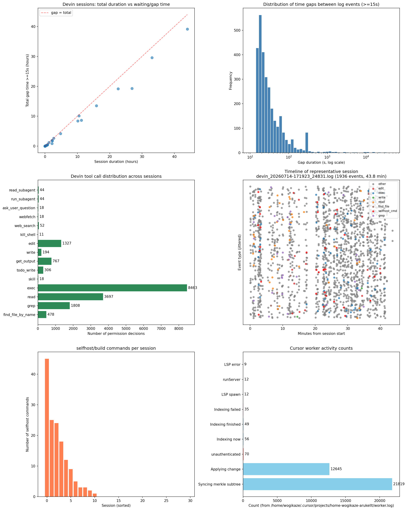

# Agent tooling latency — Devin / Cursor (2026-07-17)

ステータス: 調査メモ（決定記録ではない）  
調査日: 2026-07-17  
関連: `AGENTS.md`「エージェント運用の効率化」、`.cursor/rules/selfhost-rebuild.mdc`

## 概要

Devin CLI のログと Cursor worker ログを読み取り、AI agent タスクで何に時間がかかっているかを調査した。結論として、**コンパイルそのものよりも「ツール呼び出しのラウンドトリップ」「selfhost の無駄な再構築」「認証・インデックスの再試行ループ」が時間を圧迫している**ケースが多い。

## 観測環境

- Devin CLI ログ: `~/.local/share/devin/cli/logs/devin_*.log`
- 解析対象: 直近 30 セッション
- Cursor worker ログ: `~/.cursor/projects/*/worker.log`、特に `home-wogikaze-arukellt/worker.log`
- ツール: Python3 + matplotlib で集計・可視化

## 測定方法

### Devin ログ

Devin ログは各イベントに ISO-8601 タイムスタンプを持つ。以下を抽出した。

1. セッション全体の最初から最後までの時間
2. `Permission decision for tool <name>` の回数
3. 連続するログイベント間の `>=15s` のギャップ時間と回数
4. `command: "..."` に含まれる `manager.py selfhost` 系コマンドの回数

### Cursor worker ログ

タイムスタンプが無いため、繰り返し発生するパターンを文字列マッチで集計した。

## 結果

### 全体サマリー（直近 30 セッション）

| 項目 | 値 |
|---|---|
| 総セッション数 | 30 |
| 総ログ時間 | 192.2 時間 |
| `>=15s` ギャップ合計 | 162.3 時間 |
| 総ツール呼び出し数 | 17,245 |
| `selfhost` 系コマンド数 | 147 |

**セッション時間の約 85% が 15 秒以上の「何もログに残らない区間」に費やされている**。これは主に LLM 推論・応答生成、あるいは長時間コマンド実行の待ちに相当する。

### グラフ

### Devin ツール別ラウンドトリップ（代表セッション）

| ツール | 呼び出し回数 | 平均ラウンドトリップ | 最大 |
|---|---|---|---|
| `exec` | 541 | 5.6 s | 49.1 s |
| `read` | 90 | 12.6 s | 62.3 s |
| `edit` | 28 | 6.9 s | 24.5 s |
| `grep` | 14 | 6.5 s | 22.8 s |

`read` 1 回あたり平均 12.6 s は、ファイル読み込みの実処理時間（ミリ秒級）に対して非常に大きく、**ツール結果を受け取ってから次の行動を決定するまでの LLM 推論時間**が支配的と考えられる。

### 長い思考空白

代表セッション `devin_20260626-052938_16686.log` では、`current-state.md` 読み込み後から次の行動まで **239.8 秒（約 4 分）** の空白が発生した。これは単一ファイルの読み込みではなく、その後の計画・方針決定に LLM が時間を使ったことを示す。

### `selfhost` 再構築の繰り返し

一部のセッションでは `python3 scripts/manager.py selfhost fixpoint --build` が 1 セッションで 7～8 回呼ばれている。`fixpoint --build` は s2+s3 の再構築を含むため、`build-compiler`（stage-2 のみ）に比べて遥かに高価。`.cursor/rules/selfhost-rebuild.mdc` でも、通常の emitter 作業では `build-compiler` を使い、`fixpoint --build --no-cache` を使わないことが禁止されている。

### Cursor worker

`~/.cursor/projects/home-wogikaze-arukellt/worker.log`（48,874 行）の集計:

| 項目 | 値 |
|---|---|
| `runServer` | 12 回 |
| `Indexing now` | 56 回 |
| `Indexing finished` | 49 回 |
| `Indexing failed` | 35 回 |
| `unauthenticated` | 70 回 |
| `Syncing merkle subtree` | 21,819 回 |
| `Applying change` | 12,645 回 |
| TypeScript LSP spawn | 12 回 |
| LSP init error | 9 回 |

`unauthenticated` エラーが `Indexing failed` のたびに発生しており、インデックスの再試行ループが継続している。LSP は workspace 内に有効な TypeScript インストレーションが無いため初期化に失敗している。

### 認証・ネットワーク遅延

Devin 起動時のログには以下が頻出する。

- `Team settings refresh timed out after 3000ms`
- `failed to fetch plan info: Connection failed: Connect HTTP error ...`
- `Telemetry proxy is only available for free-tier users`
- `PKCE callback invoked more than once; ignoring duplicate`

これらは Devin が Codeium / Devin バックエンドに認証・チーム設定・テレメトリーを問い合わせる際のタイムアウト・失敗であり、起動直後に数秒〜数十秒の遅延を生む。

Cursor 側は環境変数に API key が設定されているにもかかわらず、`fastRepoInitHandshakeV2` で `unauthenticated` エラーが返り続けている。これは key の有効期限切れ、プロキシ・ファイアウォール、または Cursor バックエンド側の認証エンドポイント問題を示唆する。

## 主な原因

1. **LLM 推論ラウンドトリップ**: ツール結果から次のツール選択までに 5～15 s、長い場合は数分かかる。
2. **高価な rebuild の反復**: `fixpoint --build` を emitter 微修正ごとに回している。
3. **環境認証・ネットワーク失敗**: Devin / Cursor 双方でバックエンド接続のタイムアウト・失敗が繰り返されている。
4. **Cursor インデックスループ**: `unauthenticated` で失敗するたびに worker が再起動・再試行している。
5. **ファイル調査の逐次化**: 関連ファイルを 1 つずつ `read`/`wc` しているため、ツール呼び出し回数が増えている。

## 対策・推奨運用

### 即効性のある運用変更

- **ツール呼び出しのバッチ化**: `read`/`grep`/`exec` は独立なものを並列・同時に実行する。
- **関連ファイルは一度に読む**: `wc -l file1 file2 ...` や複数 `read` を 1 回にまとめる。
- **selfhost rebuild はバッチ後に 1 回**: `build-compiler`（stage-2）を使い、fixpoint は ADR-029 ゲートのみ。
- **長時間実行は get_output で待たずに他の調査を並列化**: ただし同じファイルへの書きは競合するため注意。

### 環境問題の回避

- Cursor worker の `unauthenticated` / LSP 初期化失敗は、エディタ設定・認証状態・プロキシの確認が必要。解決までは worker ログのエラー件数を監視する。
- Devin の `Team settings refresh timed out` はネットワーク環境に依存。解決までは起動時の待ちを前提として、可能な範囲で並列作業を計画する。

### 長期対策

- 10 分を超える作業ごとに「何に時間を使ったか」を振り返り、次回のバッチ化・並列化に反映する。
- 10 分・1 時間単位で作業時間を自己監視し、LLM 推論待ちや rebuild 反復を早期に発見する。

## 備考

- 本調査は Devin / Cursor の内部ログに依存しており、各種待ち時間の正確な内訳（LLM 推論 vs ネットワーク vs コマンド実行）はログからは分離できない。
- セッション中の長時間（数 10 時間）を記録しているログもあるが、これには agent 停止・休止中の時間が含まれる可能性があるため、純粋な作業時間ではない。
- グラフは `/tmp/devin_cursor_time_analysis.png` から `docs/research/agent-tooling-latency.png` へコピーしたもの。
