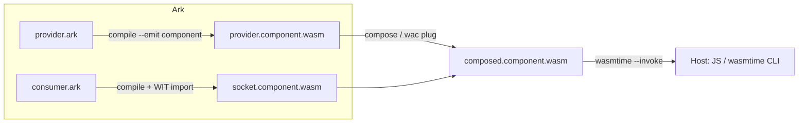

# Cross-language interop examples

Runnable recipes that show how **compiled Arukellt** (`.component.wasm`) interoperates
with other languages and with other Ark modules.

| Directory | What it demonstrates |
|-----------|----------------------|
| [`ark/`](ark/README.md) | Export an Ark library as a component; link a pre-built component into another Ark program |
| [`js/`](js/README.md) | Call an Ark component from JavaScript (wasmtime today; jco path documented) |

## Prerequisites

- **Arukellt**: `scripts/run/arukellt-selfhost.sh` (uses pinned bootstrap wasm)
- **Library `--emit component` / `--emit wit`**: point `ARUKELLT_SELFHOST_WASM` at `.build/selfhost/arukellt-s2.wasm`; the launcher packages standard P2 core output with official `wasm-tools`.
- **wasmtime** with GC + component-model support
- **wasm-tools**, **wac** — for official WIT/component composition examples
- **Node.js ≥ 18** — optional, for `js/invoke-via-jco`

## Quick start

```bash
# Ark → reusable component library
bash examples/ark/export-library/run.sh

# Ark consumer + official WIT provider → composed component
bash examples/ark/link-compiled/run.sh

# JavaScript host calling an Ark calculator export
bash examples/js/invoke-component/run.sh
```

## How linking works


```mermaid
flowchart LR
  subgraph ark_side [Ark]
    A[provider.ark] -->|compile --emit component| P[provider.component.wasm]
    B[consumer.ark] -->|compile + WIT import| S[socket.component.wasm]
  end
  P -->|compose / wac plug| C[composed.component.wasm]
  S --> C
  C -->|wasmtime --invoke| H[Host: JS / wasmtime CLI]
```

- **Export**: `pub fn` with component-compatible types → `.component.wasm` callable from any host.
- **Import**: `import "package/interface" as alias` in Ark source + matching WIT on disk (`ark.toml` / `--wit`).
- **Compose**: `arukellt compose` or `wac plug` connects a provider component to a consumer socket.

CI-grade regression fixtures live under `tests/component-interop/`; these `examples/` trees
are trimmed for readability and cross-link each other.
