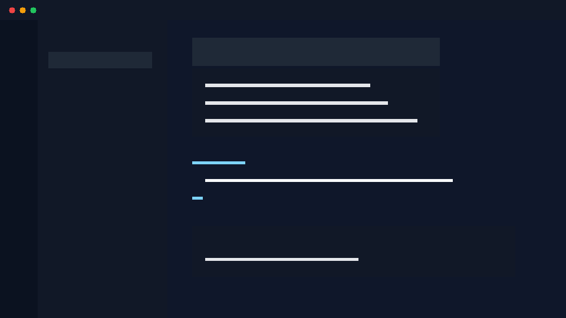

# Arukellt All-in-One

VS Code support for Arukellt: language registration, syntax highlighting,
snippets, command palette workflows, and the `arukellt lsp` language server.



## Current scope

- Registers `.ark` as the `arukellt` language
- Provides a basic language configuration, grammar, and snippets
- Launches `arukellt lsp` using the configured CLI path
- Supports restarting the language server from the command palette
- Adds command palette actions for `check`, `compile`, and `run` on the active `.ark` file
- Adds a basic `arukellt` task provider and status bar state
- Adds setup doctor (QuickPick diagnostics), executable command graph tree view, and environment diff picker

## Commands

- `Arukellt: Restart Language Server`
- `Arukellt: Check Current File`
- `Arukellt: Compile Current File`
- `Arukellt: Run Current File`
- `Arukellt: Build Component (wasm32-gc, all outputs)`
- `Arukellt: Build Component - Show WIT Interface`
- `Arukellt: Run Component (wasm32-gc)`
- `Arukellt: Open in Playground`

## Extension Settings

All settings are declared in `package.json` under `contributes.configuration.properties`
and can be configured in `.vscode/settings.json` or VS Code's Settings UI.

| Setting | Type | Default | Description |
|---------|------|---------|-------------|
| `arukellt.server.path` | `string` | `"arukellt"` | Path to the arukellt CLI used to launch the language server. |
| `arukellt.server.args` | `string[]` | `[]` | Additional arguments passed before the built-in `lsp` subcommand. |
| `arukellt.target` | `"wasm32"` \| `"wasm32-gc"` \| `"native-cpp"` \| `"native-llvm"` \| `null` | `null` | Canonical compilation target passed to the LSP server and to check/compile/run commands. `null` means auto-detect from `ark.toml`. |
| `arukellt.emit` | `string` | `"core-wasm"` | Default emit kind passed by extension compile commands. |
| `arukellt.playgroundUrl` | `string` | `"https://wogikaze.github.io/arukellt/playground/"` | Base URL used by the `Open in Playground` command. Only the repo-proved route (`docs/playground/index.html` on GitHub Pages) is supported. |
| `arukellt.enableCodeLens` | `boolean` | `true` | Show Run / Debug / Test CodeLens above functions in `.ark` files. Set to `false` to hide all CodeLens entries. |
| `arukellt.hoverDetailLevel` | `"full"` \| `"minimal"` | `"full"` | Controls how much information is shown on hover. `"full"`: signature + docs + availability + examples. `"minimal"`: signature only. |
| `arukellt.diagnostics.reportLevel` | `"errors"` \| `"warnings"` \| `"all"` | `"all"` | Controls which diagnostic severities are shown in the Problems panel. `"errors"`: errors only. `"warnings"`: errors + warnings. `"all"`: everything. |
| `arukellt.useSelfHostBackend` | `boolean` | `false` | Use the self-hosted (ark-compiled) compiler backend instead of the Rust backend. Requires Stage 2 fixpoint (Issue 459). When `true` before Stage 2 is achieved, the extension logs a warning and continues using the Rust backend. |
| `arukellt.check.onSave` | `boolean` | `true` | Run `arukellt check` on file save. |

Six settings are forwarded to the LSP server via `initializationOptions` and
`workspace/didChangeConfiguration` (Issue #479): `enableCodeLens`, `hoverDetailLevel`,
`target` (as `arkTarget`), `diagnostics.reportLevel` (as `diagnosticsReportLevel`),
`useSelfHostBackend`, and `check.onSave` (as `checkOnSave`).

## Supported Targets

| Target | Status | Notes |
|--------|--------|-------|
| `wasm32` | supported | Linear-memory Wasm workflows with the WASI P1 host profile. |
| `wasm32-gc` | primary | Component Model and WIT workflows with the WASI P2 host profile. |
| `native-cpp` | scaffold | Native C++ backend experiment. |
| `native-llvm` | scaffold | Native LLVM backend experiment. |

## Debugging

The extension registers the `arukellt` debug type and launches `arukellt debug-adapter`
for source-level stepping. See [docs/debug-support.md](../../docs/debug-support.md)
for the full DAP workflow.

### Current limitations

These match [docs/debug-support.md](../../docs/debug-support.md):

- wasm32 and wasm32-gc smoke programs support **live Wasm locals** via `arukellt_debug::breakpoint` hooks
- Step In / Step Out behave the same as Step Over (no call-level granularity)
- No watch expressions, evaluate support, or conditional breakpoints
- Single main thread only
- Component targets remain best-effort / static variables

## Compatibility

- Desktop VS Code is supported.
- VS Code Remote, Dev Containers, and Codespaces are supported when the
  configured `arukellt.server.path` resolves inside the remote environment.
- Browser/web extension hosts are not supported yet because the extension
  launches `arukellt lsp` as a process.

## Troubleshooting

| Symptom | Action |
|---------|--------|
| Language server does not start | Set `arukellt.server.path` to the absolute path of a runnable `arukellt` binary. |
| Commands fail in Remote or Codespaces | Install `arukellt` in the remote environment or point `arukellt.server.path` at the remote binary. |
| Component commands fail | Verify `wasm32-gc` is selected and required Component Model tools are installed for the current workflow. |
| Diagnostics do not update | Run `Arukellt: Restart Language Server` and check the Arukellt output channel. |

## Packaging and Release

Release packaging is documented in [RELEASE.md](RELEASE.md). The short local
check is:

```bash
npm run test:marketplace-metadata
npm run build
```

`npm run build` packages the extension with `vsce package` and writes a
versioned `.vsix` file in this directory.

## Notes

This extension intentionally keeps the language client thin and uses the
existing `arukellt lsp` command as the server entrypoint.
