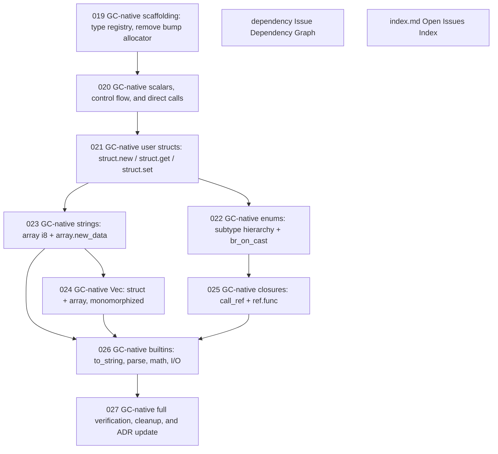

# Issue Dependency Graph

Auto-generated by `scripts/generate-issue-index.sh`. Do not edit manually.

## Mermaid graph

## Adjacency list

- **019** depends on: none; blocks: 020
- **dependency** depends on: none; blocks: none
- **index.md** depends on: none; blocks: none
- **020** depends on: 019; blocks: 021
- **021** depends on: 020; blocks: 022, 023
- **022** depends on: 021; blocks: 025
- **023** depends on: 021; blocks: 024, 026
- **025** depends on: 022; blocks: 026
- **024** depends on: 023; blocks: 026
- **026** depends on: 023, 024, 025; blocks: 027
- **027** depends on: 026; blocks: none
