# Issue Dependency Graph

Auto-generated by `scripts/gen/generate-issue-index.py`. Do not edit manually.

## Mermaid graph

```mermaid
graph LR
  I074["074 074-wasi-p2-native-component"]
  I30["30 036-jco-javascript-interop"]
  I649["649 649 — T4 native full lowering (beyond scaffold #641)"]
  I667["667 667 — Library component routing: scalar emitter bypasses specialized / WIT-complete path"]
  I669["669 669 — WIT import IDE and formatter surface"]
  I670["670 670 — WIT import resolver hardening (duplicates, spans, collisions)"]
  I671["671 671 — WIT import callable type matrix (fixtures + gates)"]
  I672["672 672 — WIT type binding code generation"]
  I674["674 674 — Component composition: dependency wasm, lockfile, and external interop"]
  I675["675 675 — Host capability user-reachability and runtime permission flags"]
  I676["676 676 — std::host fs / env / process capability completion"]
  I677["677 677 — Component developer experience (CLI, cookbooks, diagnostics explain)"]
  I678["678 678 — Verification gates: stale docs, release checklist, and close-gate coverage"]
  I680["680 680 — Target tier honesty audit (stable / smoke / scaffold / none)"]
  I681["681 681 — Stdlib manifest reachability contract audit"]
  I684["684 684 — False-done and limited-scope done issue re-audit program"]
  I685["685 685 — IDE / Playground / Extension product-claim vs compiler gate audit"]
  I686["686 Wasm GC Selfhost Implementation"]
  I687["687 687 — HashMap / HashSet Rust parity gap audit and closure"]
  I690["690 690 — `?` operator and `From<E>` error conversion"]
  I691["691 691 — `Iterator` trait, lazy adapters, and `FromIterator` / `collect`"]
  I693["693 693 — `Read` / `Write` / `BufRead` / `Seek` traits and IO unification"]
  I695["695 695 — `Ord` / `PartialOrd` traits and comparison-based algorithms"]
  I696["696 696 — `Debug` trait and `format!` / `write!` formatting ecosystem"]
  I702["702 702 — Integrate `to_string` / `clone` / `hash` builtins into trait dispatch"]
  I704["704 std::json Full JSON RFC 8259 Compliance"]
  I705["705 std::toml Full TOML 1.0 Compliance"]
  I706["706 std::wit Full WIT 1.0 Compliance"]
  I708["708 708 — `TryFrom` / `TryInto` traits for fallible conversions"]
  I718["718 718 — Stdlib free-function → method/trait migration inventory"]
  I719["719 719 — `arukellt test` execution harness (ADR-041 Phase 2)"]
  I721["721 Final Types (`sub final`) を全 struct に適用"]
  I722["722 Typed Function References (`call_ref`) ベンチマーク計測"]
  I723["723 Wasm Exception Handling (`exnref`) 統合の検討"]
  I724["724 ADR-040 Phase 3b-7: Typed MIR Signature Registry 残作業"]
  I725["725 ADR-040 Phase 5e: 命令トレーサ完全削除 (infer_ref_local_gc_type_depth)"]
  I728["728 728 — WIR / backend target IR for ADR-007 multi-target separation"]
  I760["760 ADR 台帳の規則追従 — research/plans 分離と supersession 整合"]
  I781["781 781 — CQ-02: file-family tooling inventory"]
  I474["474 Async component support (v5)"]
  I62["62 076-wasi-p2-filesystem"]
  I714["714 714 — Emitter-native WASI P2 component output without wrapper"]
  I699["699 699 — T4 LLVM native SIMD lowering for std::simd"]
  I673["673 673 — Component export aggregate expansion (Tier 2 blocked shapes)"]
  I682["682 682 — Component / WIT product-claim verification audit"]
  I694["694 694 — `Error` trait and unified error type ecosystem"]
  I697["697 697 — `Vec<T>` operation extension (windows / chunks / retain / sort_by / drain / splice)"]
  I703["703 703 — Monomorphic API cutover (ADR-036 D2 + ADR-046)"]
  I726["726 T3 WASM validation failures: validate-fail 修正（GC ref 型推論バグ）"]
  I782["782 782 — CQ-03: code-quality-rules.toml registry"]
  I783["783 783 — CQ-04: .editorconfig and whitespace gate"]
  I784["784 784 — CQ-05: manager.py fmt entrypoint"]
  I646["646 646 — T5 wasm32-wasi-p3 target scaffold"]
  I668["668 668 — P2 native component polish (post-#074)"]
  I727["727 727 — Retire `arukellt_host` custom host bridge; migrate HTTP/sockets to standard WASI P2/P3 imports"]
  I683["683 683 — User-facing executable example audit (Quickstart / skip-doc-check)"]
  I709["709 709 — Stdlib trait-first API policy and free-function eradication"]
  I730["730 730 — Bootstrap wasm 4GB memory limit blocks pinned wasm refresh"]
  I786["786 786 — CQ-07: manager.py lint entrypoint"]
  I788["788 788 — CQ-09: comment policy three kinds"]
  I789["789 789 — CQ-10: PR review checklist and AGENTS sync"]
  I785["785 785 — CQ-06: Stage A whitespace format-only apply"]
  I729["729 729 — Intrinsic layer separation: semantic stdlib + runtime ABI + Ark migration"]
  I710["710 710 — Linear collection ADTs: `Deque<T>` / queue / stack / list type surface"]
  I787["787 787 — CQ-08: baseline and touched-code ratchet formalization"]
  I711["711 711 — Rich stdlib reference docs with crates.io / docs.rs / JSR readability"]
  I790["790 790 — CQ-11: CI quality-format/lint jobs and required-checks docs"]
  I712["712 712 — LLM code quality signal gates for readability and stdlib misuse"]
  I713["713 713 — Stdlib and Arukellt code best-practices doc pack"]
  I31["31 jco: Wasm GC 型サポート待ち (upstream blocked) ⛔"]
  I074 --> I474
  I074 --> I62
  I074 --> I714
  I649 --> I699
  I667 --> I673
  I680 --> I682
  I690 --> I694
  I691 --> I697
  I695 --> I697
  I691 --> I703
  I695 --> I703
  I724 --> I726
  I781 --> I782
  I781 --> I783
  I781 --> I784
  I474 --> I646
  I074 --> I668
  I714 --> I668
  I714 --> I727
  I675 --> I727
  I682 --> I683
  I691 --> I709
  I695 --> I709
  I697 --> I709
  I703 --> I709
  I726 --> I730
  I781 --> I786
  I782 --> I786
  I782 --> I788
  I782 --> I789
  I783 --> I785
  I784 --> I785
  I724 --> I729
  I727 --> I729
  I691 --> I710
  I697 --> I710
  I709 --> I710
  I786 --> I787
  I681 --> I711
  I709 --> I711
  I710 --> I711
  I784 --> I790
  I786 --> I790
  I787 --> I790
  I709 --> I712
  I711 --> I712
  I709 --> I713
  I711 --> I713
  I712 --> I713
  I30 --> I31
```

## Adjacency list

- **074** depends on: 510, 121; blocks: 474, 62, 668, 714
- **30** depends on: 27; blocks: none
- **649** depends on: 641; blocks: 699
- **667** depends on: 666; blocks: 673
- **669** depends on: 652, done); blocks: none
- **670** depends on: 653, done); blocks: none
- **671** depends on: 653, 654; blocks: none
- **672** depends on: 664, done); blocks: none
- **674** depends on: 443, 663, 665; blocks: none
- **675** depends on: 446, 447, 655, 656, 657, 658, done); blocks: 727
- **676** depends on: 076, done), 445, done); blocks: none
- **677** depends on: 475, 485; blocks: none
- **678** depends on: none; blocks: none
- **680** depends on: 679; blocks: 682
- **681** depends on: 679; blocks: 711
- **684** depends on: none; blocks: none
- **685** depends on: 679; blocks: none
- **686** depends on: none; blocks: none
- **687** depends on: 495; blocks: none
- **690** depends on: 688; blocks: 694
- **691** depends on: 688, 707; blocks: 697, 703, 709, 710
- **693** depends on: 688, 692; blocks: none
- **695** depends on: 688; blocks: 697, 703, 709
- **696** depends on: 688, 692; blocks: none
- **702** depends on: 688, 700, 692; blocks: none
- **704** depends on: 606; blocks: none
- **705** depends on: 606; blocks: none
- **706** depends on: 606; blocks: none
- **708** depends on: 692, 707; blocks: none
- **718** depends on: 700, 701; blocks: none
- **719** depends on: 715; blocks: none
- **721** depends on: none; blocks: none
- **722** depends on: none; blocks: none
- **723** depends on: none; blocks: none
- **724** depends on: none; blocks: 726, 729
- **725** depends on: none; blocks: none
- **728** depends on: none; blocks: none
- **760** depends on: none; blocks: none
- **781** depends on: 780; blocks: 782, 783, 784, 786
- **474** depends on: 035, done), 074; blocks: 646
- **62** depends on: 074, 510; blocks: none
- **714** depends on: 074, 510; blocks: 668, 727
- **699** depends on: 649, 698; blocks: none
- **673** depends on: 648, 660, 667; blocks: none
- **682** depends on: 679, 680; blocks: 683
- **694** depends on: 690, 692; blocks: none
- **697** depends on: 691, 695; blocks: 709, 710
- **703** depends on: 700, 701, 691, 695; blocks: 709
- **726** depends on: 724; blocks: 730
- **782** depends on: 780, 781; blocks: 786, 788, 789
- **783** depends on: 781; blocks: 785
- **784** depends on: 781; blocks: 785, 790
- **646** depends on: 474; blocks: none
- **668** depends on: 074, 510, 714; blocks: none
- **727** depends on: 714, 675; blocks: 729
- **683** depends on: 679, 682; blocks: none
- **709** depends on: 691, 695, 697, 703; blocks: 710, 711, 712, 713
- **730** depends on: 726; blocks: none
- **786** depends on: 781, 782; blocks: 787, 790
- **788** depends on: 782; blocks: none
- **789** depends on: 780, 782; blocks: none
- **785** depends on: 783, 784; blocks: none
- **729** depends on: 724, 727; blocks: none
- **710** depends on: 691, 697, 701, 707, 709; blocks: 711
- **787** depends on: 786; blocks: 790
- **711** depends on: 681, 709, 710; blocks: 712, 713
- **790** depends on: 784, 786, 787; blocks: none
- **712** depends on: 709, 711; blocks: 713
- **713** depends on: 709, 711, 712; blocks: none

### Blocked

- **31** ⛔ blocked — depends on: 30; blocked by: jco upstream (<https://github.com/bytecodealliance/jco>)
