# Issue Dependency Graph

Auto-generated by `scripts/gen/generate-issue-index.sh`. Do not edit manually.

## Mermaid graph

```mermaid
graph LR
  I039["039 std モジュールシステム基盤: `use std::*` import インフラ"]
  I060["060 Wasm tail-call: return_call / return_call_ref 実装"]
  I064["064 Wasm Branch Hinting: カスタムセクションによるブランチ予測ヒント"]
  I066["066 Wasm Bulk Memory: memory.copy / memory.fill / table.copy フル対応"]
  I067["067 Wasm Sign Extension Ops: i32.extend8_s / i32.extend16_s / i64 版"]
  I070["070 Wasm GC i31ref: 小整数 unboxed scalar 最適化"]
  I072["072 Wasm Multi-Value: ブロック / ループの複数値返却フル活用"]
  I073["073 WASI P1: 全46 syscall 対応 (clock / random / proc_exit / fd_seek 等)"]
  I074["074 WASI P2 ネイティブ: P1 アダプタ不要のコンポーネント直接生成"]
  I080["080 MIR: LICM (ループ不変式移動) パス"]
  I081["081 MIR: エスケープ解析 + Scalar Replacement パス"]
  I082["082 MIR: gc_hint パス — 短命オブジェクトのパターン検出"]
  I084["084 MIR: Strength Reduction — 乗算→シフト、除算→逆数乗算"]
  I085["085 MIR: CSE (Common Subexpression Elimination) パス"]
  I086["086 MIR: 代数的簡略化 — 恒等式・吸収則・ド・モルガン則"]
  I087["087 MIR: 関数間インライン展開の強化 — 呼び出し回数・サイズ閾値の最適化"]
  I088["088 T3 Peephole: local.get/set 冗長ペア除去"]
  I089["089 T3: 関数型セクション重複排除 (Type Section Dedup)"]
  I091["091 T3: 同一文字列リテラルのデータセグメント共有"]
  I092["092 T3: 未使用 WASI import の除去"]
  I093["093 T3: 定数条件 if の emit 時除去"]
  I094["094 T3: enum dispatch の br_on_cast 連鎖最適化"]
  I095["095 T3: struct フィールドレイアウト最適化 (アクセス頻度ベース)"]
  I096["096 コンパイル速度: 未使用 stdlib 関数の遅延解決 (lazy-resolve)"]
  I099["099 コンパイル速度: インクリメンタル解析 (ファイル変更差分のみ再パース)"]
  I100["100 CLI: --time フラグ + フェーズ別コンパイル時間計測"]
  I101["101 CLI: --opt-level 0/1/2 フラグ + Session 統合"]
  I104["104 実行時性能: GC write barrier 削減 (immutable フィールド検出)"]
  I105["105 実行時性能: 数値型の Narrowing — i32 優先使用"]
  I106["106 実行時性能: 静的文字列インターニング (data segment 参照)"]
  I109["109 ベンチマーク: fib / binary_tree / vec_ops / string_concat / json_parse スイート"]
  I111["111 ツール: Wasm バイナリサイズ内訳分析ツール"]
  I114["114 Wasm 検証エラーをエラーに昇格 (W0004 warning → error)"]
  I115["115 Wasm Name Section: デバッグ用関数名・ローカル名セクション生成"]
  I117["117 Component Model: WIT 生成品質の向上と往復検証"]
  I120["120 WasmGC Post-MVP プレビュー: 将来拡張の設計調査"]
  I123["123 import 構文と WIT パッケージ識別子の統一方針決定"]
  I125["125 `compile()` のデフォルトを CoreHIR パスに移行 (Legacy パス廃止)"]
  I127["127 `MIRValidate` をコンパイル経路で無条件実行"]
  I128["128 T3 GC エミッター (t3_wasm_gc.rs 8678行) をサブモジュールに分割"]
  I129["129 T1 エミッター (t1_wasm32_p1.rs 9465行) をサブモジュールに分割"]
  I130["130 MIR lower.rs (4360行) をサブモジュールに分割"]
  I132["132 Parser parser.rs (2003行) をサブモジュールに分割"]
  I134["134 ark-lexer lib.rs (1698行) をサブモジュールに分割"]
  I135["135 ark-diagnostics lib.rs (1099行) をサブモジュールに分割"]
  I137["137 `std::host::*` namespace 導入と migration / target-gated 診断"]
  I149["149 基盤: benchmark schema・命名・実行モードの標準化"]
  I150["150 横断 docs: `docs/language/spec.md` 凍結版と `docs/compiler/ir-spec.md` を整備"]
  I151["151 横断 docs: `docs/compiler/error-codes.md` と診断コード一覧の正規化"]
  I153["153 横断検証: bit-exact Wasm 再現ビルドゲートと決定性ルール"]
  I155["155 横断 docs: selfhosting stdlib checklist と不足 migration guides を整備"]
  I156["156 T3 backend-opt: `struct.get` → 即時 `struct.set` 系の read-modify-write 最適化"]
  I157["157 ADR-004 P4: メソッド構文 / trait 再評価"]
  I171["171 canonical stringification surface を `to_string(x)` に統一する"]
  I260["260 current-state.md の target 表を CI 結果からのみ更新する仕組みを作る"]
  I330["330 Fixture harness を selfhost binary 対応にする"]
  I462["462 拡張機能の設定項目の整理と実装への配線"]
  I470["470 Playground docs: feature claim は current implementation と一致させる"]
  I471["471 Playground docs: command / workflow / publish claim の現実整合監査"]
  I472["472 Playground: type-checker product claim を独立 issue に分離する"]
  I473["473 Resource type v3+: 継承・async drops・クロスコンポーネント転送・ハンドル GC"]
  I478["478 Extension: initializationOptions で全 5 設定を LSP サーバーに渡す"]
  I481["481 scripts/update-target-status.sh: CI 出力から target-contract.md を更新"]
  I482["482 harness.rs: ARUKELLT_BIN 環境変数でバイナリパスを上書きできるようにする"]
  I484["484 compiler: to_string() builtin 実装と stdlib surface 整備"]
  I041["041 std::core: Error 型、ordering、range、cmp、math、convert、hash"]
  I043["043 std::bytes: Bytes、ByteBuf、ByteCursor、endian、hex、base64、leb128"]
  I051["051 std::time + std::random: 時刻・期間・乱数"]
  I090["090 T3: 末尾位置の call → return_call 自動変換"]
  I124["124 WIT コンポーネント import — ソース構文・ark.toml・型バインディング生成"]
  I474["474 Async Component Support (v5/T5)"]
  I475["475 `arukellt component` サブコマンド (v3 候補)"]
  I476["476 `wasm-tools compose` 統合 (v3 候補)"]
  I083["083 MIR: ループ展開 (Loop Unrolling) パス"]
  I103["103 実行時性能: 配列境界チェック除去 (Bounds Check Elimination)"]
  I108["108 実行時性能: hello.wasm 1KB 以下 達成プラン"]
  I102["102 コンパイル速度: Lexer / Parser のホットパス最適化"]
  I113["113 計測: コンパイラ RSS + 実行時 GC ヒープ計測統合"]
  I119["119 MIR: ARUKELLT_DUMP_PHASES=optimized-mir 対応"]
  I122["122 MIR 最適化パスの --opt-level 分離と passes/ ディレクトリ構造確立"]
  I112["112 ベンチマーク比較: C/Rust/Go/Grain との自動比較スクリプト"]
  I116["116 Wasm WAT ラウンドトリップ検証 (wat2wasm ⇄ wasm2wat)"]
  I118["118 Component Model: 複数エクスポート world の自動生成"]
  I126["126 `run_frontend()` の二重 lower を解消 (遅延 lower)"]
  I077["077 WASI P2: `std::host::http` facade と runtime 検証"]
  I138["138 `std::host` 共通 capability (`stdio` / `fs` / `env` / `process` / `clock` / `random`) を T1/T3 両対応で実装"]
  I139["139 WASI P2: `std::host::sockets` facade と T3 実行検証"]
  I140["140 ベンチ統合: `mise bench` 1コマンド導線と subcommand 整理"]
  I141["141 計測: cold/warm/incremental compile と phase 別時間分解"]
  I142["142 計測: startup / throughput / tail latency ベンチ"]
  I145["145 計測: Wasm サイズ内訳 diff と top contributors 追跡"]
  I146["146 基盤: benchmark variance 制御と再現性プロファイル"]
  I147["147 ベンチスイート: workload taxonomy と機能マトリクス整備"]
  I154["154 横断基盤: `scripts/run/verify-bootstrap.sh` と fixpoint 検証 scaffold"]
  I479["479 LSP server: LspConfig struct と設定反映ハンドラ実装"]
  I042["042 std::text: String API 拡張、StringBuilder、format ユーティリティ"]
  I044["044 std::collections::hash: HashMap\<K,V\> 汎用化と HashSet\<T\>"]
  I045["045 std::collections: Deque、PriorityQueue"]
  I046["046 std::collections: BTreeMap、BTreeSet、IndexMap、IndexSet、BitSet"]
  I047["047 std::collections: Arena、SlotMap、Interner ／ std::text: Rope"]
  I048["048 std::seq: Seq\<T\> 遅延シーケンスとアルゴリズム"]
  I056["056 std::test: assert、snapshot テスト、bench-lite"]
  I050["050 std::io: Reader、Writer、stdin/stdout/stderr、buffered I/O"]
  I053["053 std::wasm: Wasm バイナリ型・opcode・module builder"]
  I485["485 docs: arukellt component サブコマンド CLI リファレンス"]
  I136["136 ADR-011 に沿った `std::host` layer の段階的ロールアウト"]
  I144["144 計測: 入力サイズ sweep とスケーリングカーブ可視化"]
  I148["148 基盤: benchmark 結果保存・履歴比較・トレンドレポート"]
  I480["480 Extension README: 設定一覧テーブル追加"]
  I049["049 std::path + std::fs: パス操作とファイル I/O"]
  I052["052 std::process + std::env + std::cli: 実行環境 API"]
  I055["055 std::json + std::toml + std::csv: データ形式パーサ"]
  I054["054 std::wit + std::component: WIT 型、resource handle、canonical ABI"]
  I158["158 v4 docs 完了: optimization / pipeline / current-state / benchmark caveat の同期"]
  I037["037 jco: Wasm GC 型サポート待ち (upstream blocked) ⛔"]
  I039 --> I041
  I039 --> I043
  I039 --> I051
  I060 --> I090
  I074 --> I124
  I074 --> I474
  I074 --> I475
  I074 --> I476
  I080 --> I083
  I080 --> I103
  I091 --> I108
  I092 --> I108
  I088 --> I108
  I089 --> I108
  I100 --> I102
  I100 --> I113
  I101 --> I119
  I101 --> I122
  I109 --> I112
  I114 --> I116
  I117 --> I118
  I125 --> I126
  I074 --> I077
  I137 --> I077
  I137 --> I138
  I074 --> I139
  I137 --> I139
  I149 --> I140
  I149 --> I141
  I149 --> I142
  I149 --> I145
  I149 --> I146
  I149 --> I147
  I153 --> I154
  I478 --> I479
  I039 --> I042
  I041 --> I042
  I039 --> I044
  I041 --> I044
  I039 --> I045
  I041 --> I045
  I039 --> I046
  I041 --> I046
  I039 --> I047
  I041 --> I047
  I039 --> I048
  I041 --> I048
  I039 --> I056
  I041 --> I056
  I039 --> I050
  I041 --> I050
  I043 --> I050
  I039 --> I053
  I043 --> I053
  I475 --> I485
  I137 --> I136
  I138 --> I136
  I077 --> I136
  I139 --> I136
  I141 --> I144
  I142 --> I144
  I149 --> I144
  I140 --> I148
  I141 --> I148
  I142 --> I148
  I145 --> I148
  I146 --> I148
  I479 --> I480
  I039 --> I049
  I041 --> I049
  I042 --> I049
  I039 --> I052
  I042 --> I052
  I039 --> I055
  I042 --> I055
  I044 --> I055
  I039 --> I054
  I044 --> I054
  I053 --> I054
  I140 --> I158
  I141 --> I158
  I142 --> I158
  I145 --> I158
  I148 --> I158
  I155 --> I158
```

## Adjacency list

- **039** depends on: none; blocks: 041, 042, 043, 044, 045, 046, 047, 048, 049, 050, 051, 052, 053, 054, 055, 056
- **060** depends on: none; blocks: 090
- **064** depends on: none; blocks: none
- **066** depends on: none; blocks: none
- **067** depends on: none; blocks: none
- **070** depends on: none; blocks: none
- **072** depends on: none; blocks: none
- **073** depends on: none; blocks: none
- **074** depends on: none; blocks: 077, 124, 139, 474, 475, 476
- **080** depends on: none; blocks: 083, 103
- **081** depends on: none; blocks: none
- **082** depends on: none; blocks: none
- **084** depends on: none; blocks: none
- **085** depends on: none; blocks: none
- **086** depends on: none; blocks: none
- **087** depends on: none; blocks: none
- **088** depends on: none; blocks: 108
- **089** depends on: none; blocks: 108
- **091** depends on: none; blocks: 108
- **092** depends on: none; blocks: 108
- **093** depends on: none; blocks: none
- **094** depends on: none; blocks: none
- **095** depends on: none; blocks: none
- **096** depends on: none; blocks: none
- **099** depends on: none; blocks: none
- **100** depends on: none; blocks: 102, 113
- **101** depends on: none; blocks: 119, 122
- **104** depends on: none; blocks: none
- **105** depends on: none; blocks: none
- **106** depends on: none; blocks: none
- **109** depends on: none; blocks: 112
- **111** depends on: none; blocks: none
- **114** depends on: none; blocks: 116
- **115** depends on: none; blocks: none
- **117** depends on: none; blocks: 118
- **120** depends on: none; blocks: none
- **123** depends on: none; blocks: none
- **125** depends on: none; blocks: 126
- **127** depends on: none; blocks: none
- **128** depends on: none; blocks: none
- **129** depends on: none; blocks: none
- **130** depends on: none; blocks: none
- **132** depends on: none; blocks: none
- **134** depends on: none; blocks: none
- **135** depends on: none; blocks: none
- **137** depends on: none; blocks: 077, 136, 138, 139
- **149** depends on: none; blocks: 140, 141, 142, 144, 145, 146, 147
- **150** depends on: none; blocks: none
- **151** depends on: none; blocks: none
- **153** depends on: none; blocks: 154
- **155** depends on: none; blocks: 158
- **156** depends on: none; blocks: none
- **157** depends on: none; blocks: none
- **171** depends on: none; blocks: none
- **260** depends on: 256, 257; blocks: none
- **330** depends on: 328; blocks: none
- **462** depends on: none; blocks: none
- **470** depends on: 465; blocks: none
- **471** depends on: 465; blocks: none
- **472** depends on: 466; blocks: none
- **473** depends on: 032, done); blocks: none
- **478** depends on: 477; blocks: 479
- **481** depends on: 256, 257; blocks: none
- **482** depends on: 328; blocks: none
- **484** depends on: 483; blocks: none
- **041** depends on: 039; blocks: 042, 044, 045, 046, 047, 048, 049, 050, 056
- **043** depends on: 039, 040; blocks: 050, 053
- **051** depends on: 039, 040; blocks: none
- **090** depends on: 060; blocks: none
- **124** depends on: 074; blocks: none
- **474** depends on: 035, done), 074; blocks: none
- **475** depends on: 035, done), 074; blocks: 485
- **476** depends on: 035, done), 074; blocks: none
- **083** depends on: 080; blocks: none
- **103** depends on: 080; blocks: none
- **108** depends on: 091, 092, 088, 089; blocks: none
- **102** depends on: 100; blocks: none
- **113** depends on: 100; blocks: none
- **119** depends on: 101; blocks: none
- **122** depends on: 101; blocks: none
- **112** depends on: 109; blocks: none
- **116** depends on: 114; blocks: none
- **118** depends on: 117; blocks: none
- **126** depends on: 125; blocks: none
- **077** depends on: 074, 137; blocks: 136
- **138** depends on: 137; blocks: 136
- **139** depends on: 074, 137; blocks: 136
- **140** depends on: 149; blocks: 148, 158
- **141** depends on: 149; blocks: 144, 148, 158
- **142** depends on: 149; blocks: 144, 148, 158
- **145** depends on: 149; blocks: 148, 158
- **146** depends on: 149; blocks: 148
- **147** depends on: 149; blocks: none
- **154** depends on: 153; blocks: none
- **479** depends on: 478; blocks: 480
- **042** depends on: 039, 041; blocks: 049, 052, 055
- **044** depends on: 039, 041; blocks: 054, 055
- **045** depends on: 039, 041; blocks: none
- **046** depends on: 039, 041; blocks: none
- **047** depends on: 039, 041; blocks: none
- **048** depends on: 039, 041; blocks: none
- **056** depends on: 039, 041; blocks: none
- **050** depends on: 039, 041, 043; blocks: none
- **053** depends on: 039, 040, 043; blocks: 054
- **485** depends on: 475; blocks: none
- **136** depends on: 137, 138, 077, 139; blocks: none
- **144** depends on: 141, 142, 143, 149; blocks: none
- **148** depends on: 140, 141, 142, 143, 145, 146; blocks: 158
- **480** depends on: 479; blocks: none
- **049** depends on: 039, 041, 042; blocks: none
- **052** depends on: 039, 042; blocks: none
- **055** depends on: 039, 042, 044; blocks: none
- **054** depends on: 039, 044, 053; blocks: none
- **158** depends on: 140, 141, 142, 143, 145, 148, 155; blocks: none

### Blocked

- **037** ⛔ blocked — depends on: 036; blocked by: jco upstream (<https://github.com/bytecodealliance/jco>)
