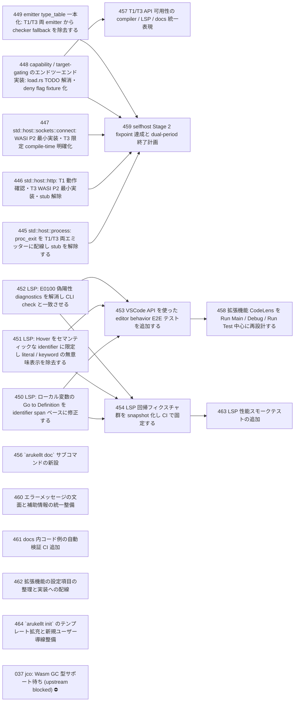

# Issue Dependency Graph

Auto-generated by `scripts/gen/generate-issue-index.sh`. Do not edit manually.

## Mermaid graph

## Adjacency list

- **445** depends on: none; blocks: 459
- **446** depends on: none; blocks: 459
- **447** depends on: none; blocks: 459
- **448** depends on: none; blocks: 457, 459
- **449** depends on: none; blocks: 459
- **450** depends on: none; blocks: 453, 454
- **451** depends on: none; blocks: 453, 454
- **452** depends on: none; blocks: 453, 454
- **456** depends on: 455; blocks: none
- **460** depends on: none; blocks: none
- **461** depends on: none; blocks: none
- **462** depends on: none; blocks: none
- **464** depends on: none; blocks: none
- **457** depends on: 448, 455; blocks: none
- **459** depends on: 445, 446, 447, 448, 449; blocks: none
- **453** depends on: 450, 451, 452; blocks: 458
- **454** depends on: 450, 451, 452; blocks: 463
- **458** depends on: 453; blocks: none
- **463** depends on: 454; blocks: none

### Blocked

- **037** ⛔ blocked — depends on: 036; blocked by: jco upstream (<https://github.com/bytecodealliance/jco>)
