# Issue Dependency Graph

Auto-generated by `scripts/gen/generate-issue-index.py`. Do not edit manually.

## Mermaid graph

```mermaid
graph LR
  I034["034 CLI --wit flag, --emit component workflow, docs"]
  I036["036 jco JavaScript interop smoke test"]
  I044["044 std::collections::hash: HashMap\<K,V\> 汎用化と HashSet\<T\>"]
  I045["045 std::collections: Deque、PriorityQueue"]
  I047["047 std::collections: Arena、SlotMap、Interner ／ std::text: Rope"]
  I051["051 std::time + std::random: 時刻・期間・乱数"]
  I099["099 Selfhost compiler: incremental parse design slice"]
  I108["108 実行時性能: hello.wasm 1KB 以下 達成プラン"]
  I112["112 ベンチマーク比較: C/Rust/Go/Grain との自動比較スクリプト"]
  I123["123 import 構文と WIT パッケージ識別子の統一方針決定"]
  I125["125 `compile()` のデフォルトを CoreHIR パスに移行 (Legacy パス廃止)"]
  I204["204 204-project-explain-build-explain-and-script-sandbox-surface"]
  I205["205 205-docs-and-codebase-intelligence-surfaces"]
  I214["214 Extension quality / packaging / marketplace readiness"]
  I285["285 Legacy lowering path を隔離・撤去する"]
  I436["436 436-playground-docs-site-integration"]
  I437["437 Playground: deployment / preview environment / asset cache 戦略を整える"]
  I468["468 468-playground-build-and-publish-path-proof"]
  I469["469 469-extension-playground-surface-points-to-repo-proved-endpoint"]
  I470["470 470-playground-feature-claims-match-implementation"]
  I473["473 Resource type v3+: 継承・async drops・クロスコンポーネント転送・ハンドル GC"]
  I489["489 489-playground-user-visible-entrypoint-wiring"]
  I495["495 495 — Selfhost typechecker: trait bounds and constraint solving"]
  I500["500 500-playground-wasm-typecheck-export"]
  I510["510 T3 emitter: WASI P2 import-table switch (full P2-native component)"]
  I520["520 Stdlib: allocation / complexity / perf footgun を family 横断で監査する"]
  I529["529 100% Self-Hosting Transition Plan (Operational Guide)"]
  I531["531 Scripts Consolidation Epic: Python CLI Refactoring"]
  I546["546 Release: Binary Smoke Tests"]
  I547["547 Release: Determinism Check"]
  I548["548 Release: LSP E2E Tests"]
  I549["549 Release: Extension Activation Tests"]
  I550["550 Release: Formatter CLI-LSP Parity"]
  I551["551 Release: Failure Recovery Tests"]
  I552["552 Release: Post-Release Documentation"]
  I553["553 Release: Binary Distribution"]
  I554["554 Release: Extension Live Editor Tests"]
  I555["555 Release: Pre-Release CI Checks"]
  I563["563 563 — Phase 5: Delete `crates/ark-stdlib`"]
  I571["571 571 — Phase 6/D: src/ide/dap.ark — debug adapter scaffold (deferred priority)"]
  I588["588 Language Surface Uplift Plan (Operational Guide)"]
  I589["589 Type System Stage-Up Plan (HM Core + Coherent Traits) (Operational Guide)"]
  I590["590 Stdlib Core Platform Baseline Plan (Operational Guide)"]
  I591["591 Optimization Uplift Plan (Compile / Run / Size) (Operational Guide)"]
  I592["592 Error Handling Convergence Plan (Operational Guide)"]
  I593["593 Selfhost Phase 1: Multi-File Fixpoint"]
  I595["595 Language Surface Uplift: Multi-Clause Function Definitions"]
  I598["598 Language Surface Uplift: Expression-Level Comprehensions"]
  I600["600 Type System Stage-Up: Soundness Floor"]
  I604["604 Stdlib Baseline: Contract and Facade Honesty"]
  I609["609 Optimization Uplift: Measurement Truth Repair"]
  I613["613 Error Handling Convergence: Stdlib Result Surface"]
  I614["614 Error Handling Convergence: Compiler Structured Diagnostics"]
  I615["615 Error Handling Convergence: Panic / ICE Policy"]
  I054["054 std::wit + std::component: WIT 型、resource handle、canonical ABI"]
  I055["055 std::json + std::toml + std::csv: データ形式パーサ"]
  I126["126 `run_frontend()` の二重 lower を解消 (遅延 lower)"]
  I512["512 Stdlib: trait ベースの再利用可能 surface へ段階移行する"]
  I121["121 WASI P2: Canonical ABI ハンドリングの堅牢化"]
  I564["564 564 — Phase 5: Delete `crates/arukellt`"]
  I573["573 573 — Phase 7: Delete `crates/ark-dap`"]
  I508["508 Legacy path removal is blocked by CoreHIR lowerer stub"]
  I594["594 Selfhost Phase 2: Fixture and Diagnostic Parity"]
  I596["596 Language Surface Uplift: Function-Level Guards"]
  I597["597 Language Surface Uplift: Real `where` Clauses"]
  I601["601 Type System Stage-Up: Type Schemes and Controlled Let-Generalization"]
  I605["605 Stdlib Baseline: Host Core-Platform Baseline"]
  I606["606 Stdlib Baseline: Structured Data and Semantics Baseline"]
  I607["607 Stdlib Baseline: Collections Hash Hardening"]
  I610["610 Optimization Uplift: Lowering Bottleneck Reduction"]
  I611["611 Optimization Uplift: T3-Safe Runtime Unlock"]
  I074["074 WASI P2 ネイティブ: P1 アダプタ不要のコンポーネント直接生成"]
  I574["574 574 — Phase 7: Delete `crates/ark-lexer`"]
  I580["580 580 — Phase 7: Delete `crates/ark-manifest`"]
  I599["599 Language Surface Uplift: Docs, Fixtures, and Rollout"]
  I602["602 Type System Stage-Up: Qualified Constraints and Coherent Trait Solving"]
  I608["608 Stdlib Baseline: Docs, Verification, and Benchmark Closeout"]
  I612["612 Optimization Uplift: Binary Size Squeeze"]
  I076["076 WASI P2 ネイティブ: wasi:filesystem ネイティブバインディング"]
  I077["077 WASI P2: `std::host::http` facade と runtime 検証"]
  I124["124 WIT コンポーネント import — ソース構文・ark.toml・型バインディング生成"]
  I139["139 WASI P2: `std::host::sockets` facade と T3 実行検証"]
  I474["474 Async Component Support (v5/T5)"]
  I475["475 `arukellt component` サブコマンド (v3 候補)"]
  I476["476 `wasm-tools compose` 統合 (v3 候補)"]
  I575["575 575 — Phase 7: Delete `crates/ark-parser`"]
  I603["603 Type System Stage-Up: Monomorphization and Lowering Contract Closure"]
  I543["543 543 — Benchmark: file I/O (I/O-heavy workloads)"]
  I136["136 ADR-011 に沿った `std::host` layer の段階的ロールアウト"]
  I485["485 docs: arukellt component サブコマンド CLI リファレンス"]
  I576["576 576 — Phase 7: Delete `crates/ark-resolve`"]
  I577["577 577 — Phase 7: Delete `crates/ark-typecheck`"]
  I578["578 578 — Phase 7: Delete `crates/ark-hir`"]
  I579["579 579 — Phase 7: Delete `crates/ark-diagnostics`"]
  I581["581 581 — Phase 7: Delete `crates/ark-target`"]
  I582["582 582 — Phase 7 final: remove `Cargo.toml` and `Cargo.lock`"]
  I037["037 jco: Wasm GC 型サポート待ち (upstream blocked) ⛔"]
  I044 --> I054
  I044 --> I055
  I125 --> I126
  I495 --> I512
  I510 --> I121
  I563 --> I564
  I571 --> I573
  I593 --> I508
  I593 --> I594
  I595 --> I596
  I595 --> I597
  I600 --> I601
  I604 --> I605
  I604 --> I606
  I604 --> I607
  I609 --> I610
  I609 --> I611
  I510 --> I074
  I121 --> I074
  I564 --> I574
  I564 --> I580
  I595 --> I599
  I596 --> I599
  I597 --> I599
  I598 --> I599
  I601 --> I602
  I604 --> I608
  I605 --> I608
  I606 --> I608
  I607 --> I608
  I609 --> I612
  I611 --> I612
  I074 --> I076
  I510 --> I076
  I074 --> I077
  I074 --> I124
  I074 --> I139
  I074 --> I474
  I074 --> I475
  I074 --> I476
  I564 --> I575
  I574 --> I575
  I601 --> I603
  I602 --> I603
  I076 --> I543
  I077 --> I136
  I139 --> I136
  I475 --> I485
  I564 --> I576
  I575 --> I576
  I564 --> I577
  I576 --> I577
  I564 --> I578
  I577 --> I578
  I564 --> I579
  I575 --> I579
  I576 --> I579
  I577 --> I579
  I564 --> I581
  I575 --> I581
  I577 --> I581
  I573 --> I582
  I574 --> I582
  I575 --> I582
  I576 --> I582
  I577 --> I582
  I578 --> I582
  I579 --> I582
  I580 --> I582
  I581 --> I582
  I036 --> I037
```

## Adjacency list

- **034** depends on: 030, 031, 028b; blocks: none
- **036** depends on: 033; blocks: none
- **044** depends on: 039, 041, 312; blocks: 054, 055
- **045** depends on: 039, 041; blocks: none
- **047** depends on: 039, 041; blocks: none
- **051** depends on: 039, 040; blocks: none
- **099** depends on: none; blocks: none
- **108** depends on: 091, 092, 088, 089; blocks: none
- **112** depends on: 109; blocks: none
- **123** depends on: none; blocks: none
- **125** depends on: none; blocks: 126
- **204** depends on: none; blocks: none
- **205** depends on: none; blocks: none
- **214** depends on: 184, 185, 186, 187, 188; blocks: none
- **285** depends on: 284; blocks: none
- **436** depends on: none; blocks: none
- **437** depends on: 431; blocks: none
- **468** depends on: none; blocks: none
- **469** depends on: none; blocks: none
- **470** depends on: none; blocks: none
- **473** depends on: 032, done); blocks: none
- **489** depends on: none; blocks: none
- **495** depends on: 312, 504; blocks: 512
- **500** depends on: none; blocks: none
- **510** depends on: none; blocks: 074, 076, 121
- **520** depends on: none; blocks: none
- **529** depends on: none; blocks: none
- **531** depends on: none; blocks: none
- **546** depends on: none; blocks: none
- **547** depends on: none; blocks: none
- **548** depends on: none; blocks: none
- **549** depends on: none; blocks: none
- **550** depends on: none; blocks: none
- **551** depends on: none; blocks: none
- **552** depends on: none; blocks: none
- **553** depends on: none; blocks: none
- **554** depends on: none; blocks: none
- **555** depends on: none; blocks: none
- **563** depends on: 559; blocks: 564
- **571** depends on: 568; blocks: 573
- **588** depends on: none; blocks: none
- **589** depends on: none; blocks: none
- **590** depends on: none; blocks: none
- **591** depends on: none; blocks: none
- **592** depends on: none; blocks: none
- **593** depends on: none; blocks: 508, 594
- **595** depends on: none; blocks: 596, 597, 599
- **598** depends on: none; blocks: 599
- **600** depends on: none; blocks: 601
- **604** depends on: none; blocks: 605, 606, 607, 608
- **609** depends on: none; blocks: 610, 611, 612
- **613** depends on: none; blocks: none
- **614** depends on: none; blocks: none
- **615** depends on: none; blocks: none
- **054** depends on: 039, 044, 053; blocks: none
- **055** depends on: 039, 042, 044; blocks: none
- **126** depends on: 125; blocks: none
- **512** depends on: 504, 495; blocks: none
- **121** depends on: 510; blocks: 074
- **564** depends on: 559, 560, 561, 562, 563; blocks: 574, 575, 576, 577, 578, 579, 580, 581
- **573** depends on: 571; blocks: 582
- **508** depends on: 593; blocks: none
- **594** depends on: 593; blocks: none
- **596** depends on: 595; blocks: 599
- **597** depends on: 595; blocks: 599
- **601** depends on: 600; blocks: 602, 603
- **605** depends on: 604; blocks: 608
- **606** depends on: 604; blocks: 608
- **607** depends on: 604; blocks: 608
- **610** depends on: 609; blocks: none
- **611** depends on: 609; blocks: 612
- **074** depends on: 510, 121; blocks: 076, 077, 124, 139, 474, 475, 476
- **574** depends on: 564; blocks: 575, 582
- **580** depends on: 564; blocks: 582
- **599** depends on: 595, 596, 597, 598; blocks: none
- **602** depends on: 601; blocks: 603
- **608** depends on: 604, 605, 606, 607; blocks: none
- **612** depends on: 609, 611; blocks: none
- **076** depends on: 074, 510; blocks: 543
- **077** depends on: 074, 137; blocks: 136
- **124** depends on: 074; blocks: none
- **139** depends on: 074, 137; blocks: 136
- **474** depends on: 035, done), 074; blocks: none
- **475** depends on: 035, done), 074; blocks: 485
- **476** depends on: 035, done), 074; blocks: none
- **575** depends on: 564, 574; blocks: 576, 579, 581, 582
- **603** depends on: 601, 602; blocks: none
- **543** depends on: 076; blocks: none
- **136** depends on: 137, 138, 077, 139; blocks: none
- **485** depends on: 475; blocks: none
- **576** depends on: 564, 575; blocks: 577, 579, 582
- **577** depends on: 564, 576; blocks: 578, 579, 581, 582
- **578** depends on: 564, 577; blocks: 582
- **579** depends on: 564, 572, 575, 576, 577; blocks: 582
- **581** depends on: 564, 575, 577; blocks: 582
- **582** depends on: 572, 573, 574, 575, 576, 577, 578, 579, 580, 581; blocks: none

### Blocked

- **037** ⛔ blocked — depends on: 036; blocked by: jco upstream (<https://github.com/bytecodealliance/jco>)
