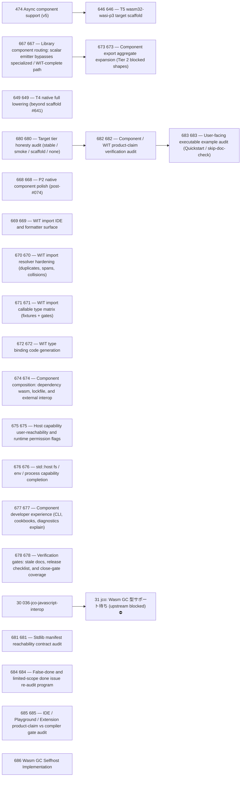

# Issue Dependency Graph

Auto-generated by `scripts/gen/generate-issue-index.py`. Do not edit manually.

## Mermaid graph

## Adjacency list

- **30** depends on: 27; blocks: none
- **474** depends on: 035, done), 074; blocks: 646
- **649** depends on: 641; blocks: none
- **667** depends on: 666; blocks: 673
- **668** depends on: 074, done), 510, done); blocks: none
- **669** depends on: 652, done); blocks: none
- **670** depends on: 653, done); blocks: none
- **671** depends on: 653, 654; blocks: none
- **672** depends on: 664, done); blocks: none
- **674** depends on: 443, 663, 665; blocks: none
- **675** depends on: 446, 447, 655, 656, 657, 658, done); blocks: none
- **676** depends on: 076, done), 445, done); blocks: none
- **677** depends on: 475, 485; blocks: none
- **678** depends on: none; blocks: none
- **680** depends on: 679; blocks: 682
- **681** depends on: 679; blocks: none
- **684** depends on: none; blocks: none
- **685** depends on: 679; blocks: none
- **686** depends on: none; blocks: none
- **646** depends on: 474; blocks: none
- **673** depends on: 648, 660, 667; blocks: none
- **682** depends on: 679, 680; blocks: 683
- **683** depends on: 679, 682; blocks: none

### Blocked

- **31** ⛔ blocked — depends on: 30; blocked by: jco upstream (<https://github.com/bytecodealliance/jco>)
