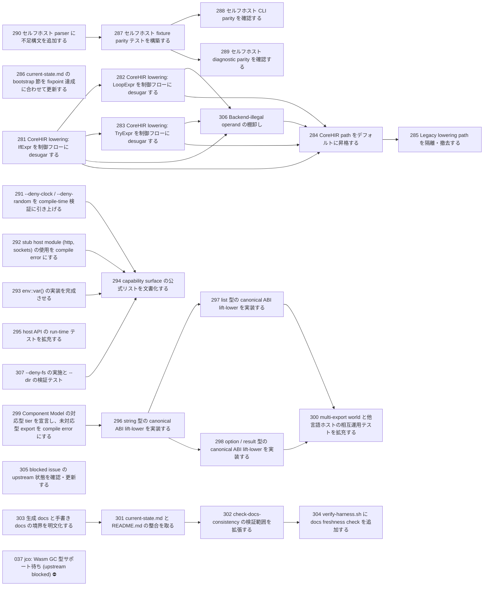

# Issue Dependency Graph

Auto-generated by `scripts/generate-issue-index.sh`. Do not edit manually.

## Mermaid graph

## Adjacency list

- **281** depends on: none; blocks: 282, 283, 284, 306
- **286** depends on: none; blocks: none
- **290** depends on: none; blocks: 287
- **291** depends on: none; blocks: 294
- **292** depends on: none; blocks: 294
- **293** depends on: none; blocks: 294
- **295** depends on: none; blocks: none
- **299** depends on: none; blocks: 296
- **303** depends on: none; blocks: 301
- **305** depends on: none; blocks: none
- **307** depends on: none; blocks: 294
- **282** depends on: 281; blocks: 284, 306
- **283** depends on: 281; blocks: 284, 306
- **287** depends on: 290; blocks: 288, 289
- **296** depends on: 299; blocks: 297, 298
- **301** depends on: 303; blocks: 302
- **294** depends on: 291, 292, 293, 307; blocks: none
- **306** depends on: 281, 282, 283; blocks: 284
- **288** depends on: 287; blocks: none
- **289** depends on: 287; blocks: none
- **297** depends on: 296; blocks: 300
- **298** depends on: 296; blocks: 300
- **302** depends on: 301; blocks: 304
- **284** depends on: 281, 282, 283, 306; blocks: 285
- **300** depends on: 297, 298; blocks: none
- **304** depends on: 302; blocks: none
- **285** depends on: 284; blocks: none

### Blocked

- **037** ⛔ blocked — depends on: 036; blocked by: jco upstream (<https://github.com/bytecodealliance/jco>)
