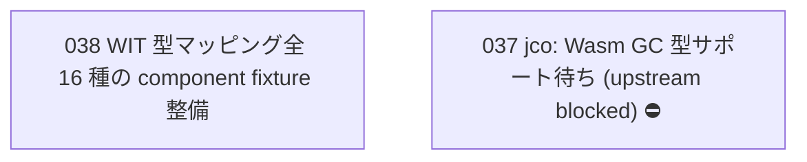

# Issue Dependency Graph

Auto-generated by `scripts/generate-issue-index.sh`. Do not edit manually.

## Mermaid graph

## Adjacency list

- **038** depends on: 028, 029, 030, 031; blocks: none

### Blocked

- **037** ⛔ blocked — depends on: 036; blocked by: jco upstream (https://github.com/bytecodealliance/jco)
