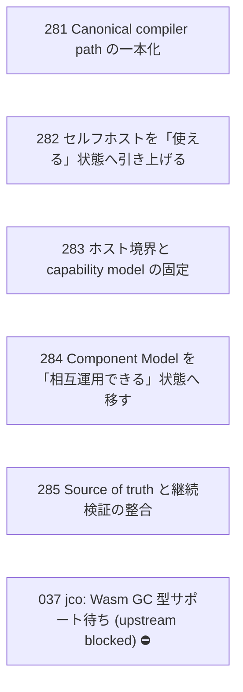

# Issue Dependency Graph

Auto-generated by `scripts/generate-issue-index.sh`. Do not edit manually.

## Mermaid graph

## Adjacency list

- **281** depends on: none; blocks: none
- **282** depends on: none; blocks: none
- **283** depends on: none; blocks: none
- **284** depends on: none; blocks: none
- **285** depends on: none; blocks: none

### Blocked

- **037** ⛔ blocked — depends on: 036; blocked by: jco upstream (<https://github.com/bytecodealliance/jco>)
