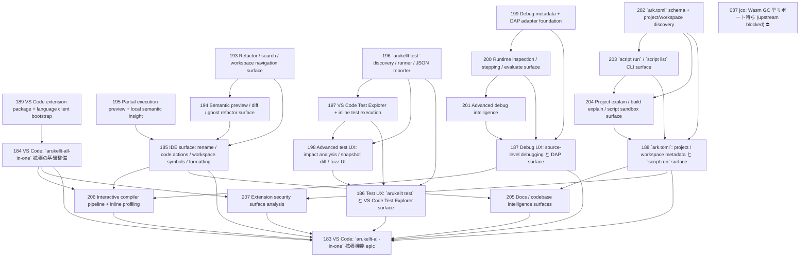

# Issue Dependency Graph

Auto-generated by `scripts/generate-issue-index.sh`. Do not edit manually.

## Mermaid graph

## Adjacency list

- **189** depends on: none; blocks: 184
- **193** depends on: none; blocks: 185, 194
- **195** depends on: none; blocks: 185
- **196** depends on: none; blocks: 186, 197, 198
- **199** depends on: none; blocks: 187, 200
- **202** depends on: 124; blocks: 188, 203, 204
- **184** depends on: 189, 190, 191; blocks: 183, 206, 207
- **194** depends on: 193; blocks: 185
- **197** depends on: 196; blocks: 186, 198
- **200** depends on: 199; blocks: 187, 201
- **203** depends on: 202; blocks: 188, 204
- **185** depends on: 192, 193, 194, 195; blocks: 183, 205, 206
- **198** depends on: 196, 197; blocks: 186
- **201** depends on: 200; blocks: 187
- **204** depends on: 202, 203; blocks: 188
- **186** depends on: 196, 197, 198; blocks: 183
- **187** depends on: 199, 200, 201; blocks: 183, 206
- **188** depends on: 202, 203, 204; blocks: 183, 205, 207
- **206** depends on: 184, 185, 187; blocks: 183
- **205** depends on: 185, 188; blocks: 183
- **207** depends on: 184, 188; blocks: 183
- **183** depends on: 184, 185, 186, 187, 188, 205, 206, 207; blocks: none

### Blocked

- **037** ⛔ blocked — depends on: 036; blocked by: jco upstream (<https://github.com/bytecodealliance/jco>)
