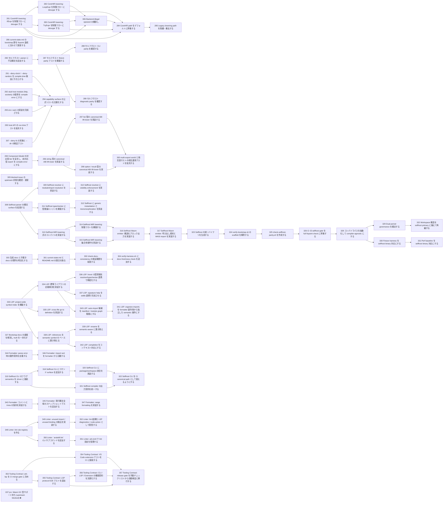

# Issue Dependency Graph

Auto-generated by `scripts/generate-issue-index.sh`. Do not edit manually.

## Mermaid graph

## Adjacency list

- **281** depends on: none; blocks: 282, 283, 284, 306
- **286** depends on: none; blocks: none
- **290** depends on: none; blocks: 287
- **291** depends on: none; blocks: 294
- **292** depends on: none; blocks: 294
- **293** depends on: none; blocks: 294
- **295** depends on: none; blocks: none
- **299** depends on: none; blocks: 296
- **303** depends on: none; blocks: 301
- **305** depends on: none; blocks: none
- **307** depends on: none; blocks: 294
- **308** depends on: none; blocks: 309, 311, 313
- **319** depends on: none; blocks: 318, 321
- **327** depends on: none; blocks: none
- **333** depends on: none; blocks: 334, 335, 338
- **343** depends on: none; blocks: 345
- **344** depends on: none; blocks: 346
- **348** depends on: none; blocks: 349, 350
- **353** depends on: none; blocks: 354, 355
- **282** depends on: 281; blocks: 284, 306
- **283** depends on: 281; blocks: 284, 306
- **287** depends on: 290; blocks: 288, 289
- **296** depends on: 299; blocks: 297, 298
- **301** depends on: 303; blocks: 302
- **294** depends on: 291, 292, 293, 307; blocks: none
- **309** depends on: 308; blocks: 310
- **311** depends on: 308; blocks: 312
- **313** depends on: 308; blocks: 314, 315
- **318** depends on: 319; blocks: 320
- **321** depends on: 319; blocks: 322
- **334** depends on: 333; blocks: 336, 337, 340
- **335** depends on: 333; blocks: none
- **338** depends on: 333; blocks: 339, 342
- **345** depends on: 343; blocks: 347
- **346** depends on: 344; blocks: none
- **349** depends on: 348; blocks: 352
- **350** depends on: 348; blocks: 351
- **354** depends on: 353; blocks: 357
- **355** depends on: 353; blocks: 356, 357
- **306** depends on: 281, 282, 283; blocks: 284
- **288** depends on: 287; blocks: none
- **289** depends on: 287; blocks: none
- **297** depends on: 296; blocks: 300
- **298** depends on: 296; blocks: 300
- **302** depends on: 301; blocks: 304
- **310** depends on: 309; blocks: none
- **312** depends on: 311; blocks: none
- **314** depends on: 313; blocks: 316
- **315** depends on: 313; blocks: 316
- **320** depends on: 318; blocks: 322
- **336** depends on: 334; blocks: none
- **337** depends on: 334; blocks: none
- **340** depends on: 334; blocks: 341
- **339** depends on: 338; blocks: none
- **342** depends on: 338; blocks: none
- **347** depends on: 345; blocks: none
- **352** depends on: 349; blocks: none
- **351** depends on: 350; blocks: none
- **356** depends on: 355; blocks: 357
- **284** depends on: 281, 282, 283, 306; blocks: 285
- **300** depends on: 297, 298; blocks: none
- **304** depends on: 302; blocks: none
- **316** depends on: 314, 315; blocks: 317
- **322** depends on: 320, 321; blocks: none
- **341** depends on: 340; blocks: none
- **357** depends on: 354, 355, 356; blocks: none
- **285** depends on: 284; blocks: none
- **317** depends on: 316; blocks: 323
- **323** depends on: 317; blocks: 324
- **324** depends on: 323; blocks: 325
- **325** depends on: 324; blocks: 326
- **326** depends on: 325; blocks: 328
- **328** depends on: 326; blocks: 329, 330
- **329** depends on: 328; blocks: 332
- **330** depends on: 328; blocks: 331
- **332** depends on: 329; blocks: none
- **331** depends on: 330; blocks: none

### Blocked

- **037** ⛔ blocked — depends on: 036; blocked by: jco upstream (<https://github.com/bytecodealliance/jco>)
