# Issue Dependency Graph

Auto-generated by `scripts/gen/generate-issue-index.sh`. Do not edit manually.

## Mermaid graph

```mermaid
graph LR
  I032["032 WIT resource type support (own/borrow)"]
  I036["036 jco JavaScript interop smoke test"]
  I039["039 std モジュールシステム基盤: `use std::*` import インフラ"]
  I064["064 Wasm Branch Hinting: カスタムセクションによるブランチ予測ヒント"]
  I066["066 Wasm Bulk Memory: memory.copy / memory.fill / table.copy フル対応"]
  I070["070 Wasm GC i31ref: 小整数 unboxed scalar 最適化"]
  I072["072 Wasm Multi-Value: ブロック / ループの複数値返却フル活用"]
  I074["074 WASI P2 ネイティブ: P1 アダプタ不要のコンポーネント直接生成"]
  I094["094 T3: enum dispatch の br_on_cast 連鎖最適化"]
  I095["095 T3: struct フィールドレイアウト最適化 (アクセス頻度ベース)"]
  I096["096 コンパイル速度: 未使用 stdlib 関数の遅延解決 (lazy-resolve)"]
  I099["099 コンパイル速度: インクリメンタル解析 (ファイル変更差分のみ再パース)"]
  I108["108 実行時性能: hello.wasm 1KB 以下 達成プラン"]
  I110["110 CI perf gate: コンパイル時間・実行時間・バイナリサイズ閾値チェック"]
  I112["112 ベンチマーク比較: C/Rust/Go/Grain との自動比較スクリプト"]
  I123["123 import 構文と WIT パッケージ識別子の統一方針決定"]
  I125["125 `compile()` のデフォルトを CoreHIR パスに移行 (Legacy パス廃止)"]
  I129["129 T1 エミッター (t1_wasm32_p1.rs 9465行) をサブモジュールに分割"]
  I130["130 MIR lower.rs (4360行) をサブモジュールに分割"]
  I134["134 ark-lexer lib.rs (1698行) をサブモジュールに分割"]
  I135["135 ark-diagnostics lib.rs (1099行) をサブモジュールに分割"]
  I154["154 横断基盤: `scripts/run/verify-bootstrap.sh` と fixpoint 検証 scaffold"]
  I157["157 ADR-004 P4: メソッド構文 / trait 再評価"]
  I194["194 Semantic preview / diff / ghost refactor surface"]
  I195["195 Partial execution preview + local semantic insight"]
  I198["198 Advanced test UX: impact analysis / snapshot diff / fuzz UI"]
  I200["200 Runtime inspection / stepping / evaluate surface"]
  I204["204 Project explain / build explain / script sandbox surface"]
  I206["206 Interactive compiler pipeline + inline profiling"]
  I249["249 migration guide v4→v5: self-hosted compiler bootstrap"]
  I251["251 ターゲットマトリクスを「宣言」ではなく、継続検証される実行契約にする"]
  I252["252 テスト戦略を fixture harness 中心から、品質面全体を覆う検証体系へ再編する"]
  I253["253 セルフホスト達成条件を厳密化し、「できたかどうか」を曖昧にしない"]
  I254["254 VS Code 拡張を、手動確認前提の bootstrap から、E2E で壊れにくい製品面へ引き上げる"]
  I255["255 デバッグ体験を「DAP の箱がある」状態から、実際に使える end-to-end workflow にする"]
  I282["282 CoreHIR lowering: LoopExpr を制御フローに desugar する"]
  I283["283 CoreHIR lowering: TryExpr を制御フローに desugar する"]
  I285["285 Legacy lowering path を隔離・撤去する"]
  I286["286 bootstrap セクションの fixpoint 記述整合を再検証する"]
  I289["289 セルフホスト diagnostic parity を確認する"]
  I301["301 current-state.md と README.md の整合を取る"]
  I312["312 Selfhost に generic instantiation と monomorphization を実装する"]
  I382["382 Playground: wasm32-freestanding (T2) target の downstream 実装を開始する"]
  I453["453 VSCode API を使った editor behavior E2E テストを追加する"]
  I459["459 selfhost Stage 2 fixpoint 達成と dual-period 終了計画"]
  I464["464 `arukellt init` のテンプレート拡充と新規ユーザー導線整備"]
  I469["469 Extension: playground surface は repo で証明できる endpoint だけを指す"]
  I472["472 Playground: type-checker product claim を独立 issue に分離する"]
  I494["494 494 — Selfhost MIR: SSA formation pass"]
  I499["499 499 — Selfhost compiler: closure capture environment lowering"]
  I504["504 504 — Selfhost: trait/interface syntax and impl-block infrastructure"]
  I511["511 Stdlib: 数値タグ / if 連鎖を enum + match 優先へ移行する"]
  I513["513 Stdlib: prelude 直叩き前提を減らし、安全な wrapper surface を優先する"]
  I514["514 Stdlib: 実装品質監査 (hash / parsing / collection algorithm の甘さ) を実施する"]
  I515["515 Stdlib: sentinel 値 / raw String error を Result / Option / Error enum に寄せる"]
  I516["516 Stdlib: raw helper と推奨 facade の境界を再設計する"]
  I517["517 Stdlib: canonical naming / module layering / surface consistency の第2監査"]
  I519["519 Stdlib: property / differential / parity test を family 横断で拡張する"]
  I520["520 Stdlib: allocation / complexity / perf footgun を family 横断で監査する"]
  I473["473 Resource type v3+: 継承・async drops・クロスコンポーネント転送・ハンドル GC"]
  I041["041 std::core: Error 型、ordering、range、cmp、math、convert、hash"]
  I043["043 std::bytes: Bytes、ByteBuf、ByteCursor、endian、hex、base64、leb128"]
  I051["051 std::time + std::random: 時刻・期間・乱数"]
  I077["077 WASI P2: `std::host::http` facade と runtime 検証"]
  I124["124 WIT コンポーネント import — ソース構文・ark.toml・型バインディング生成"]
  I139["139 WASI P2: `std::host::sockets` facade と T3 実行検証"]
  I474["474 Async Component Support (v5/T5)"]
  I475["475 `arukellt component` サブコマンド (v3 候補)"]
  I476["476 `wasm-tools compose` 統合 (v3 候補)"]
  I510["510 T3 emitter: WASI P2 import-table switch (full P2-native component)"]
  I126["126 `run_frontend()` の二重 lower を解消 (遅延 lower)"]
  I201["201 Advanced debug intelligence"]
  I188["188 `ark.toml`: project / workspace metadata と `script run` surface"]
  I266["266 selfhost 完了条件を定義し文書に固定する"]
  I508["508 Legacy path removal is blocked by CoreHIR lowerer stub"]
  I495["495 495 — Selfhost typechecker: trait bounds and constraint solving"]
  I518["518 Stdlib: docs / fixtures / cookbook を「良い Arukellt コード例」として再監査する"]
  I044["044 std::collections::hash: HashMap\<K,V\> 汎用化と HashSet\<T\>"]
  I045["045 std::collections: Deque、PriorityQueue"]
  I047["047 std::collections: Arena、SlotMap、Interner ／ std::text: Rope"]
  I048["048 std::seq: Seq\<T\> 遅延シーケンスとアルゴリズム"]
  I049["049 std::path + std::fs: パス操作とファイル I/O"]
  I136["136 ADR-011 に沿った `std::host` layer の段階的ロールアウト"]
  I485["485 docs: arukellt component サブコマンド CLI リファレンス"]
  I205["205 Docs / codebase intelligence surfaces"]
  I214["214 Extension quality / packaging / marketplace readiness"]
  I267["267 verify-bootstrap.sh を達成判定本体へ昇格させる"]
  I512["512 Stdlib: trait ベースの再利用可能 surface へ段階移行する"]
  I054["054 std::wit + std::component: WIT 型、resource handle、canonical ABI"]
  I268["268 Stage1 fixture parity・CLI parity・diagnostic parity を CI で継続検証する"]
  I269["269 Rust 実装と selfhost 実装の dual period 終了条件を定義する"]
  I028["028 WIT import parsing & host function binding"]
  I034["034 CLI --wit flag, --emit component workflow, docs"]
  I037["037 jco: Wasm GC 型サポート待ち (upstream blocked) ⛔"]
  I032 --> I473
  I039 --> I041
  I039 --> I043
  I039 --> I051
  I074 --> I077
  I074 --> I124
  I074 --> I139
  I074 --> I474
  I074 --> I475
  I074 --> I476
  I074 --> I510
  I125 --> I126
  I200 --> I201
  I204 --> I188
  I253 --> I266
  I285 --> I508
  I312 --> I495
  I504 --> I495
  I513 --> I518
  I517 --> I518
  I039 --> I044
  I041 --> I044
  I039 --> I045
  I041 --> I045
  I039 --> I047
  I041 --> I047
  I039 --> I048
  I041 --> I048
  I039 --> I049
  I041 --> I049
  I077 --> I136
  I139 --> I136
  I475 --> I485
  I188 --> I205
  I188 --> I214
  I266 --> I267
  I504 --> I512
  I495 --> I512
  I039 --> I054
  I044 --> I054
  I267 --> I268
  I266 --> I269
  I268 --> I269
  I028 --> I028
  I028 --> I034
  I036 --> I037
```

## Adjacency list

- **032** depends on: 030; blocks: 473
- **036** depends on: 033; blocks: none
- **039** depends on: none; blocks: 041, 043, 044, 045, 047, 048, 049, 051, 054
- **064** depends on: none; blocks: none
- **066** depends on: none; blocks: none
- **070** depends on: none; blocks: none
- **072** depends on: none; blocks: none
- **074** depends on: none; blocks: 077, 124, 139, 474, 475, 476, 510
- **094** depends on: none; blocks: none
- **095** depends on: none; blocks: none
- **096** depends on: none; blocks: none
- **099** depends on: none; blocks: none
- **108** depends on: 091, 092, 088, 089; blocks: none
- **110** depends on: 109; blocks: none
- **112** depends on: 109; blocks: none
- **123** depends on: none; blocks: none
- **125** depends on: none; blocks: 126
- **129** depends on: none; blocks: none
- **130** depends on: none; blocks: none
- **134** depends on: none; blocks: none
- **135** depends on: none; blocks: none
- **154** depends on: 153; blocks: none
- **157** depends on: none; blocks: none
- **194** depends on: 193; blocks: none
- **195** depends on: none; blocks: none
- **198** depends on: 196, 197; blocks: none
- **200** depends on: 199; blocks: 201
- **204** depends on: 202, 203; blocks: 188
- **206** depends on: 184, 185, 187; blocks: none
- **249** depends on: none; blocks: none
- **251** depends on: none; blocks: none
- **252** depends on: none; blocks: none
- **253** depends on: none; blocks: 266
- **254** depends on: none; blocks: none
- **255** depends on: none; blocks: none
- **282** depends on: 281; blocks: none
- **283** depends on: 281; blocks: none
- **285** depends on: 284; blocks: 508
- **286** depends on: none; blocks: none
- **289** depends on: 287; blocks: none
- **301** depends on: 303; blocks: none
- **312** depends on: 311; blocks: 495
- **382** depends on: 378; blocks: none
- **453** depends on: 450, 451, 452; blocks: none
- **459** depends on: 445, 446, 447, 448, 449; blocks: none
- **464** depends on: none; blocks: none
- **469** depends on: 466, 468; blocks: none
- **472** depends on: 466; blocks: none
- **494** depends on: 493, 503; blocks: none
- **499** depends on: none; blocks: none
- **504** depends on: none; blocks: 495, 512
- **511** depends on: none; blocks: none
- **513** depends on: none; blocks: 518
- **514** depends on: none; blocks: none
- **515** depends on: none; blocks: none
- **516** depends on: none; blocks: none
- **517** depends on: none; blocks: 518
- **519** depends on: none; blocks: none
- **520** depends on: none; blocks: none
- **473** depends on: 032, done); blocks: none
- **041** depends on: 039; blocks: 044, 045, 047, 048, 049
- **043** depends on: 039, 040; blocks: none
- **051** depends on: 039, 040; blocks: none
- **077** depends on: 074, 137; blocks: 136
- **124** depends on: 074; blocks: none
- **139** depends on: 074, 137; blocks: 136
- **474** depends on: 035, done), 074; blocks: none
- **475** depends on: 035, done), 074; blocks: 485
- **476** depends on: 035, done), 074; blocks: none
- **510** depends on: 074; blocks: none
- **126** depends on: 125; blocks: none
- **201** depends on: 200; blocks: none
- **188** depends on: 202, 203, 204; blocks: 205, 214
- **266** depends on: 253; blocks: 267, 269
- **508** depends on: 285; blocks: none
- **495** depends on: 312, 504; blocks: 512
- **518** depends on: 513, 517; blocks: none
- **044** depends on: 039, 041; blocks: 054
- **045** depends on: 039, 041; blocks: none
- **047** depends on: 039, 041; blocks: none
- **048** depends on: 039, 041; blocks: none
- **049** depends on: 039, 041, 042; blocks: none
- **136** depends on: 137, 138, 077, 139; blocks: none
- **485** depends on: 475; blocks: none
- **205** depends on: 185, 188; blocks: none
- **214** depends on: 184, 185, 186, 187, 188; blocks: none
- **267** depends on: 266; blocks: 268
- **512** depends on: 504, 495; blocks: none
- **054** depends on: 039, 044, 053; blocks: none
- **268** depends on: 267; blocks: 269
- **269** depends on: 266, 268; blocks: none
- **028** depends on: 028; blocks: 028, 034
- **034** depends on: 030, 031, 028; blocks: none

### Blocked

- **037** ⛔ blocked — depends on: 036; blocked by: jco upstream (<https://github.com/bytecodealliance/jco>)
