# Issue Dependency Graph

Auto-generated by `scripts/gen/generate-issue-index.py`. Do not edit manually.

## Mermaid graph

```mermaid
graph LR
  I30["30 036-jco-javascript-interop"]
  I474["474 Async component support (v5)"]
  I60["60 074-wasi-p2-native-component"]
  I62["62 076-wasi-p2-filesystem"]
  I649["649 649 — T4 native full lowering (beyond scaffold #641)"]
  I667["667 667 — Library component routing: scalar emitter bypasses specialized / WIT-complete path"]
  I669["669 669 — WIT import IDE and formatter surface"]
  I670["670 670 — WIT import resolver hardening (duplicates, spans, collisions)"]
  I671["671 671 — WIT import callable type matrix (fixtures + gates)"]
  I672["672 672 — WIT type binding code generation"]
  I674["674 674 — Component composition: dependency wasm, lockfile, and external interop"]
  I675["675 675 — Host capability user-reachability and runtime permission flags"]
  I676["676 676 — std::host fs / env / process capability completion"]
  I677["677 677 — Component developer experience (CLI, cookbooks, diagnostics explain)"]
  I678["678 678 — Verification gates: stale docs, release checklist, and close-gate coverage"]
  I680["680 680 — Target tier honesty audit (stable / smoke / scaffold / none)"]
  I681["681 681 — Stdlib manifest reachability contract audit"]
  I684["684 684 — False-done and limited-scope done issue re-audit program"]
  I685["685 685 — IDE / Playground / Extension product-claim vs compiler gate audit"]
  I686["686 Wasm GC Selfhost Implementation"]
  I687["687 687 — HashMap / HashSet Rust parity gap audit and closure"]
  I690["690 690 — `?` operator and `From<E>` error conversion"]
  I691["691 691 — `Iterator` trait, lazy adapters, and `FromIterator` / `collect`"]
  I693["693 693 — `Read` / `Write` / `BufRead` / `Seek` traits and IO unification"]
  I695["695 695 — `Ord` / `PartialOrd` traits and comparison-based algorithms"]
  I696["696 696 — `Debug` trait and `format!` / `write!` formatting ecosystem"]
  I702["702 702 — Integrate `to_string` / `clone` / `hash` builtins into trait dispatch"]
  I704["704 std::json Full JSON RFC 8259 Compliance"]
  I705["705 std::toml Full TOML 1.0 Compliance"]
  I706["706 std::wit Full WIT 1.0 Compliance"]
  I708["708 708 — `TryFrom` / `TryInto` traits for fallible conversions"]
  I714["714 714 — Emitter-native WASI P2 component output without wrapper"]
  I715["715 715 — In-file test coverage targets for compiler and stdlib"]
  I718["718 718 — Stdlib free-function → method/trait migration inventory"]
  I721["721 Final Types (`sub final`) を全 struct に適用"]
  I722["722 Typed Function References (`call_ref`) ベンチマーク計測"]
  I723["723 Wasm Exception Handling (`exnref`) 統合の検討"]
  I724["724 ADR-040 Phase 3b-7: Typed MIR Signature Registry 残作業"]
  I725["725 ADR-040 Phase 5e: 命令トレーサ完全削除 (infer_ref_local_gc_type_depth)"]
  I728["728 728 — WIR / backend target IR for ADR-007 multi-target separation"]
  I760["760 ADR 台帳の規則追従 — research/plans 分離と supersession 整合"]
  I791["791 791 — Eliminate the Ark canonical parser baseline"]
  I807["807 807 — Fixture parity: 367 remaining failures"]
  I809["809 809 — WAT roundtrip failure"]
  I810["810 810 — Component interop failures"]
  I811["811 811 — Selfhost CLI parity drift"]
  I812["812 812 — Selfhost diagnostic parity drift"]
  I813["813 813 — Selfhost fixpoint not reached"]
  I815["815 815 — Diagnostic/T3 compile skips"]
  I816["816 816 — Prelude compilation restoration"]
  I817["817 817 — Sealed raw API module for Vec/String internal representation"]
  I646["646 646 — T5 wasm32-wasi-p3 target scaffold"]
  I673["673 673 — Component export aggregate expansion (Tier 2 blocked shapes)"]
  I682["682 682 — Component / WIT product-claim verification audit"]
  I698["698 698 — std::simd explicit SIMD library API and v128 first-class type"]
  I716["716 GC target intrinsic stub completion (silent-wrong-result backfill)"]
  I801["801 GC 完了までのプラン"]
  I808["808 808 — T3/Wasm validation failures"]
  I694["694 694 — `Error` trait and unified error type ecosystem"]
  I697["697 697 — `Vec<T>` operation extension (windows / chunks / retain / sort_by / drain / splice)"]
  I703["703 703 — Monomorphic API cutover (ADR-036 D2 + ADR-046)"]
  I668["668 668 — P2 native component polish (post-#074)"]
  I727["727 727 — Retire `arukellt_host` custom host bridge; migrate HTTP/sockets to standard WASI P2/P3 imports"]
  I719["719 719 — `arukellt test` execution harness (ADR-041 Phase 2)"]
  I799["799 799 — CQ-18: code-quality closed-loop strict final audit"]
  I726["726 T3 WASM validation failures: validate-fail 修正（GC ref 型推論バグ）"]
  I729["729 729 — Intrinsic layer separation (unblocked epic)"]
  I800["800 800 — Batch multi-file fmt to amortize wasmtime cold-start"]
  I814["814 814 — Formatter/parser exceptions (23 files)"]
  I820["820 820 — Bounded stdlib-only inliner"]
  I683["683 683 — User-facing executable example audit (Quickstart / skip-doc-check)"]
  I699["699 699 — T4 LLVM native SIMD lowering for std::simd"]
  I709["709 709 — Stdlib trait-first API policy and free-function eradication"]
  I819["819 819 — Runtime ABI CoreOp lowering and emitter host-operation removal"]
  I730["730 730 — Bootstrap wasm 4GB memory limit blocks pinned wasm refresh"]
  I821["821 821 — Pure semantic stdlib migration"]
  I822["822 822 — Representation-dependent and allocating stdlib migration"]
  I710["710 710 — Linear collection ADTs: `Deque<T>` / queue / stack / list type surface"]
  I823["823 Selfhost compile latency: remove quadratic MIR vector rebuilds"]
  I818["818 818 — CoreOpRegistry production scaffold exit"]
  I711["711 711 — Rich stdlib reference docs with crates.io / docs.rs / JSR readability"]
  I824["824 Early body lowering (worklist; design first)"]
  I825["825 AST cache format repair (not “re-enable as-is”)"]
  I826["826 P2a: symbol / path interning + hot-path clone audit"]
  I827["827 P2b: phase arena (only after heap lifetime / ownership)"]
  I712["712 712 — LLM code quality signal gates for readability and stdlib misuse"]
  I713["713 713 — Stdlib and Arukellt code best-practices doc pack"]
  I31["31 jco: Wasm GC 型サポート待ち (upstream blocked) ⛔"]
  I474 --> I646
  I667 --> I673
  I680 --> I682
  I686 --> I698
  I649 --> I698
  I686 --> I716
  I686 --> I801
  I686 --> I808
  I690 --> I694
  I691 --> I697
  I695 --> I697
  I691 --> I703
  I695 --> I703
  I714 --> I668
  I714 --> I727
  I675 --> I727
  I715 --> I719
  I715 --> I799
  I724 --> I726
  I724 --> I729
  I791 --> I800
  I791 --> I814
  I816 --> I820
  I682 --> I683
  I649 --> I699
  I698 --> I699
  I691 --> I709
  I695 --> I709
  I697 --> I709
  I703 --> I709
  I727 --> I819
  I726 --> I730
  I816 --> I821
  I820 --> I821
  I816 --> I822
  I817 --> I822
  I820 --> I822
  I691 --> I710
  I697 --> I710
  I709 --> I710
  I730 --> I823
  I816 --> I818
  I817 --> I818
  I819 --> I818
  I820 --> I818
  I821 --> I818
  I822 --> I818
  I681 --> I711
  I709 --> I711
  I710 --> I711
  I823 --> I824
  I823 --> I825
  I823 --> I826
  I730 --> I827
  I823 --> I827
  I709 --> I712
  I711 --> I712
  I709 --> I713
  I711 --> I713
  I712 --> I713
  I30 --> I31
```

## Adjacency list

- **30** depends on: 27, 037; blocks: none
- **474** depends on: 035, done), 074; blocks: 646
- **60** depends on: 510, 121; blocks: none
- **62** depends on: 074, 510; blocks: none
- **649** depends on: 641; blocks: 698, 699
- **667** depends on: 666; blocks: 673
- **669** depends on: 652, done); blocks: none
- **670** depends on: 653, done); blocks: none
- **671** depends on: 653, 654; blocks: none
- **672** depends on: 664, done); blocks: none
- **674** depends on: 443, 663, 665; blocks: none
- **675** depends on: 446, 447, 655, 656, 657, 658, done); blocks: 727
- **676** depends on: 076, done), 445, done); blocks: none
- **677** depends on: 475, 485; blocks: none
- **678** depends on: none; blocks: none
- **680** depends on: 679; blocks: 682
- **681** depends on: 679; blocks: 711
- **684** depends on: none; blocks: none
- **685** depends on: 679; blocks: none
- **686** depends on: none; blocks: 698, 716, 801, 808
- **687** depends on: 495; blocks: none
- **690** depends on: 688; blocks: 694
- **691** depends on: 688, 707; blocks: 697, 703, 709, 710
- **693** depends on: 688, 692; blocks: none
- **695** depends on: 688; blocks: 697, 703, 709
- **696** depends on: 688, 692; blocks: none
- **702** depends on: 688, 700, 692; blocks: none
- **704** depends on: 606; blocks: none
- **705** depends on: 606; blocks: none
- **706** depends on: 606; blocks: none
- **708** depends on: 692, 707; blocks: none
- **714** depends on: 074, 510; blocks: 668, 727
- **715** depends on: 041, done); blocks: 719, 799
- **718** depends on: 700, 701; blocks: none
- **721** depends on: none; blocks: none
- **722** depends on: none; blocks: none
- **723** depends on: none; blocks: none
- **724** depends on: none; blocks: 726, 729
- **725** depends on: None; blocks: none
- **728** depends on: none; blocks: none
- **760** depends on: none; blocks: none
- **791** depends on: 785; blocks: 800, 814
- **807** depends on: 287, framework); blocks: none
- **809** depends on: none; blocks: none
- **810** depends on: none; blocks: none
- **811** depends on: none; blocks: none
- **812** depends on: none; blocks: none
- **813** depends on: 459, framework); blocks: none
- **815** depends on: none; blocks: none
- **816** depends on: 798; blocks: 818, 820, 821, 822
- **817** depends on: 798; blocks: 818, 822
- **646** depends on: 474; blocks: none
- **673** depends on: 648, 660, 667; blocks: none
- **682** depends on: 679, 680; blocks: 683
- **698** depends on: 686, 649; blocks: 699
- **716** depends on: 686; blocks: none
- **801** depends on: 686; blocks: none
- **808** depends on: 686; blocks: none
- **694** depends on: 690, 692; blocks: none
- **697** depends on: 691, 695; blocks: 709, 710
- **703** depends on: 700, 701, 691, 695; blocks: 709
- **668** depends on: 074, 510, 714; blocks: none
- **727** depends on: 714, 675; blocks: 819
- **719** depends on: 715; blocks: none
- **799** depends on: 715, 796, 797; blocks: none
- **726** depends on: 724; blocks: 730
- **729** depends on: 724; blocks: none
- **800** depends on: 791; blocks: none
- **814** depends on: 791; blocks: none
- **820** depends on: 798, 816; blocks: 818, 821, 822
- **683** depends on: 679, 682; blocks: none
- **699** depends on: 649, 698; blocks: none
- **709** depends on: 691, 695, 697, 703; blocks: 710, 711, 712, 713
- **819** depends on: 727, 798; blocks: 818
- **730** depends on: 726; blocks: 823, 827
- **821** depends on: 798, 816, 820; blocks: 818
- **822** depends on: 798, 816, 817, 820; blocks: 818
- **710** depends on: 691, 697, 701, 707, 709; blocks: 711
- **823** depends on: 730; blocks: 824, 825, 826, 827
- **818** depends on: 798, 816, 817, 819, 820, 821, 822; blocks: none
- **711** depends on: 681, 709, 710; blocks: 712, 713
- **824** depends on: 823; blocks: none
- **825** depends on: 823; blocks: none
- **826** depends on: 823; blocks: none
- **827** depends on: 730, 823; blocks: none
- **712** depends on: 709, 711; blocks: 713
- **713** depends on: 709, 711, 712; blocks: none

### Blocked

- **31** ⛔ blocked — depends on: 30; blocked by: jco upstream (<https://github.com/bytecodealliance/jco>)
