# Issue Dependency Graph

Auto-generated by `scripts/generate-issue-index.sh`. Do not edit manually.

## Mermaid graph

```mermaid
graph LR
  I281["281 CoreHIR lowering: IfExpr を制御フローに desugar する"]
  I290["290 セルフホスト parser に不足構文を追加する"]
  I296["296 string 型の canonical ABI lift-lower を実装する"]
  I305["305 blocked issue の upstream 状態を確認・更新する"]
  I308["308 Selfhost parser の構文 surface を拡張する"]
  I319["319 Selfhost CLI のフラグ semantics を driver に接続する"]
  I327["327 Bootstrap docs の重複を解消し truth を一本化する"]
  I337["337 LSP: signature help を stdlib 連携で完成させる"]
  I338["338 LSP: references を semantic symbol ID ベースに置き換える"]
  I356["356 Tooling Contract: CLI / LSP / Extension の機能契約を文書化する"]
  I358["358 Stdlib: host family の stub を解消し stable capability に引き上げる"]
  I363["363 Stdlib Docs: module family ごとの curated overview page を作る"]
  I367["367 Stdlib Docs: deprecated API の移行ガイドを整備する"]
  I368["368 Language Docs: current-first な言語ガイドを spec から分離して作る"]
  I369["369 Language Docs: feature maturity matrix を作成する"]
  I378["378 Playground: execution model を選定し v1 scope を確定する"]
  I395["395 Stdlib Docs: 生成スキーマと metadata 契約を強化する"]
  I397["397 Stdlib Docs: host API の target / capability / warning 表示を統一する"]
  I408["408 Language Docs: normative / explanatory / transitional の境界を ADR と banner で固定する"]
  I412["412 Language Docs: 安定した anchor / permalink 体系を整える"]
  I414["414 Language Docs: transitional / archive banner を一括適用する"]
  I440["440 VSCode Extension: Code Actions・Formatter・Diagnostics を統合し「fix-allが意味を持つ」状態にする"]
  I441["441 VSCode Extension: Workspace / Package / ark.toml を理解した project-aware editor にする"]
  I442["442 Component Model: WIT / Component 生成を「出力できる」から「相互運用可能」に引き上げる"]
  I282["282 CoreHIR lowering: LoopExpr を制御フローに desugar する"]
  I283["283 CoreHIR lowering: TryExpr を制御フローに desugar する"]
  I287["287 セルフホスト fixture parity テストを構築する"]
  I297["297 list 型の canonical ABI lift-lower を実装する"]
  I298["298 option / result 型の canonical ABI lift-lower を実装する"]
  I309["309 Selfhost resolver に module/import resolution を実装する"]
  I311["311 Selfhost typechecker に型推論エンジンを構築する"]
  I313["313 Selfhost MIR lowering: 式のコンパイルを実装する"]
  I318["318 Selfhost CLI にコマンド surface を追加する"]
  I321["321 Selfhost compiler の出力契約を統一する"]
  I339["339 LSP: rename を semantic-aware に置き換える"]
  I357["357 Tooling Contract: release gate を手動チェックリストから自動検証に移行する"]
  I362["362 Stdlib: stability tier を実行時・CI で検証する"]
  I365["365 Stdlib Docs: source-backed な cookbook / recipe 集を拡充する"]
  I396["396 Stdlib Docs: family overview ページを実装し learning path を作る"]
  I400["400 Stdlib Docs: deprecated API の表示と migration cross-link を自動化する"]
  I371["371 Language Docs: 読む順番と entry point を明確化する"]
  I406["406 Language Docs: current-first guide の骨格と章立てを作る"]
  I370["370 Language Docs: spec と guide の同期ポイントを CI で検証する"]
  I407["407 Language Docs: feature maturity matrix の生成元と更新フローを実装する"]
  I379["379 Playground: parser / formatter を Wasm に build しブラウザで動かす"]
  I382["382 Playground: wasm32-freestanding (T2) target の downstream 実装を開始する"]
  I428["428 Playground: v1 の product contract と execution ADR を固定する"]
  I399["399 Stdlib Docs: canonical name / alias / historical name を横断検索できるようにする"]
  I403["403 Stdlib Docs: manifest metadata と生成 docs の整合チェックを拡張する"]
  I443["443 Component Composition: 複数コンポーネントの合成と linking モデルを定義・実装する"]
  I284["284 CoreHIR path をデフォルトに昇格する"]
  I288["288 セルフホスト CLI parity を確認する"]
  I289["289 セルフホスト diagnostic parity を確認する"]
  I310["310 Selfhost resolver に visibility enforcement を実装する"]
  I312["312 Selfhost に generic instantiation と monomorphization を実装する"]
  I314["314 Selfhost MIR lowering: 制御フローを構築する"]
  I315["315 Selfhost MIR lowering: 集合体操作を実装する"]
  I320["320 Selfhost CLI に package/workspace 統合を実装する"]
  I439["439 VSCode Extension: LSP機能を「ローカル補助」から「標準ライブラリ含む完全ナビゲーション」に昇格する"]
  I398["398 Stdlib Docs: recipe と fixtures / examples を結ぶ manifest を作る"]
  I402["402 Stdlib Docs: landing page と読む順番を family 単位で再設計する"]
  I409["409 Language Docs: syntax / type / error / memory の重複記述を統合する"]
  I410["410 Language Docs: guide / reference の例コードを fixture 連動にする"]
  I413["413 Language Docs: entry page に目的別 reading order を実装する"]
  I415["415 Language Docs: spec と guide の drift checker を CI に入れる"]
  I380["380 Playground: editor / diagnostics UI を実装する"]
  I429["429 Playground: parser / formatter / diagnostics の Wasm package と JS wrapper を作る"]
  I433["433 Playground: permalink / share format と圧縮方式を定義する"]
  I435["435 Playground: unsupported target / host capability を明示する UX を入れる"]
  I285["285 Legacy lowering path を隔離・撤去する"]
  I316["316 Selfhost Wasm emitter: 構造化ブロック出力を実装する"]
  I322["322 Selfhost CLI を CI canonical path として使えるようにする"]
  I444["444 VSCode Extension × Component: Playground / Editor から component を直接生成・実行できる導線を作る"]
  I401["401 Stdlib Docs: examples を compile-check して docs drift を防ぐ"]
  I404["404 Stdlib Docs: legacy ページの整理と redirect / archive 方針を実装する"]
  I416["416 Language Docs: ownership map と release gate を定義する"]
  I381["381 Playground: examples loader と share link を実装する"]
  I430["430 Playground: diagnostics worker と incremental parse loop の性能予算を作る"]
  I431["431 Playground: editor shell と syntax highlighting を実装する"]
  I434["434 Playground: shared link の version pinning と再現性を確保する"]
  I317["317 Selfhost Wasm emitter: 呼び出し規約と WASI import を実装する"]
  I405["405 Stdlib Docs: ownership map と release gate を整備する"]
  I432["432 Playground: examples catalog を docs / fixtures と共有する"]
  I436["436 Playground: docs site への統合と navigation を実装する"]
  I437["437 Playground: deployment / preview environment / asset cache 戦略を整える"]
  I323["323 Selfhost の統一バイナリを生成する"]
  I438["438 Playground: privacy / telemetry / error reporting を実装方針付きで定める"]
  I324["324 verify-bootstrap.sh の scaffold を解除する"]
  I325["325 check-selfhost-parity.sh を作成する"]
  I326["326 CI の selfhost gate を full fixpoint check に昇格する"]
  I328["328 コンパイラパスを抽象化して compiler-agnostic にする"]
  I329["329 Dual-period governance を確定する"]
  I330["330 Fixture harness を selfhost binary 対応にする"]
  I332["332 Workspace 構造を selfhost primary に備えて再編する"]
  I331["331 Perf baseline を selfhost binary 対応にする"]
  I037["037 jco: Wasm GC 型サポート待ち (upstream blocked) ⛔"]
  I281 --> I282
  I281 --> I283
  I290 --> I287
  I296 --> I297
  I296 --> I298
  I308 --> I309
  I308 --> I311
  I308 --> I313
  I319 --> I318
  I319 --> I321
  I338 --> I339
  I356 --> I357
  I358 --> I362
  I363 --> I365
  I363 --> I396
  I367 --> I400
  I368 --> I371
  I368 --> I406
  I368 --> I370
  I369 --> I370
  I369 --> I407
  I378 --> I379
  I378 --> I382
  I378 --> I428
  I395 --> I399
  I395 --> I403
  I442 --> I443
  I281 --> I284
  I282 --> I284
  I283 --> I284
  I287 --> I288
  I287 --> I289
  I309 --> I310
  I311 --> I312
  I313 --> I314
  I313 --> I315
  I318 --> I320
  I338 --> I439
  I339 --> I439
  I365 --> I398
  I396 --> I402
  I406 --> I409
  I408 --> I409
  I406 --> I410
  I406 --> I413
  I406 --> I415
  I407 --> I415
  I379 --> I380
  I379 --> I429
  I428 --> I433
  I428 --> I435
  I284 --> I285
  I314 --> I316
  I315 --> I316
  I320 --> I322
  I321 --> I322
  I439 --> I444
  I440 --> I444
  I441 --> I444
  I443 --> I444
  I398 --> I401
  I402 --> I404
  I413 --> I416
  I415 --> I416
  I380 --> I381
  I429 --> I430
  I429 --> I431
  I433 --> I434
  I316 --> I317
  I401 --> I405
  I403 --> I405
  I381 --> I432
  I431 --> I436
  I431 --> I437
  I317 --> I323
  I437 --> I438
  I323 --> I324
  I324 --> I325
  I325 --> I326
  I326 --> I328
  I328 --> I329
  I328 --> I330
  I329 --> I332
  I330 --> I331
```

## Adjacency list

- **281** depends on: none; blocks: 282, 283, 284
- **290** depends on: none; blocks: 287
- **296** depends on: 299; blocks: 297, 298
- **305** depends on: none; blocks: none
- **308** depends on: none; blocks: 309, 311, 313
- **319** depends on: none; blocks: 318, 321
- **327** depends on: none; blocks: none
- **337** depends on: 334; blocks: none
- **338** depends on: 333; blocks: 339, 439
- **356** depends on: 355; blocks: 357
- **358** depends on: none; blocks: 362
- **363** depends on: none; blocks: 365, 396
- **367** depends on: 359; blocks: 400
- **368** depends on: none; blocks: 370, 371, 406
- **369** depends on: none; blocks: 370, 407
- **378** depends on: none; blocks: 379, 382, 428
- **395** depends on: 366; blocks: 399, 403
- **397** depends on: 364; blocks: none
- **408** depends on: none; blocks: 409
- **412** depends on: none; blocks: none
- **414** depends on: 372; blocks: none
- **440** depends on: 341, 346, 348, 349, 350, 352; blocks: 444
- **441** depends on: 333, 335, 340; blocks: 444
- **442** depends on: 299, 300; blocks: 443
- **282** depends on: 281; blocks: 284
- **283** depends on: 281; blocks: 284
- **287** depends on: 290; blocks: 288, 289
- **297** depends on: 296; blocks: none
- **298** depends on: 296; blocks: none
- **309** depends on: 308; blocks: 310
- **311** depends on: 308; blocks: 312
- **313** depends on: 308; blocks: 314, 315
- **318** depends on: 319; blocks: 320
- **321** depends on: 319; blocks: 322
- **339** depends on: 338; blocks: 439
- **357** depends on: 354, 355, 356; blocks: none
- **362** depends on: 358, 360; blocks: none
- **365** depends on: 363; blocks: 398
- **396** depends on: 363; blocks: 402
- **400** depends on: 367; blocks: none
- **371** depends on: 368; blocks: none
- **406** depends on: 368; blocks: 409, 410, 413, 415
- **370** depends on: 368, 369; blocks: none
- **407** depends on: 369; blocks: 415
- **379** depends on: 378; blocks: 380, 429
- **382** depends on: 378; blocks: none
- **428** depends on: 378; blocks: 433, 435
- **399** depends on: 395; blocks: none
- **403** depends on: 395; blocks: 405
- **443** depends on: 442; blocks: 444
- **284** depends on: 281, 282, 283, 306; blocks: 285
- **288** depends on: 287; blocks: none
- **289** depends on: 287; blocks: none
- **310** depends on: 309; blocks: none
- **312** depends on: 311; blocks: none
- **314** depends on: 313; blocks: 316
- **315** depends on: 313; blocks: 316
- **320** depends on: 318; blocks: 322
- **439** depends on: 333, 334, 335, 338, 339; blocks: 444
- **398** depends on: 365; blocks: 401
- **402** depends on: 396; blocks: 404
- **409** depends on: 406, 408; blocks: none
- **410** depends on: 406; blocks: none
- **413** depends on: 406; blocks: 416
- **415** depends on: 406, 407; blocks: 416
- **380** depends on: 379; blocks: 381
- **429** depends on: 379; blocks: 430, 431
- **433** depends on: 428; blocks: 434
- **435** depends on: 428; blocks: none
- **285** depends on: 284; blocks: none
- **316** depends on: 314, 315; blocks: 317
- **322** depends on: 320, 321; blocks: none
- **444** depends on: 439, 440, 441, 443; blocks: none
- **401** depends on: 398; blocks: 405
- **404** depends on: 402; blocks: none
- **416** depends on: 413, 415; blocks: none
- **381** depends on: 380; blocks: 432
- **430** depends on: 429; blocks: none
- **431** depends on: 429; blocks: 436, 437
- **434** depends on: 433; blocks: none
- **317** depends on: 316; blocks: 323
- **405** depends on: 401, 403; blocks: none
- **432** depends on: 381; blocks: none
- **436** depends on: 431; blocks: none
- **437** depends on: 431; blocks: 438
- **323** depends on: 317; blocks: 324
- **438** depends on: 437; blocks: none
- **324** depends on: 323; blocks: 325
- **325** depends on: 324; blocks: 326
- **326** depends on: 325; blocks: 328
- **328** depends on: 326; blocks: 329, 330
- **329** depends on: 328; blocks: 332
- **330** depends on: 328; blocks: 331
- **332** depends on: 329; blocks: none
- **331** depends on: 330; blocks: none

### Blocked

- **037** ⛔ blocked — depends on: 036; blocked by: jco upstream (<https://github.com/bytecodealliance/jco>)
