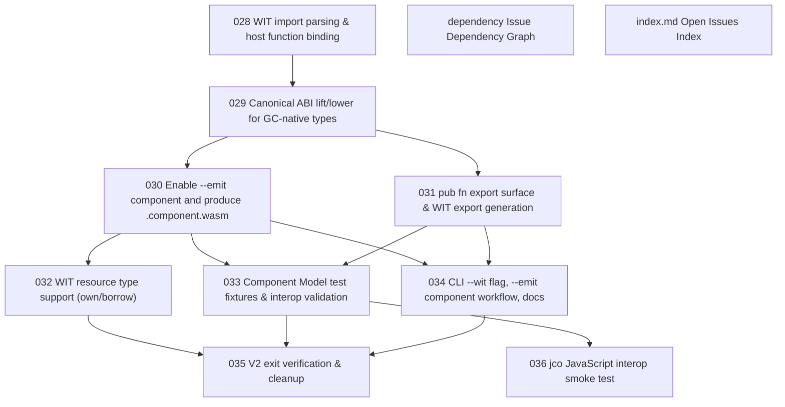

# Issue Dependency Graph

Auto-generated by `scripts/generate-issue-index.sh`. Do not edit manually.

## Mermaid graph

## Adjacency list

- **028** depends on: none; blocks: 029
- **dependency** depends on: none; blocks: none
- **index.md** depends on: none; blocks: none
- **029** depends on: 028; blocks: 030, 031
- **030** depends on: 029; blocks: 032, 033, 034
- **031** depends on: 029; blocks: 033, 034
- **032** depends on: 030; blocks: 035
- **033** depends on: 030, 031; blocks: 035, 036
- **034** depends on: 030, 031; blocks: 035
- **036** depends on: 033; blocks: none
- **035** depends on: 032, 033, 034; blocks: none
