# Issue Dependency Graph

Auto-generated by `scripts/generate-issue-index.sh`. Do not edit manually.

## Mermaid graph

```mermaid
graph TD
  I060["060 Wasm tail-call: return_call / return_call_ref 実装"]
  I061["061 Wasm native 例外処理: try_table / throw / exnref 実装"]
  I062["062 Wasm Memory64: i64 アドレス空間対応"]
  I063["063 Wasm Multi-Memory: 複数メモリモジュール対応"]
  I064["064 Wasm Branch Hinting: カスタムセクションによるブランチ予測ヒント"]
  I065["065 Wasm Extended Const: 定数式での算術演算"]
  I066["066 Wasm Bulk Memory: memory.copy / memory.fill / table.copy フル対応"]
  I067["067 Wasm Sign Extension Ops: i32.extend8_s / i32.extend16_s / i64 版"]
  I068["068 Wasm Reference Types: table.get / table.set / externref フル対応"]
  I069["069 Wasm Typed Function References: ref.func / call_ref フル活用"]
  I070["070 Wasm GC i31ref: 小整数 unboxed scalar 最適化"]
  I071["071 Wasm GC Abstract Heap Types: any/eq/none/func/nofunc の完全活用"]
  I072["072 Wasm Multi-Value: ブロック / ループの複数値返却フル活用"]
  I073["073 WASI P1: 全46 syscall 対応 (clock / random / proc_exit / fd_seek 等)"]
  I074["074 WASI P2 ネイティブ: P1 アダプタ不要のコンポーネント直接生成"]
  I080["080 MIR: LICM (ループ不変式移動) パス"]
  I081["081 MIR: エスケープ解析 + Scalar Replacement パス"]
  I082["082 MIR: gc_hint パス — 短命オブジェクトのパターン検出"]
  I085["085 MIR: CSE (Common Subexpression Elimination) パス"]
  I087["087 MIR: 関数間インライン展開の強化 — 呼び出し回数・サイズ閾値の最適化"]
  I088["088 T3 Peephole: local.get/set 冗長ペア除去"]
  I089["089 T3: 関数型セクション重複排除 (Type Section Dedup)"]
  I092["092 T3: 未使用 WASI import の除去"]
  I093["093 T3: 定数条件 if の emit 時除去"]
  I094["094 T3: enum dispatch の br_on_cast 連鎖最適化"]
  I095["095 T3: struct フィールドレイアウト最適化 (アクセス頻度ベース)"]
  I096["096 コンパイル速度: 未使用 stdlib 関数の遅延解決 (lazy-resolve)"]
  I097["097 コンパイル速度: MIR lowering のアリーナ割り当て"]
  I098["098 コンパイル速度: 並列型チェック (rayon)"]
  I099["099 コンパイル速度: インクリメンタル解析 (ファイル変更差分のみ再パース)"]
  I102["102 コンパイル速度: Lexer / Parser のホットパス最適化"]
  I104["104 実行時性能: GC write barrier 削減 (immutable フィールド検出)"]
  I105["105 実行時性能: 数値型の Narrowing — i32 優先使用"]
  I106["106 実行時性能: 静的文字列インターニング (data segment 参照)"]
  I109["109 ベンチマーク: fib / binary_tree / vec_ops / string_concat / json_parse スイート"]
  I111["111 ツール: Wasm バイナリサイズ内訳分析ツール"]
  I113["113 計測: コンパイラ RSS + 実行時 GC ヒープ計測統合"]
  I115["115 Wasm Name Section: デバッグ用関数名・ローカル名セクション生成"]
  I116["116 Wasm WAT ラウンドトリップ検証 (wat2wasm ⇄ wasm2wat)"]
  I117["117 Component Model: WIT 生成品質の向上と往復検証"]
  I124["124 WIT コンポーネント import — ソース構文・ark.toml・型バインディング生成"]
  I125["125 `compile()` のデフォルトを CoreHIR パスに移行 (Legacy パス廃止)"]
  I128["128 T3 GC エミッター (t3_wasm_gc.rs 8678行) をサブモジュールに分割"]
  I129["129 T1 エミッター (t1_wasm32_p1.rs 9465行) をサブモジュールに分割"]
  I130["130 MIR lower.rs (4360行) をサブモジュールに分割"]
  I131["131 TypeChecker checker.rs (2790行) をサブモジュールに分割"]
  I132["132 Parser parser.rs (2003行) をサブモジュールに分割"]
  I133["133 MIR opt/pipeline.rs (916行) を passes/ ディレクトリに分割"]
  I134["134 ark-lexer lib.rs (1698行) をサブモジュールに分割"]
  I135["135 ark-diagnostics lib.rs (1099行) をサブモジュールに分割"]
  I090["090 T3: 末尾位置の call → return_call 自動変換"]
  I107["107 実行時性能: ループのベクトル化可能性アノテーション"]
  I075["075 WASI P2 ネイティブ: wasi:clocks / wasi:random / wasi:io バインディング"]
  I076["076 WASI P2 ネイティブ: wasi:filesystem ネイティブバインディング"]
  I077["077 WASI P2: wasi:http IncomingHandler / OutgoingHandler 対応"]
  I078["078 WASI P2: wasi:sockets TCP/UDP ネイティブバインディング"]
  I079["079 WASI 0.3-rc: async func / stream<T> / future<T> コンパイルサポート"]
  I121["121 WASI P2: Canonical ABI ハンドリングの堅牢化"]
  I083["083 MIR: ループ展開 (Loop Unrolling) パス"]
  I103["103 実行時性能: 配列境界チェック除去 (Bounds Check Elimination)"]
  I108["108 実行時性能: hello.wasm 1KB 以下 達成プラン"]
  I110["110 CI perf gate: コンパイル時間・実行時間・バイナリサイズ閾値チェック"]
  I112["112 ベンチマーク比較: C/Rust/Go/Grain との自動比較スクリプト"]
  I118["118 Component Model: 複数エクスポート world の自動生成"]
  I126["126 `run_frontend()` の二重 lower を解消 (遅延 lower)"]
  I037["037 jco: Wasm GC 型サポート待ち (upstream blocked) ⛔"]
  I060 --> I090
  I064 --> I107
  I074 --> I075
  I074 --> I076
  I074 --> I077
  I074 --> I078
  I074 --> I079
  I074 --> I121
  I080 --> I083
  I080 --> I103
  I092 --> I108
  I088 --> I108
  I089 --> I108
  I109 --> I110
  I109 --> I112
  I117 --> I118
  I125 --> I126
```

## Adjacency list

- **060** depends on: —; blocks: 090
- **061** depends on: —; blocks: none
- **062** depends on: —; blocks: none
- **063** depends on: —; blocks: none
- **064** depends on: —; blocks: 107
- **065** depends on: —; blocks: none
- **066** depends on: —; blocks: none
- **067** depends on: —; blocks: none
- **068** depends on: —; blocks: none
- **069** depends on: —; blocks: none
- **070** depends on: —; blocks: none
- **071** depends on: —; blocks: none
- **072** depends on: —; blocks: none
- **073** depends on: —; blocks: none
- **074** depends on: —; blocks: 075, 076, 077, 078, 079, 121
- **080** depends on: —; blocks: 083, 103
- **081** depends on: —; blocks: none
- **082** depends on: —; blocks: none
- **085** depends on: —; blocks: none
- **087** depends on: —; blocks: none
- **088** depends on: —; blocks: 108
- **089** depends on: —; blocks: 108
- **092** depends on: —; blocks: 108
- **093** depends on: —; blocks: none
- **094** depends on: —; blocks: none
- **095** depends on: —; blocks: none
- **096** depends on: —; blocks: none
- **097** depends on: —; blocks: none
- **098** depends on: —; blocks: none
- **099** depends on: —; blocks: none
- **102** depends on: 100; blocks: none
- **104** depends on: —; blocks: none
- **105** depends on: —; blocks: none
- **106** depends on: —; blocks: none
- **109** depends on: —; blocks: 110, 112
- **111** depends on: —; blocks: none
- **113** depends on: 100; blocks: none
- **115** depends on: —; blocks: none
- **116** depends on: 114; blocks: none
- **117** depends on: —; blocks: 118
- **124** depends on: 074 (wasi-p2-native-component); blocks: none
- **125** depends on: —; blocks: 126
- **128** depends on: —; blocks: none
- **129** depends on: —; blocks: none
- **130** depends on: —; blocks: none
- **131** depends on: —; blocks: none
- **132** depends on: —; blocks: none
- **133** depends on: —; blocks: none
- **134** depends on: —; blocks: none
- **135** depends on: —; blocks: none
- **090** depends on: 060; blocks: none
- **107** depends on: 064; blocks: none
- **075** depends on: 074; blocks: none
- **076** depends on: 074; blocks: none
- **077** depends on: 074; blocks: none
- **078** depends on: 074; blocks: none
- **079** depends on: 074; blocks: none
- **121** depends on: 074; blocks: none
- **083** depends on: 080; blocks: none
- **103** depends on: 080; blocks: none
- **108** depends on: 091, 092, 088, 089; blocks: none
- **110** depends on: 109; blocks: none
- **112** depends on: 109; blocks: none
- **118** depends on: 117; blocks: none
- **126** depends on: 125; blocks: none

### Blocked

- **037** ⛔ blocked — depends on: 036; blocked by: jco upstream (<https://github.com/bytecodealliance/jco>)
