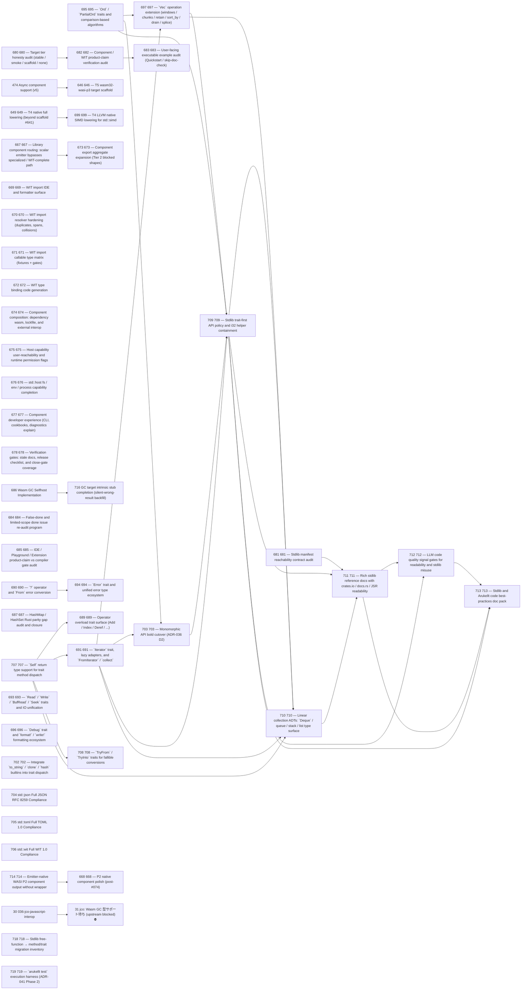

# Issue Dependency Graph

Auto-generated by `scripts/gen/generate-issue-index.py`. Do not edit manually.

## Mermaid graph

## Adjacency list

- **30** depends on: 27; blocks: none
- **474** depends on: 035, done), 074; blocks: 646
- **649** depends on: 641; blocks: 699
- **667** depends on: 666; blocks: 673
- **669** depends on: 652, done); blocks: none
- **670** depends on: 653, done); blocks: none
- **671** depends on: 653, 654; blocks: none
- **672** depends on: 664, done); blocks: none
- **674** depends on: 443, 663, 665; blocks: none
- **675** depends on: 446, 447, 655, 656, 657, 658, done); blocks: none
- **676** depends on: 076, done), 445, done); blocks: none
- **677** depends on: 475, 485; blocks: none
- **678** depends on: none; blocks: none
- **680** depends on: 679; blocks: 682
- **681** depends on: 679; blocks: 711
- **684** depends on: none; blocks: none
- **685** depends on: 679; blocks: none
- **686** depends on: none; blocks: 716
- **687** depends on: 495; blocks: none
- **690** depends on: 688; blocks: 694
- **693** depends on: 688, 692; blocks: none
- **695** depends on: 688; blocks: 697, 703, 709
- **696** depends on: 688, 692; blocks: none
- **702** depends on: 688, 700, 692; blocks: none
- **704** depends on: 606; blocks: none
- **705** depends on: 606; blocks: none
- **706** depends on: 606; blocks: none
- **707** depends on: 688; blocks: 689, 691, 708, 710
- **714** depends on: 074, 510; blocks: 668
- **718** depends on: 700, 701; blocks: none
- **719** depends on: 715; blocks: none
- **646** depends on: 474; blocks: none
- **699** depends on: 649, 698; blocks: none
- **673** depends on: 648, 660, 667; blocks: none
- **682** depends on: 679, 680; blocks: 683
- **716** depends on: 686; blocks: none
- **694** depends on: 690, 692; blocks: none
- **689** depends on: 688, 707; blocks: none
- **691** depends on: 688, 707; blocks: 697, 703, 709, 710
- **708** depends on: 692, 707; blocks: none
- **668** depends on: 074, 510, 714; blocks: none
- **683** depends on: 679, 682; blocks: none
- **697** depends on: 691, 695; blocks: 709, 710
- **703** depends on: 700, 701, 691, 695; blocks: 709
- **709** depends on: 691, 695, 697, 703; blocks: 710, 711, 712, 713
- **710** depends on: 691, 697, 701, 707, 709; blocks: 711
- **711** depends on: 681, 709, 710; blocks: 712, 713
- **712** depends on: 709, 711; blocks: 713
- **713** depends on: 709, 711, 712; blocks: none

### Blocked

- **31** ⛔ blocked — depends on: 30; blocked by: jco upstream (<https://github.com/bytecodealliance/jco>)
