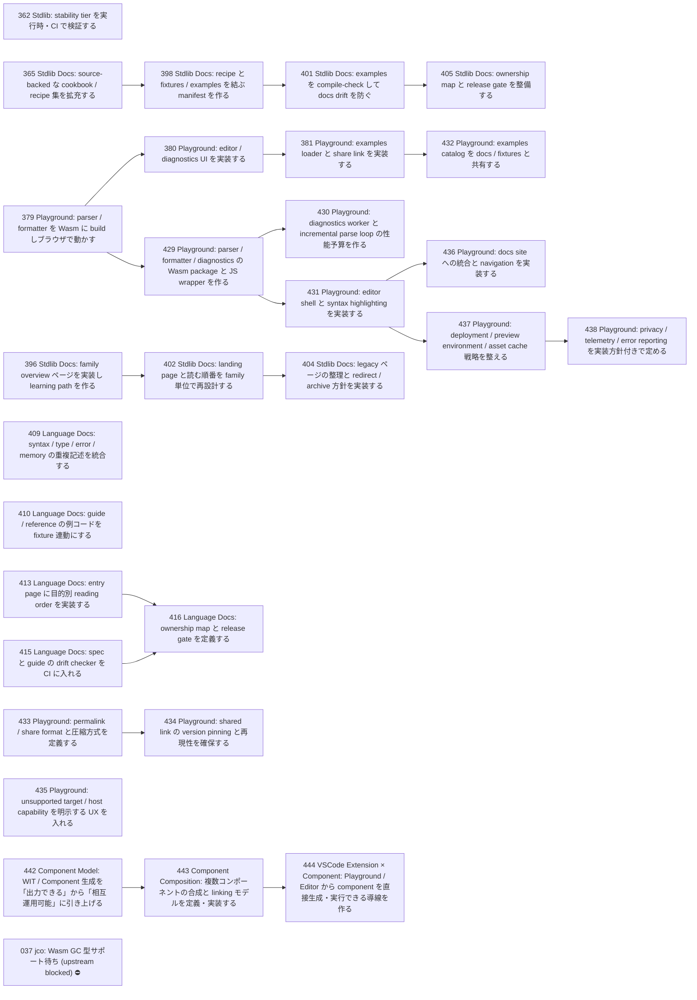

# Issue Dependency Graph

Auto-generated by `scripts/generate-issue-index.sh`. Do not edit manually.

## Mermaid graph

## Adjacency list

- **362** depends on: 358, 360; blocks: none
- **365** depends on: 363; blocks: 398
- **379** depends on: 378; blocks: 380, 429
- **396** depends on: 363; blocks: 402
- **409** depends on: 406, 408; blocks: none
- **410** depends on: 406; blocks: none
- **413** depends on: 406; blocks: 416
- **415** depends on: 406, 407; blocks: 416
- **433** depends on: 428; blocks: 434
- **435** depends on: 428; blocks: none
- **442** depends on: 299, 300; blocks: 443
- **398** depends on: 365; blocks: 401
- **380** depends on: 379; blocks: 381
- **429** depends on: 379; blocks: 430, 431
- **402** depends on: 396; blocks: 404
- **416** depends on: 413, 415; blocks: none
- **434** depends on: 433; blocks: none
- **443** depends on: 442; blocks: 444
- **401** depends on: 398; blocks: 405
- **381** depends on: 380; blocks: 432
- **430** depends on: 429; blocks: none
- **431** depends on: 429; blocks: 436, 437
- **404** depends on: 402; blocks: none
- **444** depends on: 439, 440, 441, 443; blocks: none
- **405** depends on: 401, 403; blocks: none
- **432** depends on: 381; blocks: none
- **436** depends on: 431; blocks: none
- **437** depends on: 431; blocks: 438
- **438** depends on: 437; blocks: none

### Blocked

- **037** ⛔ blocked — depends on: 036; blocked by: jco upstream (<https://github.com/bytecodealliance/jco>)
