# Issue Dependency Graph

Auto-generated by `scripts/gen/generate-issue-index.sh`. Do not edit manually.

## Mermaid graph

```mermaid
graph LR
  I032["032 WIT resource type support (own/borrow)"]
  I034["034 CLI --wit flag, --emit component workflow, docs"]
  I036["036 jco JavaScript interop smoke test"]
  I044["044 std::collections::hash: HashMap\<K,V\> 汎用化と HashSet\<T\>"]
  I045["045 std::collections: Deque、PriorityQueue"]
  I047["047 std::collections: Arena、SlotMap、Interner ／ std::text: Rope"]
  I051["051 std::time + std::random: 時刻・期間・乱数"]
  I074["074 WASI P2 ネイティブ: P1 アダプタ不要のコンポーネント直接生成"]
  I099["099 コンパイル速度: インクリメンタル解析 (ファイル変更差分のみ再パース)"]
  I108["108 実行時性能: hello.wasm 1KB 以下 達成プラン"]
  I110["110 CI perf gate: コンパイル時間・実行時間・バイナリサイズ閾値チェック"]
  I112["112 ベンチマーク比較: C/Rust/Go/Grain との自動比較スクリプト"]
  I123["123 import 構文と WIT パッケージ識別子の統一方針決定"]
  I125["125 `compile()` のデフォルトを CoreHIR パスに移行 (Legacy パス廃止)"]
  I194["194 Semantic preview / diff / ghost refactor surface"]
  I195["195 Partial execution preview + local semantic insight"]
  I198["198 Advanced test UX: impact analysis / snapshot diff / fuzz UI"]
  I200["200 Runtime inspection / stepping / evaluate surface"]
  I204["204 Project explain / build explain / script sandbox surface"]
  I206["206 Interactive compiler pipeline + inline profiling"]
  I249["249 migration guide v4→v5: self-hosted compiler bootstrap"]
  I252["252 テスト戦略を fixture harness 中心から、品質面全体を覆う検証体系へ再編する"]
  I253["253 セルフホスト達成条件を厳密化し、「できたかどうか」を曖昧にしない"]
  I254["254 VS Code 拡張を、手動確認前提の bootstrap から、E2E で壊れにくい製品面へ引き上げる"]
  I268["268 Stage1 fixture parity・CLI parity・diagnostic parity を CI で継続検証する"]
  I285["285 Legacy lowering path を隔離・撤去する"]
  I312["312 Selfhost に generic instantiation と monomorphization を実装する"]
  I459["459 selfhost Stage 2 fixpoint 達成と dual-period 終了計画"]
  I490["490 pub use / pub import re-export"]
  I494["494 494 — Selfhost MIR: SSA formation pass"]
  I499["499 499 — Selfhost compiler: closure capture environment lowering"]
  I504["504 504 — Selfhost: trait/interface syntax and impl-block infrastructure"]
  I513["513 Stdlib: prelude 直叩き前提を減らし、安全な wrapper surface を優先する"]
  I514["514 Stdlib: 実装品質監査 (hash / parsing / collection algorithm の甘さ) を実施する"]
  I515["515 Stdlib: sentinel 値 / raw String error を Result / Option / Error enum に寄せる"]
  I516["516 Stdlib: raw helper と推奨 facade の境界を再設計する"]
  I517["517 Stdlib: canonical naming / module layering / surface consistency の第2監査"]
  I520["520 Stdlib: allocation / complexity / perf footgun を family 横断で監査する"]
  I521["521 Stdlib JSON: top-level parse は trailing non-whitespace を拒否する"]
  I522["522 Stdlib JSON: `stringify_pretty` の product claim を現実に合わせる"]
  I523["523 Stdlib TOML: parse failure と supported subset contract を定義する"]
  I524["524 Stdlib FS: `exists` の意味を path existence に揃えるか probe helper に縮退する"]
  I525["525 Stdlib FS: module-level docs を host rollout reality に合わせる"]
  I526["526 Stdlib JSON: parity と differential tests を round-trip corpus で拡張する"]
  I527["527 Stdlib TOML: parity と differential tests を valid / invalid corpus で拡張する"]
  I528["528 Stdlib collections/hash: property と differential tests を map / set invariant で拡張する"]
  I473["473 Resource type v3+: 継承・async drops・クロスコンポーネント転送・ハンドル GC"]
  I054["054 std::wit + std::component: WIT 型、resource handle、canonical ABI"]
  I055["055 std::json + std::toml + std::csv: データ形式パーサ"]
  I077["077 WASI P2: `std::host::http` facade と runtime 検証"]
  I124["124 WIT コンポーネント import — ソース構文・ark.toml・型バインディング生成"]
  I139["139 WASI P2: `std::host::sockets` facade と T3 実行検証"]
  I474["474 Async Component Support (v5/T5)"]
  I475["475 `arukellt component` サブコマンド (v3 候補)"]
  I476["476 `wasm-tools compose` 統合 (v3 候補)"]
  I510["510 T3 emitter: WASI P2 import-table switch (full P2-native component)"]
  I126["126 `run_frontend()` の二重 lower を解消 (遅延 lower)"]
  I201["201 Advanced debug intelligence"]
  I188["188 `ark.toml`: project / workspace metadata と `script run` surface"]
  I269["269 Rust 実装と selfhost 実装の dual period 終了条件を定義する"]
  I508["508 Legacy path removal is blocked by CoreHIR lowerer stub"]
  I495["495 495 — Selfhost typechecker: trait bounds and constraint solving"]
  I518["518 Stdlib: docs / fixtures / cookbook を「良い Arukellt コード例」として再監査する"]
  I136["136 ADR-011 に沿った `std::host` layer の段階的ロールアウト"]
  I485["485 docs: arukellt component サブコマンド CLI リファレンス"]
  I205["205 Docs / codebase intelligence surfaces"]
  I214["214 Extension quality / packaging / marketplace readiness"]
  I512["512 Stdlib: trait ベースの再利用可能 surface へ段階移行する"]
  I037["037 jco: Wasm GC 型サポート待ち (upstream blocked) ⛔"]
  I032 --> I473
  I044 --> I054
  I044 --> I055
  I074 --> I077
  I074 --> I124
  I074 --> I139
  I074 --> I474
  I074 --> I475
  I074 --> I476
  I074 --> I510
  I125 --> I126
  I200 --> I201
  I204 --> I188
  I268 --> I269
  I285 --> I508
  I312 --> I495
  I504 --> I495
  I513 --> I518
  I517 --> I518
  I077 --> I136
  I139 --> I136
  I475 --> I485
  I188 --> I205
  I188 --> I214
  I504 --> I512
  I495 --> I512
  I036 --> I037
```

## Adjacency list

- **032** depends on: 030; blocks: 473
- **034** depends on: 030, 031, 028b; blocks: none
- **036** depends on: 033; blocks: none
- **044** depends on: 039, 041; blocks: 054, 055
- **045** depends on: 039, 041; blocks: none
- **047** depends on: 039, 041; blocks: none
- **051** depends on: 039, 040; blocks: none
- **074** depends on: none; blocks: 077, 124, 139, 474, 475, 476, 510
- **099** depends on: none; blocks: none
- **108** depends on: 091, 092, 088, 089; blocks: none
- **110** depends on: 109; blocks: none
- **112** depends on: 109; blocks: none
- **123** depends on: none; blocks: none
- **125** depends on: none; blocks: 126
- **194** depends on: 193; blocks: none
- **195** depends on: none; blocks: none
- **198** depends on: 196, 197; blocks: none
- **200** depends on: 199; blocks: 201
- **204** depends on: 202, 203; blocks: 188
- **206** depends on: 184, 185, 187; blocks: none
- **249** depends on: none; blocks: none
- **252** depends on: none; blocks: none
- **253** depends on: none; blocks: none
- **254** depends on: none; blocks: none
- **268** depends on: 267; blocks: 269
- **285** depends on: 284; blocks: 508
- **312** depends on: 311; blocks: 495
- **459** depends on: 445, 446, 447, 448, 449; blocks: none
- **490** depends on: 234; blocks: none
- **494** depends on: 493, 503; blocks: none
- **499** depends on: none; blocks: none
- **504** depends on: none; blocks: 495, 512
- **513** depends on: none; blocks: 518
- **514** depends on: none; blocks: none
- **515** depends on: none; blocks: none
- **516** depends on: none; blocks: none
- **517** depends on: none; blocks: 518
- **520** depends on: none; blocks: none
- **521** depends on: none; blocks: none
- **522** depends on: none; blocks: none
- **523** depends on: none; blocks: none
- **524** depends on: none; blocks: none
- **525** depends on: none; blocks: none
- **526** depends on: none; blocks: none
- **527** depends on: none; blocks: none
- **528** depends on: none; blocks: none
- **473** depends on: 032, done); blocks: none
- **054** depends on: 039, 044, 053; blocks: none
- **055** depends on: 039, 042, 044; blocks: none
- **077** depends on: 074, 137; blocks: 136
- **124** depends on: 074; blocks: none
- **139** depends on: 074, 137; blocks: 136
- **474** depends on: 035, done), 074; blocks: none
- **475** depends on: 035, done), 074; blocks: 485
- **476** depends on: 035, done), 074; blocks: none
- **510** depends on: 074; blocks: none
- **126** depends on: 125; blocks: none
- **201** depends on: 200; blocks: none
- **188** depends on: 202, 203, 204; blocks: 205, 214
- **269** depends on: 266, 268; blocks: none
- **508** depends on: 285; blocks: none
- **495** depends on: 312, 504; blocks: 512
- **518** depends on: 513, 517; blocks: none
- **136** depends on: 137, 138, 077, 139; blocks: none
- **485** depends on: 475; blocks: none
- **205** depends on: 185, 188; blocks: none
- **214** depends on: 184, 185, 186, 187, 188; blocks: none
- **512** depends on: 504, 495; blocks: none

### Blocked

- **037** ⛔ blocked — depends on: 036; blocked by: jco upstream (<https://github.com/bytecodealliance/jco>)
