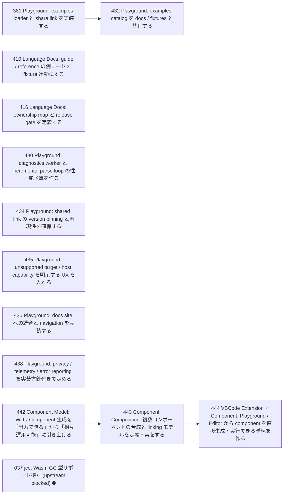

# Issue Dependency Graph

Auto-generated by `scripts/generate-issue-index.sh`. Do not edit manually.

## Mermaid graph

## Adjacency list

- **381** depends on: 380; blocks: 432
- **410** depends on: 406; blocks: none
- **416** depends on: 413, 415; blocks: none
- **430** depends on: 429; blocks: none
- **434** depends on: 433; blocks: none
- **435** depends on: 428; blocks: none
- **436** depends on: 431; blocks: none
- **438** depends on: 437; blocks: none
- **442** depends on: 299, 300; blocks: 443
- **432** depends on: 381; blocks: none
- **443** depends on: 442; blocks: 444
- **444** depends on: 439, 440, 441, 443; blocks: none

### Blocked

- **037** ⛔ blocked — depends on: 036; blocked by: jco upstream (<https://github.com/bytecodealliance/jco>)
