# Issue Dependency Graph

Auto-generated by `scripts/generate-issue-index.sh`. Do not edit manually.

## Mermaid graph

```mermaid
graph TD
  I074["074 WASI P2 ネイティブ: P1 アダプタ不要のコンポーネント直接生成"]
  I124["124 WIT コンポーネント import — ソース構文・ark.toml・型バインディング生成"]
  I137["137 `std::host::*` namespace 導入と migration / target-gated 診断"]
  I140["140 ベンチ統合: `mise bench` 1コマンド導線と subcommand 整理"]
  I141["141 計測: cold/warm/incremental compile と phase 別時間分解"]
  I142["142 計測: startup / throughput / tail latency ベンチ"]
  I143["143 計測: allocation / live-set / GC pause / RSS telemetry"]
  I145["145 計測: Wasm サイズ内訳 diff と top contributors 追跡"]
  I146["146 基盤: benchmark variance 制御と再現性プロファイル"]
  I147["147 ベンチスイート: workload taxonomy と機能マトリクス整備"]
  I154["154 横断基盤: `scripts/verify-bootstrap.sh` と fixpoint 検証 scaffold"]
  I156["156 T3 backend-opt: `struct.get` → 即時 `struct.set` 系の read-modify-write 最適化"]
  I162["162 162: Phase 1 — Parser の Arukellt 実装"]
  I163["163 163: Phase 1 — Driver + CLI の Arukellt 実装"]
  I164["164 164: Phase 2 — Resolver + TypeChecker の Arukellt 実装"]
  I165["165 165: Phase 3 — Wasm Emitter の Arukellt 実装"]
  I166["166 166: ブートストラップ検証スクリプト"]
  I167["167 167: Arukellt 版コンパイラの ARUKELLT_DUMP_PHASES 実装"]
  I169["169 169: ブートストラップ手順ドキュメント"]
  I170["170 170: v4→v5 移行ガイド"]
  I077["077 WASI P2: `std::host::http` facade と runtime 検証"]
  I138["138 `std::host` 共通 capability (`stdio` / `fs` / `env` / `process` / `clock` / `random`) を T1/T3 両対応で実装"]
  I139["139 WASI P2: `std::host::sockets` facade と T3 実行検証"]
  I144["144 計測: 入力サイズ sweep とスケーリングカーブ可視化"]
  I148["148 基盤: benchmark 結果保存・履歴比較・トレンドレポート"]
  I136["136 ADR-011 に沿った `std::host` layer の段階的ロールアウト"]
  I158["158 v4 docs 完了: optimization / pipeline / current-state / benchmark caveat の同期"]
  I037["037 jco: Wasm GC 型サポート待ち (upstream blocked) ⛔"]
  I074 --> I077
  I137 --> I077
  I137 --> I138
  I074 --> I139
  I137 --> I139
  I141 --> I144
  I142 --> I144
  I143 --> I144
  I140 --> I148
  I141 --> I148
  I142 --> I148
  I143 --> I148
  I145 --> I148
  I146 --> I148
  I137 --> I136
  I138 --> I136
  I077 --> I136
  I139 --> I136
  I140 --> I158
  I141 --> I158
  I142 --> I158
  I143 --> I158
  I145 --> I158
  I148 --> I158
```

## Adjacency list

- **074** depends on: —; blocks: 077, 139
- **124** depends on: 074 (wasi-p2-native-component); blocks: none
- **137** depends on: —; blocks: 077, 136, 138, 139
- **140** depends on: 149; blocks: 148, 158
- **141** depends on: 149; blocks: 144, 148, 158
- **142** depends on: 149; blocks: 144, 148, 158
- **143** depends on: 149; blocks: 144, 148, 158
- **145** depends on: 149; blocks: 148, 158
- **146** depends on: 149; blocks: 148
- **147** depends on: 149; blocks: none
- **154** depends on: 153; blocks: none
- **156** depends on: —; blocks: none
- **162** depends on: #161 (Lexer); blocks: none
- **163** depends on: #161 (Lexer), #162 (Parser); blocks: none
- **164** depends on: #163 (Driver + CLI); blocks: none
- **165** depends on: #164 (Resolver + TypeChecker); blocks: none
- **166** depends on: #165 (Wasm Emitter); blocks: none
- **167** depends on: #163 (Driver + CLI); blocks: none
- **169** depends on: #166 (Bootstrap verification); blocks: none
- **170** depends on: #165 (Phase 3 完了後); blocks: none
- **077** depends on: 074, 137; blocks: 136
- **138** depends on: 137; blocks: 136
- **139** depends on: 074, 137; blocks: 136
- **144** depends on: 141, 142, 143, 149; blocks: none
- **148** depends on: 140, 141, 142, 143, 145, 146; blocks: 158
- **136** depends on: 137, 138, 077, 139; blocks: none
- **158** depends on: 140, 141, 142, 143, 145, 148, 155; blocks: none

### Blocked

- **037** ⛔ blocked — depends on: 036; blocked by: jco upstream (<https://github.com/bytecodealliance/jco>)
