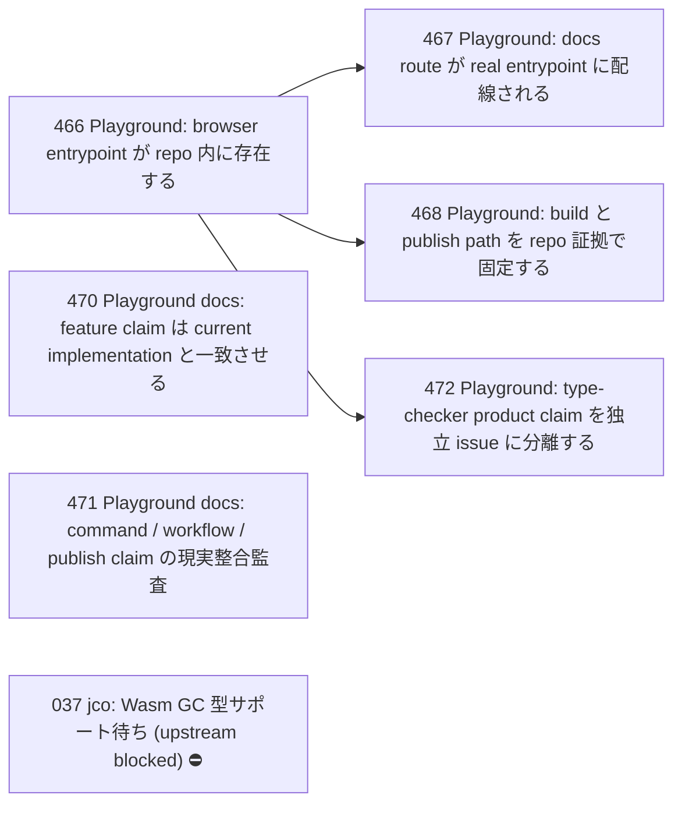

# Issue Dependency Graph

Auto-generated by `scripts/gen/generate-issue-index.sh`. Do not edit manually.

## Mermaid graph

## Adjacency list

- **466** depends on: 465; blocks: 467, 468, 472
- **470** depends on: 465; blocks: none
- **471** depends on: 465; blocks: none
- **467** depends on: 466; blocks: none
- **468** depends on: 466; blocks: none
- **472** depends on: 466; blocks: none

### Blocked

- **037** ⛔ blocked — depends on: 036; blocked by: jco upstream (<https://github.com/bytecodealliance/jco>)
