# Issue Dependency Graph

Auto-generated by `scripts/generate-issue-index.sh`. Do not edit manually.

## Mermaid graph

```mermaid
graph TD
  I026["026 GC-native builtins: to_string, parse, math, I/O"]
  I035["035 V2 exit verification & cleanup"]
  I038["038 WIT 型マッピング全 16 種の component fixture 整備"]
  I059["059 v3 fixture 統合 + verify-harness.sh v3 ゲート"]
  I212["212 Extension sidebar + project UI tree view"]
  I213["213 Language status item + observability surface"]
  I214["214 Extension quality / packaging / marketplace readiness"]
  I215["215 VS Code extension: multi-root workspace + per-project configuration UI"]
  I216["216 Formatter surface"]
  I217["217 Code actions + refactor code actions"]
  I218["218 Navigation completeness: go to implementation / call hierarchy / type hierarchy"]
  I219["219 LSP standard feature completeness"]
  I220["220 Task provider: background task support and pre-execution validation"]
  I221["221 current-state.md を唯一の現行状態ソースとして再構築する"]
  I223["223 全文書の「完成/実験/未着手」表記を統一する用語基準を策定する"]
  I231["231 ark.toml を project model の唯一の正規入口として仕様化する"]
  I236["236 CLI 起動契約を明確化する（LSP 起動方法・バージョン検出・stdio 扱い）"]
  I249["249 migration guide v4→v5: self-hosted compiler bootstrap"]
  I250["250 benchmark measurement plan: GC vs linear memory decision data"]
  I027["027 GC-native full verification, cleanup, and ADR update"]
  I239["239 日常利用に必要な LSP 基本機能を完成させる"]
  I222["222 README を現在の利用可能面を正確に示す入口に更新する"]
  I241["241 本線 target を選定し、experimental/blocked target を明示的に区分する"]
  I224["224 issues/open・done・blocked と実装状態の同期確認・修正"]
  I225["225 リリース可否基準を「何を保証するか」ベースで文書化する"]
  I226["226 言語仕様に stable/provisional/experimental/removed の4段階ラベルを定義・適用する"]
  I232["232 単一ファイルモードと project モードの挙動差を明確化・ドキュメント化する"]
  I233["233 module / package / workspace / dependency の解決規則を仕様として固定する"]
  I237["237 バイナリ探索・server.path・起動引数の統合と自動設定を実装する"]
  I238["238 project root・target・emit・manifest・scripts の CLI/LSP/Tasks 解決を統一する"]
  I242["242 CI を unit/fixture/integration/packaging/editor smoke/determinism の各層で構成する"]
  I227["227 構文・型システム・import・visibility・error model の契約を文書化する"]
  I228["228 stdlib 全公開 API に安定性ラベルと互換ポリシーを付与する"]
  I230["230 破壊的変更の issue/changelog/migration guide 3点セット手順を確立する"]
  I234["234 visibility・public API・internal API を言語機能として確立する"]
  I235["235 コンパイラ/CLI/LSP ツール層: multi-root workspace・script 実行・target 設定の解決統一"]
  I240["240 エラー時の診断案内（何が足りないか・どこを直すか）を実装する"]
  I243["243 ユーザー到達経路での panic/unwrap/起動失敗の即時 issue 化品質基準を確立する"]
  I244["244 最適化・backend の「無効でも使える/有効でも壊さない」検証体制を構築する"]
  I229["229 Quickstart を「今後も基準になる書き方」に更新する"]
  I245["245 配布物・統合面・失敗時の回復性の出荷品質基準を策定する"]
  I037["037 jco: Wasm GC 型サポート待ち (upstream blocked) ⛔"]
  I026 --> I027
  I219 --> I239
  I221 --> I222
  I221 --> I241
  I223 --> I224
  I221 --> I225
  I223 --> I225
  I223 --> I226
  I231 --> I232
  I231 --> I233
  I236 --> I237
  I231 --> I238
  I236 --> I238
  I241 --> I242
  I226 --> I227
  I226 --> I228
  I226 --> I230
  I233 --> I234
  I232 --> I235
  I233 --> I235
  I237 --> I240
  I239 --> I240
  I242 --> I243
  I241 --> I244
  I242 --> I244
  I226 --> I229
  I227 --> I229
  I241 --> I245
  I242 --> I245
  I243 --> I245
```

## Adjacency list

- **026** depends on: 023, 024, 025; blocks: 027
- **035** depends on: 032, 033, 034; blocks: none
- **038** depends on: 028, 029, 030, 031; blocks: none
- **059** depends on: 039, 040, 041, 042, 043, 044, 045, 046, 047, 048, 049, 050, 051, 052, 053, 054, 055, 056, 057; blocks: none
- **212** depends on: 190; blocks: none
- **213** depends on: 190; blocks: none
- **214** depends on: 184, 185, 186, 187, 188; blocks: none
- **215** depends on: 202; blocks: none
- **216** depends on: none; blocks: none
- **217** depends on: 193; blocks: none
- **218** depends on: 193; blocks: none
- **219** depends on: none; blocks: 239
- **220** depends on: none; blocks: none
- **221** depends on: none; blocks: 222, 225, 241
- **223** depends on: none; blocks: 224, 225, 226
- **231** depends on: none; blocks: 232, 233, 238
- **236** depends on: none; blocks: 237, 238
- **249** depends on: none; blocks: none
- **250** depends on: none; blocks: none
- **027** depends on: 026; blocks: none
- **239** depends on: 219; blocks: 240
- **222** depends on: 221; blocks: none
- **241** depends on: 221; blocks: 242, 244, 245
- **224** depends on: 223; blocks: none
- **225** depends on: 221, 223; blocks: none
- **226** depends on: 223; blocks: 227, 228, 229, 230
- **232** depends on: 231; blocks: 235
- **233** depends on: 231; blocks: 234, 235
- **237** depends on: 236; blocks: 240
- **238** depends on: 231, 236; blocks: none
- **242** depends on: 241; blocks: 243, 244, 245
- **227** depends on: 226; blocks: 229
- **228** depends on: 226; blocks: none
- **230** depends on: 226; blocks: none
- **234** depends on: 233; blocks: none
- **235** depends on: 232, 233; blocks: none
- **240** depends on: 237, 239; blocks: none
- **243** depends on: 242; blocks: 245
- **244** depends on: 241, 242; blocks: none
- **229** depends on: 226, 227; blocks: none
- **245** depends on: 241, 242, 243; blocks: none

### Blocked

- **037** ⛔ blocked — depends on: 036; blocked by: jco upstream (<https://github.com/bytecodealliance/jco>)
