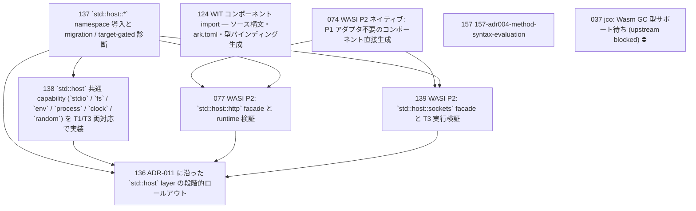

# Issue Dependency Graph

Auto-generated by `scripts/generate-issue-index.sh`. Do not edit manually.

## Mermaid graph

## Adjacency list

- **074** depends on: —; blocks: 077, 139
- **124** depends on: 074 (wasi-p2-native-component); blocks: none
- **137** depends on: —; blocks: 077, 136, 138, 139
- **157** depends on: none; blocks: none
- **077** depends on: 074, 137; blocks: 136
- **138** depends on: 137; blocks: 136
- **139** depends on: 074, 137; blocks: 136
- **136** depends on: 137, 138, 077, 139; blocks: none

### Blocked

- **037** ⛔ blocked — depends on: 036; blocked by: jco upstream (<https://github.com/bytecodealliance/jco>)
