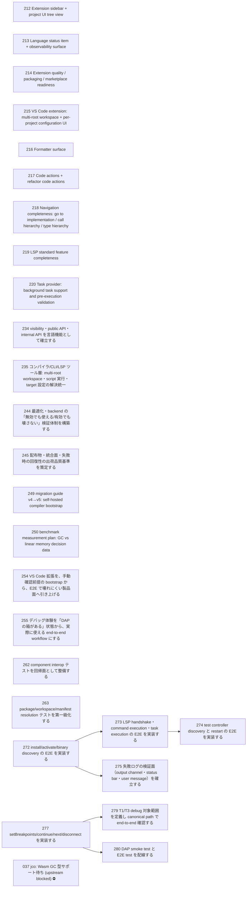

# Issue Dependency Graph

Auto-generated by `scripts/generate-issue-index.sh`. Do not edit manually.

## Mermaid graph

## Adjacency list

- **212** depends on: 190; blocks: none
- **213** depends on: 190; blocks: none
- **214** depends on: 184, 185, 186, 187, 188; blocks: none
- **215** depends on: 202; blocks: none
- **216** depends on: none; blocks: none
- **217** depends on: 193; blocks: none
- **218** depends on: 193; blocks: none
- **219** depends on: none; blocks: none
- **220** depends on: none; blocks: none
- **234** depends on: 233; blocks: none
- **235** depends on: 232, 233; blocks: none
- **244** depends on: 241, 242; blocks: none
- **245** depends on: 241, 242, 243; blocks: none
- **249** depends on: none; blocks: none
- **250** depends on: none; blocks: none
- **254** depends on: none; blocks: none
- **255** depends on: none; blocks: none
- **262** depends on: 261; blocks: none
- **263** depends on: 261; blocks: none
- **272** depends on: 271; blocks: 273, 275
- **277** depends on: 276; blocks: 279, 280
- **273** depends on: 272; blocks: 274
- **275** depends on: 272; blocks: none
- **279** depends on: 277, 278; blocks: none
- **280** depends on: 277, 278; blocks: none
- **274** depends on: 273; blocks: none

### Blocked

- **037** ⛔ blocked — depends on: 036; blocked by: jco upstream (<https://github.com/bytecodealliance/jco>)
