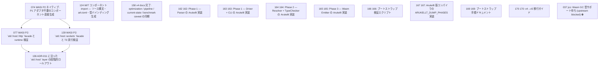

# Issue Dependency Graph

Auto-generated by `scripts/generate-issue-index.sh`. Do not edit manually.

## Mermaid graph

## Adjacency list

- **074** depends on: —; blocks: 077, 139
- **124** depends on: 074 (wasi-p2-native-component); blocks: none
- **158** depends on: 140, 141, 142, 143, 145, 148, 155; blocks: none
- **162** depends on: #161 (Lexer); blocks: none
- **163** depends on: #161 (Lexer), #162 (Parser); blocks: none
- **164** depends on: #163 (Driver + CLI); blocks: none
- **165** depends on: #164 (Resolver + TypeChecker); blocks: none
- **166** depends on: #165 (Wasm Emitter); blocks: none
- **167** depends on: #163 (Driver + CLI); blocks: none
- **169** depends on: #166 (Bootstrap verification); blocks: none
- **170** depends on: #165 (Phase 3 完了後); blocks: none
- **077** depends on: 074, 137; blocks: 136
- **139** depends on: 074, 137; blocks: 136
- **136** depends on: 137, 138, 077, 139; blocks: none

### Blocked

- **037** ⛔ blocked — depends on: 036; blocked by: jco upstream (<https://github.com/bytecodealliance/jco>)
