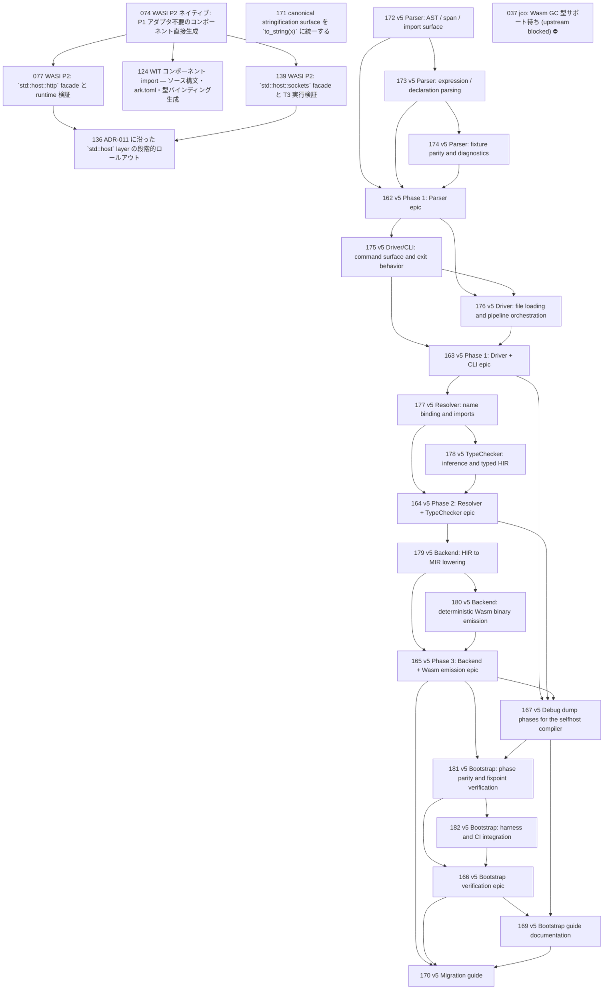

# Issue Dependency Graph

Auto-generated by `scripts/generate-issue-index.sh`. Do not edit manually.

## Mermaid graph

## Adjacency list

- **074** depends on: none; blocks: 077, 124, 139
- **171** depends on: none; blocks: none
- **172** depends on: 161; blocks: 162, 173
- **077** depends on: 074, 137; blocks: 136
- **124** depends on: 074; blocks: none
- **139** depends on: 074, 137; blocks: 136
- **173** depends on: 172; blocks: 162, 174
- **136** depends on: 137, 138, 077, 139; blocks: none
- **174** depends on: 173; blocks: 162
- **162** depends on: 172, 173, 174; blocks: 175, 176
- **175** depends on: 162; blocks: 163, 176
- **176** depends on: 162, 175; blocks: 163
- **163** depends on: 175, 176; blocks: 167, 177
- **177** depends on: 163; blocks: 164, 178
- **178** depends on: 177; blocks: 164
- **164** depends on: 177, 178; blocks: 167, 179
- **179** depends on: 164; blocks: 165, 180
- **180** depends on: 179; blocks: 165
- **165** depends on: 179, 180; blocks: 167, 170, 181
- **167** depends on: 163, 164, 165; blocks: 169, 181
- **181** depends on: 165, 167; blocks: 166, 182
- **182** depends on: 181; blocks: 166
- **166** depends on: 181, 182; blocks: 169, 170
- **169** depends on: 166, 167; blocks: 170
- **170** depends on: 165, 166, 169; blocks: none

### Blocked

- **037** ⛔ blocked — depends on: 036; blocked by: jco upstream (<https://github.com/bytecodealliance/jco>)
