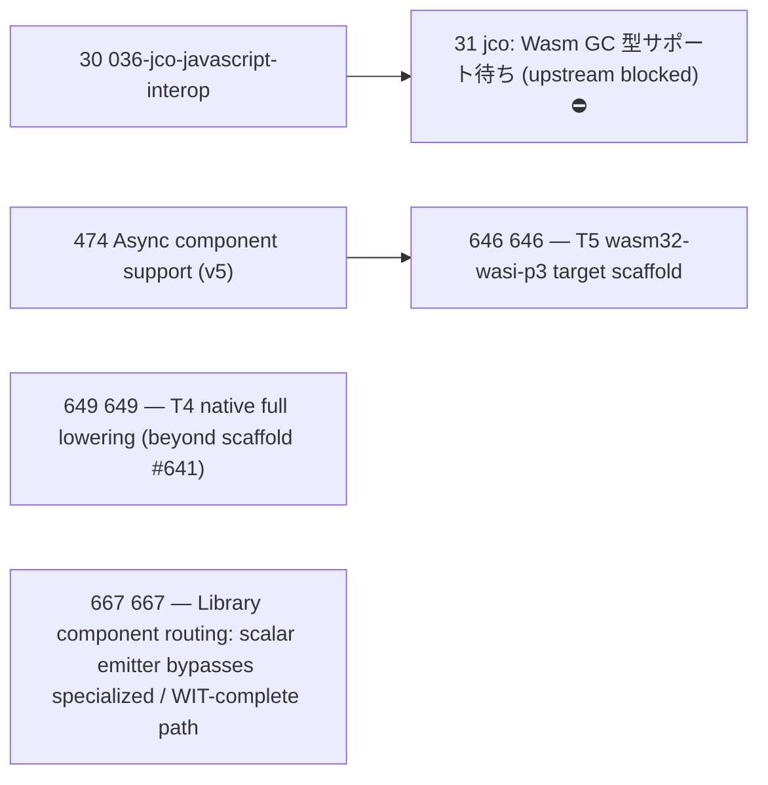

# Issue Dependency Graph

Auto-generated by `scripts/gen/generate-issue-index.py`. Do not edit manually.

## Mermaid graph

## Adjacency list

- **30** depends on: 27; blocks: none
- **474** depends on: 035, done), 074; blocks: 646
- **649** depends on: 641; blocks: none
- **667** depends on: 666; blocks: none
- **646** depends on: 474; blocks: none

### Blocked

- **31** ⛔ blocked — depends on: 30; blocked by: jco upstream (<https://github.com/bytecodealliance/jco>)
