# Issue Dependency Graph

Auto-generated by `scripts/gen/generate-issue-index.sh`. Do not edit manually.

## Mermaid graph

```mermaid
graph LR
  I028["028 WIT import parsing & host function binding"]
  I032["032 WIT resource type support (own/borrow)"]
  I034["034 CLI --wit flag, --emit component workflow, docs"]
  I036["036 jco JavaScript interop smoke test"]
  I039["039 std モジュールシステム基盤: `use std::*` import インフラ"]
  I064["064 Wasm Branch Hinting: カスタムセクションによるブランチ予測ヒント"]
  I066["066 Wasm Bulk Memory: memory.copy / memory.fill / table.copy フル対応"]
  I070["070 Wasm GC i31ref: 小整数 unboxed scalar 最適化"]
  I072["072 Wasm Multi-Value: ブロック / ループの複数値返却フル活用"]
  I073["073 WASI P1: 全46 syscall 対応 (clock / random / proc_exit / fd_seek 等)"]
  I074["074 WASI P2 ネイティブ: P1 アダプタ不要のコンポーネント直接生成"]
  I082["082 MIR: gc_hint パス — 短命オブジェクトのパターン検出"]
  I083["083 MIR: ループ展開 (Loop Unrolling) パス"]
  I094["094 T3: enum dispatch の br_on_cast 連鎖最適化"]
  I095["095 T3: struct フィールドレイアウト最適化 (アクセス頻度ベース)"]
  I096["096 コンパイル速度: 未使用 stdlib 関数の遅延解決 (lazy-resolve)"]
  I099["099 コンパイル速度: インクリメンタル解析 (ファイル変更差分のみ再パース)"]
  I102["102 コンパイル速度: Lexer / Parser のホットパス最適化"]
  I103["103 実行時性能: 配列境界チェック除去 (Bounds Check Elimination)"]
  I104["104 実行時性能: GC write barrier 削減 (immutable フィールド検出)"]
  I105["105 実行時性能: 数値型の Narrowing — i32 優先使用"]
  I106["106 実行時性能: 静的文字列インターニング (data segment 参照)"]
  I108["108 実行時性能: hello.wasm 1KB 以下 達成プラン"]
  I109["109 ベンチマーク: fib / binary_tree / vec_ops / string_concat / json_parse スイート"]
  I111["111 ツール: Wasm バイナリサイズ内訳分析ツール"]
  I113["113 計測: コンパイラ RSS + 実行時 GC ヒープ計測統合"]
  I116["116 Wasm WAT ラウンドトリップ検証 (wat2wasm ⇄ wasm2wat)"]
  I117["117 Component Model: WIT 生成品質の向上と往復検証"]
  I119["119 MIR: ARUKELLT_DUMP_PHASES=optimized-mir 対応"]
  I120["120 WasmGC Post-MVP プレビュー: 将来拡張の設計調査"]
  I122["122 MIR 最適化パスの --opt-level 分離と passes/ ディレクトリ構造確立"]
  I123["123 import 構文と WIT パッケージ識別子の統一方針決定"]
  I125["125 `compile()` のデフォルトを CoreHIR パスに移行 (Legacy パス廃止)"]
  I128["128 T3 GC エミッター (t3_wasm_gc.rs 8678行) をサブモジュールに分割"]
  I129["129 T1 エミッター (t1_wasm32_p1.rs 9465行) をサブモジュールに分割"]
  I130["130 MIR lower.rs (4360行) をサブモジュールに分割"]
  I132["132 Parser parser.rs (2003行) をサブモジュールに分割"]
  I134["134 ark-lexer lib.rs (1698行) をサブモジュールに分割"]
  I135["135 ark-diagnostics lib.rs (1099行) をサブモジュールに分割"]
  I140["140 ベンチ統合: `mise bench` 1コマンド導線と subcommand 整理"]
  I141["141 計測: cold/warm/incremental compile と phase 別時間分解"]
  I142["142 計測: startup / throughput / tail latency ベンチ"]
  I143["143 計測: allocation / live-set / GC pause / RSS telemetry"]
  I145["145 計測: Wasm サイズ内訳 diff と top contributors 追跡"]
  I146["146 基盤: benchmark variance 制御と再現性プロファイル"]
  I147["147 ベンチスイート: workload taxonomy と機能マトリクス整備"]
  I153["153 横断検証: bit-exact Wasm 再現ビルドゲートと決定性ルール"]
  I156["156 T3 backend-opt: `struct.get` → 即時 `struct.set` 系の read-modify-write 最適化"]
  I157["157 ADR-004 P4: メソッド構文 / trait 再評価"]
  I160["160 160: セルフホスト必要 stdlib チェックリストの確認"]
  I170["170 v5 Migration guide"]
  I194["194 Semantic preview / diff / ghost refactor surface"]
  I195["195 Partial execution preview + local semantic insight"]
  I198["198 Advanced test UX: impact analysis / snapshot diff / fuzz UI"]
  I200["200 Runtime inspection / stepping / evaluate surface"]
  I204["204 Project explain / build explain / script sandbox surface"]
  I206["206 Interactive compiler pipeline + inline profiling"]
  I249["249 migration guide v4→v5: self-hosted compiler bootstrap"]
  I253["253 セルフホスト達成条件を厳密化し、「できたかどうか」を曖昧にしない"]
  I283["283 CoreHIR lowering: TryExpr を制御フローに desugar する"]
  I286["286 current-state.md の bootstrap 節を fixpoint 達成に合わせて更新する"]
  I289["289 セルフホスト diagnostic parity を確認する"]
  I301["301 current-state.md と README.md の整合を取る"]
  I309["309 Selfhost resolver に module/import resolution を実装する"]
  I312["312 Selfhost に generic instantiation と monomorphization を実装する"]
  I382["382 Playground: wasm32-freestanding (T2) target の downstream 実装を開始する"]
  I424["424 Repo Hygiene: generated index の stale 検出を追加する"]
  I437["437 Playground: deployment / preview environment / asset cache 戦略を整える"]
  I441["441 VSCode Extension: Workspace / Package / ark.toml を理解した project-aware editor にする"]
  I453["453 VSCode API を使った editor behavior E2E テストを追加する"]
  I459["459 selfhost Stage 2 fixpoint 達成と dual-period 終了計画"]
  I464["464 `arukellt init` のテンプレート拡充と新規ユーザー導線整備"]
  I469["469 Extension: playground surface は repo で証明できる endpoint だけを指す"]
  I472["472 Playground: type-checker product claim を独立 issue に分離する"]
  I490["490 pub use / pub import re-export"]
  I473["473 Resource type v3+: 継承・async drops・クロスコンポーネント転送・ハンドル GC"]
  I041["041 std::core: Error 型、ordering、range、cmp、math、convert、hash"]
  I043["043 std::bytes: Bytes、ByteBuf、ByteCursor、endian、hex、base64、leb128"]
  I051["051 std::time + std::random: 時刻・期間・乱数"]
  I487["487 Package registry resolution"]
  I077["077 WASI P2: `std::host::http` facade と runtime 検証"]
  I124["124 WIT コンポーネント import — ソース構文・ark.toml・型バインディング生成"]
  I139["139 WASI P2: `std::host::sockets` facade と T3 実行検証"]
  I474["474 Async Component Support (v5/T5)"]
  I475["475 `arukellt component` サブコマンド (v3 候補)"]
  I476["476 `wasm-tools compose` 統合 (v3 候補)"]
  I110["110 CI perf gate: コンパイル時間・実行時間・バイナリサイズ閾値チェック"]
  I112["112 ベンチマーク比較: C/Rust/Go/Grain との自動比較スクリプト"]
  I118["118 Component Model: 複数エクスポート world の自動生成"]
  I486["486 T3: MIR 最適化の段階的再開 (GC-safe audit + opt-level 復帰)"]
  I126["126 `run_frontend()` の二重 lower を解消 (遅延 lower)"]
  I144["144 計測: 入力サイズ sweep とスケーリングカーブ可視化"]
  I148["148 基盤: benchmark 結果保存・履歴比較・トレンドレポート"]
  I154["154 横断基盤: `scripts/run/verify-bootstrap.sh` と fixpoint 検証 scaffold"]
  I201["201 Advanced debug intelligence"]
  I188["188 `ark.toml`: project / workspace metadata と `script run` surface"]
  I266["266 selfhost 完了条件を定義し文書に固定する"]
  I284["284 CoreHIR path をデフォルトに昇格する"]
  I438["438 Playground: privacy / telemetry / error reporting を実装方針付きで定める"]
  I042["042 std::text: String API 拡張、StringBuilder、format ユーティリティ"]
  I044["044 std::collections::hash: HashMap\<K,V\> 汎用化と HashSet\<T\>"]
  I045["045 std::collections: Deque、PriorityQueue"]
  I046["046 std::collections: BTreeMap、BTreeSet、IndexMap、IndexSet、BitSet"]
  I047["047 std::collections: Arena、SlotMap、Interner ／ std::text: Rope"]
  I048["048 std::seq: Seq\<T\> 遅延シーケンスとアルゴリズム"]
  I056["056 std::test: assert、snapshot テスト、bench-lite"]
  I050["050 std::io: Reader、Writer、stdin/stdout/stderr、buffered I/O"]
  I053["053 std::wasm: Wasm バイナリ型・opcode・module builder"]
  I136["136 ADR-011 に沿った `std::host` layer の段階的ロールアウト"]
  I485["485 docs: arukellt component サブコマンド CLI リファレンス"]
  I158["158 v4 docs 完了: optimization / pipeline / current-state / benchmark caveat の同期"]
  I205["205 Docs / codebase intelligence surfaces"]
  I214["214 Extension quality / packaging / marketplace readiness"]
  I267["267 verify-bootstrap.sh を達成判定本体へ昇格させる"]
  I285["285 Legacy lowering path を隔離・撤去する"]
  I489["489 Playground user-visible entrypoint wiring"]
  I049["049 std::path + std::fs: パス操作とファイル I/O"]
  I052["052 std::process + std::env + std::cli: 実行環境 API"]
  I055["055 std::json + std::toml + std::csv: データ形式パーサ"]
  I054["054 std::wit + std::component: WIT 型、resource handle、canonical ABI"]
  I268["268 Stage1 fixture parity・CLI parity・diagnostic parity を CI で継続検証する"]
  I057["057 Prelude 再構成と API 移行"]
  I269["269 Rust 実装と selfhost 実装の dual period 終了条件を定義する"]
  I037["037 jco: Wasm GC 型サポート待ち (upstream blocked) ⛔"]
  I032 --> I473
  I039 --> I041
  I039 --> I043
  I039 --> I051
  I039 --> I487
  I074 --> I077
  I074 --> I124
  I074 --> I139
  I074 --> I474
  I074 --> I475
  I074 --> I476
  I109 --> I110
  I109 --> I112
  I117 --> I118
  I122 --> I486
  I125 --> I126
  I141 --> I144
  I142 --> I144
  I143 --> I144
  I140 --> I148
  I141 --> I148
  I142 --> I148
  I143 --> I148
  I145 --> I148
  I146 --> I148
  I153 --> I154
  I200 --> I201
  I204 --> I188
  I253 --> I266
  I283 --> I284
  I437 --> I438
  I039 --> I042
  I041 --> I042
  I039 --> I044
  I041 --> I044
  I039 --> I045
  I041 --> I045
  I039 --> I046
  I041 --> I046
  I039 --> I047
  I041 --> I047
  I039 --> I048
  I041 --> I048
  I039 --> I056
  I041 --> I056
  I039 --> I050
  I041 --> I050
  I043 --> I050
  I039 --> I053
  I043 --> I053
  I077 --> I136
  I139 --> I136
  I475 --> I485
  I140 --> I158
  I141 --> I158
  I142 --> I158
  I143 --> I158
  I145 --> I158
  I148 --> I158
  I188 --> I205
  I188 --> I214
  I266 --> I267
  I284 --> I285
  I382 --> I489
  I437 --> I489
  I438 --> I489
  I464 --> I489
  I039 --> I049
  I041 --> I049
  I042 --> I049
  I039 --> I052
  I042 --> I052
  I039 --> I055
  I042 --> I055
  I044 --> I055
  I039 --> I054
  I044 --> I054
  I053 --> I054
  I267 --> I268
  I039 --> I057
  I041 --> I057
  I042 --> I057
  I044 --> I057
  I048 --> I057
  I049 --> I057
  I052 --> I057
  I266 --> I269
  I268 --> I269
  I036 --> I037
```

## Adjacency list

- **028** depends on: none; blocks: none
- **032** depends on: 030; blocks: 473
- **034** depends on: 030, 031; blocks: none
- **036** depends on: 033; blocks: none
- **039** depends on: none; blocks: 041, 042, 043, 044, 045, 046, 047, 048, 049, 050, 051, 052, 053, 054, 055, 056, 057, 487
- **064** depends on: none; blocks: none
- **066** depends on: none; blocks: none
- **070** depends on: none; blocks: none
- **072** depends on: none; blocks: none
- **073** depends on: none; blocks: none
- **074** depends on: none; blocks: 077, 124, 139, 474, 475, 476
- **082** depends on: none; blocks: none
- **083** depends on: 080; blocks: none
- **094** depends on: none; blocks: none
- **095** depends on: none; blocks: none
- **096** depends on: none; blocks: none
- **099** depends on: none; blocks: none
- **102** depends on: 100; blocks: none
- **103** depends on: 080; blocks: none
- **104** depends on: none; blocks: none
- **105** depends on: none; blocks: none
- **106** depends on: none; blocks: none
- **108** depends on: 091, 092, 088, 089; blocks: none
- **109** depends on: none; blocks: 110, 112
- **111** depends on: none; blocks: none
- **113** depends on: 100; blocks: none
- **116** depends on: 114; blocks: none
- **117** depends on: none; blocks: 118
- **119** depends on: 101; blocks: none
- **120** depends on: none; blocks: none
- **122** depends on: 101; blocks: 486
- **123** depends on: none; blocks: none
- **125** depends on: none; blocks: 126
- **128** depends on: none; blocks: none
- **129** depends on: none; blocks: none
- **130** depends on: none; blocks: none
- **132** depends on: none; blocks: none
- **134** depends on: none; blocks: none
- **135** depends on: none; blocks: none
- **140** depends on: 149; blocks: 148, 158
- **141** depends on: 149; blocks: 144, 148, 158
- **142** depends on: 149; blocks: 144, 148, 158
- **143** depends on: 149; blocks: 144, 148, 158
- **145** depends on: 149; blocks: 148, 158
- **146** depends on: 149; blocks: 148
- **147** depends on: 149; blocks: none
- **153** depends on: none; blocks: 154
- **156** depends on: none; blocks: none
- **157** depends on: none; blocks: none
- **160** depends on: none; blocks: none
- **170** depends on: 165, 166, 169; blocks: none
- **194** depends on: 193; blocks: none
- **195** depends on: none; blocks: none
- **198** depends on: 196, 197; blocks: none
- **200** depends on: 199; blocks: 201
- **204** depends on: 202, 203; blocks: 188
- **206** depends on: 184, 185, 187; blocks: none
- **249** depends on: none; blocks: none
- **253** depends on: none; blocks: 266
- **283** depends on: 281; blocks: 284
- **286** depends on: none; blocks: none
- **289** depends on: 287; blocks: none
- **301** depends on: 303; blocks: none
- **309** depends on: 308; blocks: none
- **312** depends on: 311; blocks: none
- **382** depends on: 378; blocks: 489
- **424** depends on: 417; blocks: none
- **437** depends on: 431; blocks: 438, 489
- **441** depends on: 333, 335, 340; blocks: none
- **453** depends on: 450, 451, 452; blocks: none
- **459** depends on: 445, 446, 447, 448, 449; blocks: none
- **464** depends on: none; blocks: 489
- **469** depends on: 466, 468; blocks: none
- **472** depends on: 466; blocks: none
- **490** depends on: 234; blocks: none
- **473** depends on: 032, done); blocks: none
- **041** depends on: 039; blocks: 042, 044, 045, 046, 047, 048, 049, 050, 056, 057
- **043** depends on: 039, 040; blocks: 050, 053
- **051** depends on: 039, 040; blocks: none
- **487** depends on: 039; blocks: none
- **077** depends on: 074, 137; blocks: 136
- **124** depends on: 074; blocks: none
- **139** depends on: 074, 137; blocks: 136
- **474** depends on: 035, done), 074; blocks: none
- **475** depends on: 035, done), 074; blocks: 485
- **476** depends on: 035, done), 074; blocks: none
- **110** depends on: 109; blocks: none
- **112** depends on: 109; blocks: none
- **118** depends on: 117; blocks: none
- **486** depends on: 122; blocks: none
- **126** depends on: 125; blocks: none
- **144** depends on: 141, 142, 143, 149; blocks: none
- **148** depends on: 140, 141, 142, 143, 145, 146; blocks: 158
- **154** depends on: 153; blocks: none
- **201** depends on: 200; blocks: none
- **188** depends on: 202, 203, 204; blocks: 205, 214
- **266** depends on: 253; blocks: 267, 269
- **284** depends on: 281, 282, 283, 306; blocks: 285
- **438** depends on: 437; blocks: 489
- **042** depends on: 039, 041; blocks: 049, 052, 055, 057
- **044** depends on: 039, 041; blocks: 054, 055, 057
- **045** depends on: 039, 041; blocks: none
- **046** depends on: 039, 041; blocks: none
- **047** depends on: 039, 041; blocks: none
- **048** depends on: 039, 041; blocks: 057
- **056** depends on: 039, 041; blocks: none
- **050** depends on: 039, 041, 043; blocks: none
- **053** depends on: 039, 040, 043; blocks: 054
- **136** depends on: 137, 138, 077, 139; blocks: none
- **485** depends on: 475; blocks: none
- **158** depends on: 140, 141, 142, 143, 145, 148, 155; blocks: none
- **205** depends on: 185, 188; blocks: none
- **214** depends on: 184, 185, 186, 187, 188; blocks: none
- **267** depends on: 266; blocks: 268
- **285** depends on: 284; blocks: none
- **489** depends on: 382, 437, 438, 464; blocks: none
- **049** depends on: 039, 041, 042; blocks: 057
- **052** depends on: 039, 042; blocks: 057
- **055** depends on: 039, 042, 044; blocks: none
- **054** depends on: 039, 044, 053; blocks: none
- **268** depends on: 267; blocks: 269
- **057** depends on: 039, 041, 042, 044, 048, 049, 052; blocks: none
- **269** depends on: 266, 268; blocks: none

### Blocked

- **037** ⛔ blocked — depends on: 036; blocked by: jco upstream (<https://github.com/bytecodealliance/jco>)
