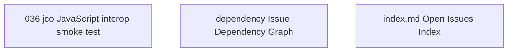

# Issue Dependency Graph

Auto-generated by `scripts/generate-issue-index.sh`. Do not edit manually.

## Mermaid graph

## Adjacency list

- **036** depends on: 033; blocks: none
- **dependency** depends on: none; blocks: none
- **index.md** depends on: none; blocks: none
