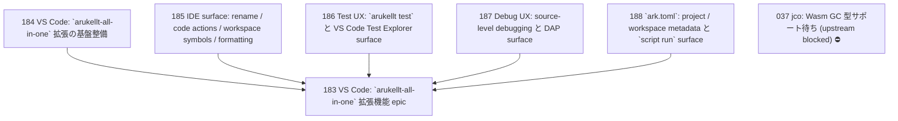

# Issue Dependency Graph

Auto-generated by `scripts/generate-issue-index.sh`. Do not edit manually.

## Mermaid graph

## Adjacency list

- **184** depends on: none; blocks: 183
- **185** depends on: none; blocks: 183
- **186** depends on: none; blocks: 183
- **187** depends on: none; blocks: 183
- **188** depends on: 124; blocks: 183
- **183** depends on: 184, 185, 186, 187, 188; blocks: none

### Blocked

- **037** ⛔ blocked — depends on: 036; blocked by: jco upstream (<https://github.com/bytecodealliance/jco>)
