# Issue Dependency Graph

Auto-generated by `scripts/gen/generate-issue-index.sh`. Do not edit manually.

## Mermaid graph

```mermaid
graph LR
  I028b["028b WIT import pipeline wiring — flags, resolver injection, pipeline integration"]
  I032["032 WIT resource type support (own/borrow)"]
  I036["036 jco JavaScript interop smoke test"]
  I054["054 std::wit + std::component: WIT 型、resource handle、canonical ABI"]
  I072["072 Wasm Multi-Value: ブロック / ループの複数値返却フル活用"]
  I074["074 WASI P2 ネイティブ: P1 アダプタ不要のコンポーネント直接生成"]
  I094["094 T3: enum dispatch の br_on_cast 連鎖最適化"]
  I095["095 T3: struct フィールドレイアウト最適化 (アクセス頻度ベース)"]
  I096["096 コンパイル速度: 未使用 stdlib 関数の遅延解決 (lazy-resolve)"]
  I099["099 コンパイル速度: インクリメンタル解析 (ファイル変更差分のみ再パース)"]
  I120["120 WasmGC Post-MVP プレビュー: 将来拡張の設計調査"]
  I125["125 `compile()` のデフォルトを CoreHIR パスに移行 (Legacy パス廃止)"]
  I170["170 v5 Migration guide"]
  I194["194 Semantic preview / diff / ghost refactor surface"]
  I195["195 Partial execution preview + local semantic insight"]
  I198["198 Advanced test UX: impact analysis / snapshot diff / fuzz UI"]
  I200["200 Runtime inspection / stepping / evaluate surface"]
  I204["204 Project explain / build explain / script sandbox surface"]
  I206["206 Interactive compiler pipeline + inline profiling"]
  I249["249 migration guide v4→v5: self-hosted compiler bootstrap"]
  I253["253 セルフホスト達成条件を厳密化し、「できたかどうか」を曖昧にしない"]
  I269["269 Rust 実装と selfhost 実装の dual period 終了条件を定義する"]
  I285["285 Legacy lowering path を隔離・撤去する"]
  I459["459 selfhost Stage 2 fixpoint 達成と dual-period 終了計画"]
  I489["489 Playground user-visible entrypoint wiring"]
  I494["494 494 — Selfhost MIR: SSA formation pass"]
  I495["495 495 — Selfhost typechecker: trait bounds and constraint solving"]
  I499["499 499 — Selfhost compiler: closure capture environment lowering"]
  I501["501 T2 (`wasm32-freestanding`) Wasm Emitter Implementation"]
  I502["502 LSP: Full Multi-Root Workspace and Cross-Package Resolution"]
  I503["503 Issue #503 — Selfhost MIR: CFG and Dominance-Frontier Infrastructure for SSA"]
  I504["504 504 — Selfhost: trait/interface syntax and impl-block infrastructure"]
  I505["505 T3: br_table enum dispatch — feasible IfStmt-chain optimization"]
  I473["473 Resource type v3+: 継承・async drops・クロスコンポーネント転送・ハンドル GC"]
  I077["077 WASI P2: `std::host::http` facade と runtime 検証"]
  I124["124 WIT コンポーネント import — ソース構文・ark.toml・型バインディング生成"]
  I139["139 WASI P2: `std::host::sockets` facade と T3 実行検証"]
  I474["474 Async Component Support (v5/T5)"]
  I475["475 `arukellt component` サブコマンド (v3 候補)"]
  I476["476 `wasm-tools compose` 統合 (v3 候補)"]
  I510["510 T3 emitter: WASI P2 import-table switch (full P2-native component)"]
  I126["126 `run_frontend()` の二重 lower を解消 (遅延 lower)"]
  I201["201 Advanced debug intelligence"]
  I188["188 `ark.toml`: project / workspace metadata と `script run` surface"]
  I508["508 Legacy path removal is blocked by CoreHIR lowerer stub"]
  I136["136 ADR-011 に沿った `std::host` layer の段階的ロールアウト"]
  I485["485 docs: arukellt component サブコマンド CLI リファレンス"]
  I205["205 Docs / codebase intelligence surfaces"]
  I214["214 Extension quality / packaging / marketplace readiness"]
  I028["028 WIT import parsing & host function binding"]
  I034["034 CLI --wit flag, --emit component workflow, docs"]
  I037["037 jco: Wasm GC 型サポート待ち (upstream blocked) ⛔"]
  I032 --> I473
  I074 --> I077
  I074 --> I124
  I074 --> I139
  I074 --> I474
  I074 --> I475
  I074 --> I476
  I074 --> I510
  I125 --> I126
  I200 --> I201
  I204 --> I188
  I285 --> I508
  I077 --> I136
  I139 --> I136
  I475 --> I485
  I188 --> I205
  I188 --> I214
  I028 --> I028
  I028 --> I034
  I036 --> I037
```

## Adjacency list

- **028b** depends on: none; blocks: none
- **032** depends on: 030; blocks: 473
- **036** depends on: 033; blocks: none
- **054** depends on: 039, 044, 053; blocks: none
- **072** depends on: none; blocks: none
- **074** depends on: none; blocks: 077, 124, 139, 474, 475, 476, 510
- **094** depends on: none; blocks: none
- **095** depends on: none; blocks: none
- **096** depends on: none; blocks: none
- **099** depends on: none; blocks: none
- **120** depends on: none; blocks: none
- **125** depends on: none; blocks: 126
- **170** depends on: 165, 166, 169; blocks: none
- **194** depends on: 193; blocks: none
- **195** depends on: none; blocks: none
- **198** depends on: 196, 197; blocks: none
- **200** depends on: 199; blocks: 201
- **204** depends on: 202, 203; blocks: 188
- **206** depends on: 184, 185, 187; blocks: none
- **249** depends on: none; blocks: none
- **253** depends on: none; blocks: none
- **269** depends on: 266, 268; blocks: none
- **285** depends on: 284; blocks: 508
- **459** depends on: 445, 446, 447, 448, 449; blocks: none
- **489** depends on: 437, 438, 464; blocks: none
- **494** depends on: none; blocks: none
- **495** depends on: none; blocks: none
- **499** depends on: none; blocks: none
- **501** depends on: none; blocks: none
- **502** depends on: 441; blocks: none
- **503** depends on: none; blocks: none
- **504** depends on: none; blocks: none
- **505** depends on: none; blocks: none
- **473** depends on: 032, done); blocks: none
- **077** depends on: 074, 137; blocks: 136
- **124** depends on: 074; blocks: none
- **139** depends on: 074, 137; blocks: 136
- **474** depends on: 035, done), 074; blocks: none
- **475** depends on: 035, done), 074; blocks: 485
- **476** depends on: 035, done), 074; blocks: none
- **510** depends on: 074; blocks: none
- **126** depends on: 125; blocks: none
- **201** depends on: 200; blocks: none
- **188** depends on: 202, 203, 204; blocks: 205, 214
- **508** depends on: 285; blocks: none
- **136** depends on: 137, 138, 077, 139; blocks: none
- **485** depends on: 475; blocks: none
- **205** depends on: 185, 188; blocks: none
- **214** depends on: 184, 185, 186, 187, 188; blocks: none
- **028** depends on: 028; blocks: 028, 034
- **034** depends on: 030, 031, 028; blocks: none

### Blocked

- **037** ⛔ blocked — depends on: 036; blocked by: jco upstream (<https://github.com/bytecodealliance/jco>)
