# Issue Dependency Graph

Auto-generated by `scripts/generate-issue-index.sh`. Do not edit manually.

## Mermaid graph

```mermaid
graph TD
  I061["061 Wasm native 例外処理: try_table / throw / exnref 実装"]
  I062["062 Wasm Memory64: i64 アドレス空間対応"]
  I063["063 Wasm Multi-Memory: 複数メモリモジュール対応"]
  I064["064 Wasm Branch Hinting: カスタムセクションによるブランチ予測ヒント"]
  I065["065 Wasm Extended Const: 定数式での算術演算"]
  I066["066 Wasm Bulk Memory: memory.copy / memory.fill / table.copy フル対応"]
  I068["068 Wasm Reference Types: table.get / table.set / externref フル対応"]
  I069["069 Wasm Typed Function References: ref.func / call_ref フル活用"]
  I071["071 Wasm GC Abstract Heap Types: any/eq/none/func/nofunc の完全活用"]
  I073["073 WASI P1: 全46 syscall 対応 (clock / random / proc_exit / fd_seek 等)"]
  I074["074 WASI P2 ネイティブ: P1 アダプタ不要のコンポーネント直接生成"]
  I095["095 T3: struct フィールドレイアウト最適化 (アクセス頻度ベース)"]
  I097["097 コンパイル速度: MIR lowering のアリーナ割り当て"]
  I098["098 コンパイル速度: 並列型チェック (rayon)"]
  I099["099 コンパイル速度: インクリメンタル解析 (ファイル変更差分のみ再パース)"]
  I118["118 Component Model: 複数エクスポート world の自動生成"]
  I124["124 WIT コンポーネント import — ソース構文・ark.toml・型バインディング生成"]
  I125["125 `compile()` のデフォルトを CoreHIR パスに移行 (Legacy パス廃止)"]
  I107["107 実行時性能: ループのベクトル化可能性アノテーション"]
  I075["075 WASI P2 ネイティブ: wasi:clocks / wasi:random / wasi:io バインディング"]
  I076["076 WASI P2 ネイティブ: wasi:filesystem ネイティブバインディング"]
  I077["077 WASI P2: wasi:http IncomingHandler / OutgoingHandler 対応"]
  I078["078 WASI P2: wasi:sockets TCP/UDP ネイティブバインディング"]
  I079["079 WASI 0.3-rc: async func / stream<T> / future<T> コンパイルサポート"]
  I121["121 WASI P2: Canonical ABI ハンドリングの堅牢化"]
  I037["037 jco: Wasm GC 型サポート待ち (upstream blocked) ⛔"]
  I064 --> I107
  I074 --> I075
  I074 --> I076
  I074 --> I077
  I074 --> I078
  I074 --> I079
  I074 --> I121
```

## Adjacency list

- **061** depends on: —; blocks: none
- **062** depends on: —; blocks: none
- **063** depends on: —; blocks: none
- **064** depends on: —; blocks: 107
- **065** depends on: —; blocks: none
- **066** depends on: —; blocks: none
- **068** depends on: —; blocks: none
- **069** depends on: —; blocks: none
- **071** depends on: —; blocks: none
- **073** depends on: —; blocks: none
- **074** depends on: —; blocks: 075, 076, 077, 078, 079, 121
- **095** depends on: —; blocks: none
- **097** depends on: —; blocks: none
- **098** depends on: —; blocks: none
- **099** depends on: —; blocks: none
- **118** depends on: 117; blocks: none
- **124** depends on: 074 (wasi-p2-native-component); blocks: none
- **125** depends on: —; blocks: none
- **107** depends on: 064; blocks: none
- **075** depends on: 074; blocks: none
- **076** depends on: 074; blocks: none
- **077** depends on: 074; blocks: none
- **078** depends on: 074; blocks: none
- **079** depends on: 074; blocks: none
- **121** depends on: 074; blocks: none

### Blocked

- **037** ⛔ blocked — depends on: 036; blocked by: jco upstream (<https://github.com/bytecodealliance/jco>)
