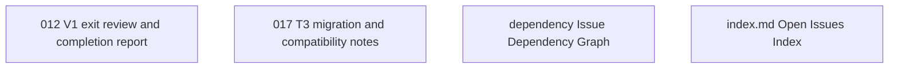

# Issue Dependency Graph

Auto-generated by `scripts/generate-issue-index.sh`. Do not edit manually.

## Mermaid graph

## Adjacency list

- **012** depends on: 001, 002, 003, 004, 005, 006, 007, 008, 009, 010, 011; blocks: none
- **017** depends on: 011, 015; blocks: none
- **dependency** depends on: none; blocks: none
- **index.md** depends on: none; blocks: none
