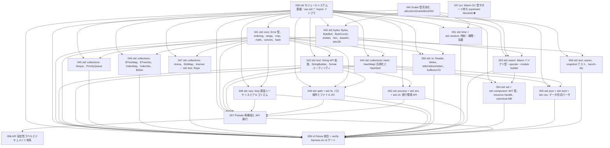

# Issue Dependency Graph

Auto-generated by `scripts/generate-issue-index.sh`. Do not edit manually.

## Mermaid graph

## Adjacency list

- **039** depends on: —; blocks: 041, 042, 043, 044, 045, 046, 047, 048, 049, 050, 051, 052, 053, 054, 055, 056, 057, 059
- **040** depends on: —; blocks: 043, 051, 053, 059
- **041** depends on: 039; blocks: 042, 044, 045, 046, 047, 048, 049, 050, 056, 057, 059
- **043** depends on: 039, 040; blocks: 050, 053, 059
- **051** depends on: 039, 040; blocks: 059
- **042** depends on: 039, 041; blocks: 049, 052, 055, 057, 059
- **044** depends on: 039, 041; blocks: 054, 055, 057, 059
- **045** depends on: 039, 041; blocks: 059
- **046** depends on: 039, 041; blocks: 059
- **047** depends on: 039, 041; blocks: 059
- **048** depends on: 039, 041; blocks: 057, 059
- **056** depends on: 039, 041; blocks: 059
- **050** depends on: 039, 041, 043; blocks: 059
- **053** depends on: 039, 040, 043; blocks: 054, 059
- **049** depends on: 039, 041, 042; blocks: 057, 059
- **052** depends on: 039, 042; blocks: 057, 059
- **055** depends on: 039, 042, 044; blocks: 059
- **054** depends on: 039, 044, 053; blocks: 059
- **057** depends on: 039, 041, 042, 044, 048, 049, 052; blocks: 058, 059
- **058** depends on: 057; blocks: none
- **059** depends on: 039, 040, 041, 042, 043, 044, 045, 046, 047, 048, 049, 050, 051, 052, 053, 054, 055, 056, 057; blocks: none

### Blocked

- **037** ⛔ blocked — depends on: 036; blocked by: jco upstream (<https://github.com/bytecodealliance/jco>)
