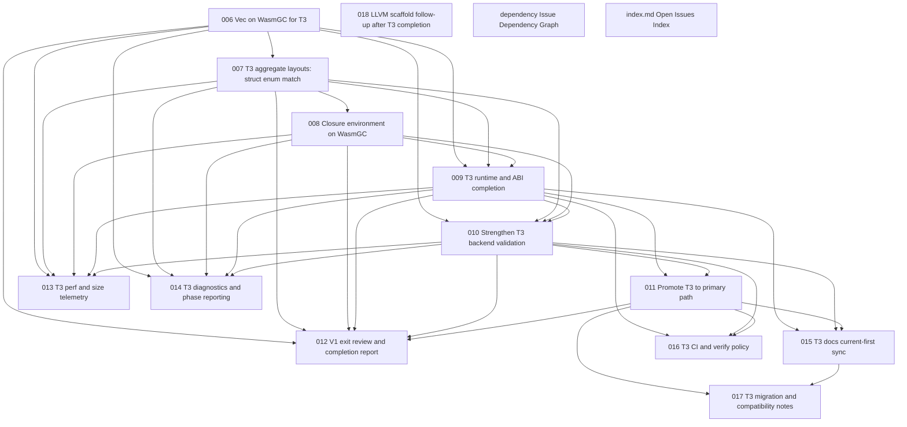

# Issue Dependency Graph

Auto-generated by `scripts/generate-issue-index.sh`. Do not edit manually.

## Mermaid graph

## Adjacency list

- **006** depends on: 004, 005; blocks: 007, 009, 010, 012, 013, 014
- **018** depends on: none; blocks: none
- **dependency** depends on: none; blocks: none
- **index.md** depends on: none; blocks: none
- **007** depends on: 004, 006; blocks: 008, 009, 010, 012, 013, 014
- **008** depends on: 004, 007; blocks: 009, 010, 012, 013, 014
- **009** depends on: 003, 004, 005, 006, 007, 008; blocks: 010, 011, 012, 013, 014, 015, 016
- **010** depends on: 004, 005, 006, 007, 008, 009; blocks: 011, 012, 013, 014, 015, 016
- **011** depends on: 009, 010; blocks: 012, 015, 016, 017
- **013** depends on: 002, 004, 005, 006, 007, 008, 009, 010; blocks: none
- **014** depends on: 004, 005, 006, 007, 008, 009, 010; blocks: none
- **012** depends on: 001, 002, 003, 004, 005, 006, 007, 008, 009, 010, 011; blocks: none
- **015** depends on: 003, 009, 010, 011; blocks: 017
- **016** depends on: 002, 009, 010, 011; blocks: none
- **017** depends on: 011, 015; blocks: none
