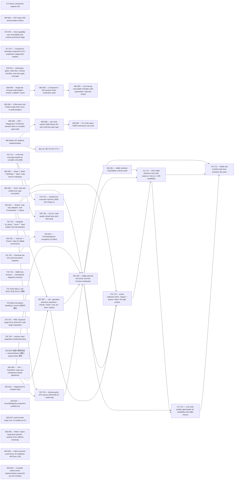

# Issue Dependency Graph

Auto-generated by `scripts/gen/generate-issue-index.py`. Do not edit manually.

## Mermaid graph

```mermaid
graph LR
  I474["474 Async component support (v5)"]
  I669["669 669 — WIT import IDE and formatter surface"]
  I675["675 675 — Host capability user-reachability and runtime permission flags"]
  I677["677 677 — Component developer experience (CLI, cookbooks, diagnostics explain)"]
  I678["678 678 — Verification gates: stale docs, release checklist, and close-gate coverage"]
  I680["680 680 — Target tier honesty audit (stable / smoke / scaffold / none)"]
  I681["681 681 — Stdlib manifest reachability contract audit"]
  I684["684 684 — False-done and limited-scope done issue re-audit program"]
  I685["685 685 — IDE / Playground / Extension product-claim vs compiler gate audit"]
  I686["686 Wasm GC Selfhost Implementation"]
  I691["691 691 — `Iterator` trait, lazy adapters, and `FromIterator` / `collect`"]
  I693["693 693 — `Read` / `Write` / `BufRead` / `Seek` traits and IO unification"]
  I694["694 694 — `Error` trait and unified error type ecosystem"]
  I695["695 695 — `Ord` / `PartialOrd` traits and comparison-based algorithms"]
  I702["702 702 — Integrate `to_string` / `clone` / `hash` builtins into trait dispatch"]
  I708["708 708 — `TryFrom` / `TryInto` traits for fallible conversions"]
  I715["715 715 — In-file test coverage targets for compiler and stdlib"]
  I718["718 718 — Stdlib free-function → method/trait migration inventory"]
  I721["721 Final Types (`sub final`) を全 struct に適用"]
  I723["723 Wasm Exception Handling (`exnref`) 統合の検討"]
  I728["728 728 — WIR / backend target IR for ADR-007 multi-target separation"]
  I729["729 729 — Intrinsic layer separation (unblocked epic)"]
  I760["760 ADR 台帳の規則追従 — research/plans 分離と supersession 整合"]
  I791["791 791 — Eliminate the Ark canonical parser baseline"]
  I815["815 815 — Diagnostic/T3 compile skips"]
  I818["818 818 — CoreOpRegistry production scaffold exit"]
  I825["825 AST cache format repair (not “re-enable as-is”)"]
  I830["830 830 — Retire `wasm-heap-grow-patcher` (walrus) from selfhost bootstrap"]
  I849["849 849 — native-executor wasm32-gc S3 validation drift (func 118)"]
  I850["850 850 — Compiler phase-arena implementation (wasm32-gc host overlay)"]
  I682["682 682 — Component / WIT product-claim verification audit"]
  I698["698 698 — std::simd explicit SIMD library API and v128 first-class type"]
  I801["801 GC 完了までのプラン"]
  I697["697 697 — `Vec<T>` operation extension (windows / chunks / retain / sort_by / drain / splice)"]
  I703["703 703 — Monomorphic API cutover (ADR-036 D2 + ADR-046)"]
  I719["719 719 — `arukellt test` execution harness (ADR-041 Phase 2)"]
  I799["799 799 — CQ-18: code-quality closed-loop strict final audit"]
  I814["814 814 — Formatter/parser exceptions (23 files)"]
  I683["683 683 — User-facing executable example audit (Quickstart / skip-doc-check)"]
  I699["699 699 — T4 LLVM native SIMD lowering for std::simd"]
  I709["709 709 — Stdlib trait-first API policy and free-function eradication"]
  I710["710 710 — Linear collection ADTs: `Deque<T>` / queue / stack / list type surface"]
  I711["711 711 — Rich stdlib reference docs with crates.io / docs.rs / JSR readability"]
  I712["712 712 — LLM code quality signal gates for readability and stdlib misuse"]
  I713["713 713 — Stdlib and Arukellt code best-practices doc pack"]
  I680 --> I682
  I686 --> I698
  I686 --> I801
  I691 --> I697
  I695 --> I697
  I691 --> I703
  I695 --> I703
  I715 --> I719
  I715 --> I799
  I791 --> I814
  I682 --> I683
  I698 --> I699
  I691 --> I709
  I695 --> I709
  I697 --> I709
  I703 --> I709
  I691 --> I710
  I697 --> I710
  I709 --> I710
  I681 --> I711
  I709 --> I711
  I710 --> I711
  I709 --> I712
  I711 --> I712
  I709 --> I713
  I711 --> I713
  I712 --> I713
```

## Adjacency list

- **474** depends on: 035, done), 074; blocks: none
- **669** depends on: 652, done); blocks: none
- **675** depends on: 841; blocks: none
- **677** depends on: 475, 485; blocks: none
- **678** depends on: none; blocks: none
- **680** depends on: 679; blocks: 682
- **681** depends on: 679; blocks: 711
- **684** depends on: none; blocks: none
- **685** depends on: 679; blocks: none
- **686** depends on: none; blocks: 698, 801
- **691** depends on: 688, 707; blocks: 697, 703, 709, 710
- **693** depends on: 688, 692; blocks: none
- **694** depends on: 690, 692; blocks: none
- **695** depends on: 688; blocks: 697, 703, 709
- **702** depends on: 688, 700, 692; blocks: none
- **708** depends on: 692, 707; blocks: none
- **715** depends on: 041, done); blocks: 719, 799
- **718** depends on: 700, 701; blocks: none
- **721** depends on: none; blocks: none
- **723** depends on: none; blocks: none
- **728** depends on: none; blocks: none
- **729** depends on: 843; blocks: none
- **760** depends on: none; blocks: none
- **791** depends on: 785; blocks: 814
- **815** depends on: none; blocks: none
- **818** depends on: 798, 816, 817, 819, 820, 821, 822; blocks: none
- **825** depends on: 823; blocks: none
- **830** depends on: 730; blocks: none
- **849** depends on: none; blocks: none
- **850** depends on: 827; blocks: none
- **682** depends on: 679, 680; blocks: 683
- **698** depends on: 686, 649; blocks: 699
- **801** depends on: 686; blocks: none
- **697** depends on: 691, 695; blocks: 709, 710
- **703** depends on: 700, 701, 691, 695; blocks: 709
- **719** depends on: 715; blocks: none
- **799** depends on: 715, 796, 797; blocks: none
- **814** depends on: 791; blocks: none
- **683** depends on: 679, 682; blocks: none
- **699** depends on: 649, 698; blocks: none
- **709** depends on: 691, 695, 697, 703; blocks: 710, 711, 712, 713
- **710** depends on: 691, 697, 701, 707, 709; blocks: 711
- **711** depends on: 681, 709, 710; blocks: 712, 713
- **712** depends on: 709, 711; blocks: 713
- **713** depends on: 709, 711, 712; blocks: none
